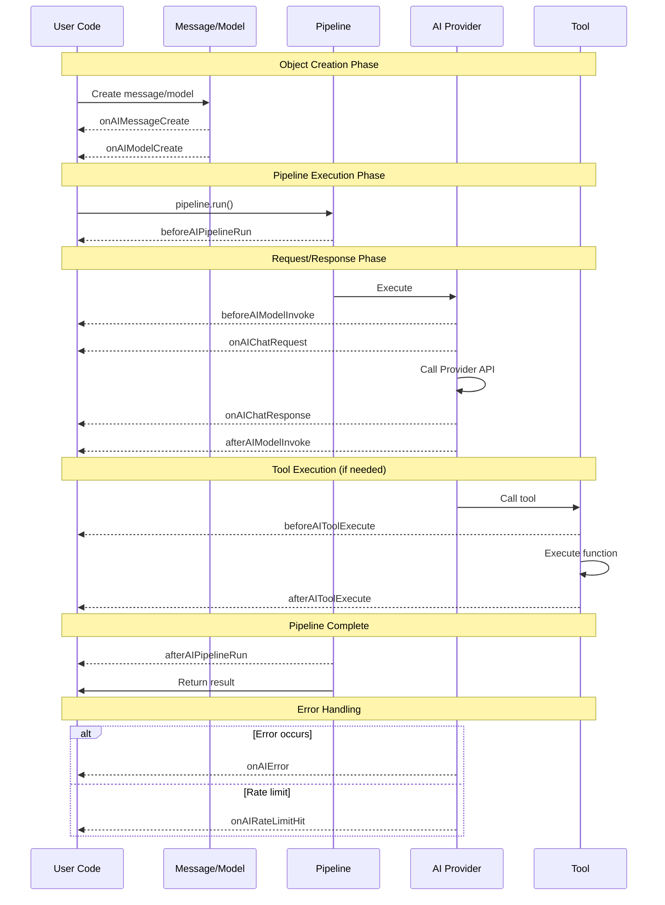
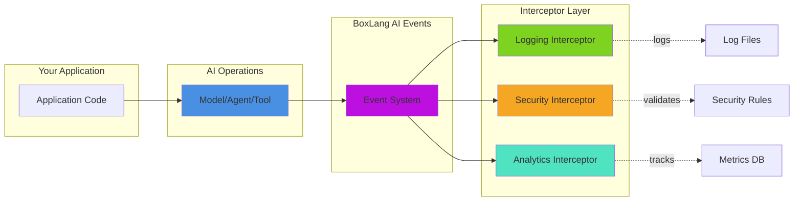

# Event System

The BoxLang AI module provides a comprehensive event system that allows you to intercept, monitor, and customize AI operations at various stages. These events give you fine-grained control over the AI lifecycle, from object creation to request/response handling.

***

## 🔍 Overview

The event system allows you to **monitor**, **modify**, **validate**, **audit**, **secure**, and **customize** AI operations without modifying core code.

### All Available Events

| #  | Event                                                   | When Fired                       | Key Data                                          |
| -- | ------------------------------------------------------- | --------------------------------- | -------------------------------------------------- |
| 1  | [onAIMessageCreate](core-events.md#onaimessagecreate)      | Message template created         | `message`                                         |
| 2  | [onAIChatRequestCreate](core-events.md#onaichatrequestcreate) | Chat request object instantiated | `aiRequest`                                       |
| 4  | [onAIProviderCreate](core-events.md#onaiprovidercreate)    | Provider instance created        | `provider`                                        |
| 5  | onMissingAiProvider  | Provider not found               | `provider`, `options`                             |
| 6  | [onAIModelCreate](core-events.md#onaimodelcreate)          | Model runnable created           | `model`, `service`                                |
| 7  | [onAITransformerCreate](core-events.md#onaitransformercreate) | Transform runnable created    | `transform`                                       |
| 8  | onAIAgentCreate          | Agent instance created           | `agent`, `name`                                   |
| 9  | beforeAIAgentRun        | Before agent execution           | `agent`, `input`                                  |
| 10 | afterAIAgentRun         | After agent execution            | `agent`, `result`                                 |
| 11 | [beforeAIModelInvoke](core-events.md#beforeaimodelinvoke) | Before model execution           | `model`, `request`                                |
| 12 | [onAIChatRequest](core-events.md#onaichatrequest)         | Before chat HTTP request         | `dataPacket`, `aiRequest`, `provider`             |
| 13 | [onAIChatResponse](core-events.md#onaichatresponse)       | After chat HTTP response         | `response`, `rawResponse`, `provider`             |
| 14 | [afterAIModelInvoke](core-events.md#afteraimodelinvoke)   | After model execution completes  | `model`, `request`, `results`                     |
| 15 | beforeAIEmbed             | Before embedding generation      | `embeddingRequest`, `service`                     |
| 16 | onAIEmbedRequest       | Before embedding HTTP request    | `dataPacket`, `embeddingRequest`, `provider`      |
| 17 | onAIEmbedResponse     | After embedding HTTP response    | `response`, `rawResponse`, `provider`             |
| 18 | afterAIEmbed               | After embedding generation       | `embeddingRequest`, `service`, `result`           |
| 19 | [onAIToolCreate](core-events.md#onaitoolcreate)           | Tool created                     | `tool`, `name`, `description`                     |
| 20 | [beforeAIToolExecute](core-events.md#beforeaitoolexecute) | Before tool execution            | `tool`, `name`, `arguments`                       |
| 21 | [afterAIToolExecute](core-events.md#afteraitoolexecute)   | After tool execution             | `tool`, `results`, `executionTime`                |
| 22 | onAiLoaderCreate       | Document loader created          | `loader`, `type`                                  |
| 23 | onAiMemoryCreate       | Memory instance created          | `memory`, `type`                                  |
| 24 | [beforeAIPipelineRun](core-events.md#beforeaipipelinerun) | Before pipeline starts           | `sequence`, `stepCount`, `input`                  |
| 25 | [afterAIPipelineRun](core-events.md#afteraipipelinerun)   | After pipeline completes         | `sequence`, `result`, `executionTime`             |
| 26 | [onAIError](core-events.md#onaierror)                     | Error occurs                     | `error`, `errorMessage`, `provider`, `canRetry`   |
| 27 | [onAIRateLimitHit](core-events.md#onairatelimithit)       | Rate limit detected (429)        | `provider`, `statusCode`, `retryAfter`            |
| 28 | [onAITokenCount](token-usage-events.md#onaitokencount)           | Token usage available            | `provider`, `operation`, `model`, `promptTokens`, `completionTokens`, `totalTokens`, `aiRequest`, `usage`, `timestamp` |
| 29 | [onMCPServerCreate](mcp-events.md#onmcpservercreate)     | MCP server instance created      | `server`, `name`, `description`                   |
| 30 | [onMCPServerRemove](mcp-events.md#onmcpserverremove)     | MCP server instance removed      | `name`                                            |
| 31 | [onMCPRequest](mcp-events.md#onmcprequest)               | Before processing MCP request    | `server`, `requestData`, `serverName`             |
| 32 | [onMCPResponse](mcp-events.md#onmcpresponse)             | After processing MCP response    | `server`, `response`, `requestData`               |
| 33 | [onMCPError](mcp-events.md#onmcperror)                   | Exception during MCP operations  | `server`, `context`, `exception`, request details |
| 34 | [beforeAISpeech](audio-events.md#beforeaispeech)            | Before TTS request is sent       | `speechRequest`, `service`                        |
| 35 | [afterAISpeech](audio-events.md#afteraispeech)              | After TTS response received      | `speechRequest`, `service`, `result`              |
| 36 | [beforeAITranscription](audio-events.md#beforeaitranscription) | Before STT request is sent    | `transcriptionRequest`, `service`                 |
| 37 | [afterAITranscription](audio-events.md#afteraitranscription)   | After STT response received   | `transcriptionRequest`, `service`, `result`       |
| 38 | [beforeAITranslation](audio-events.md#beforeaitranslation)  | Before audio translation request | `transcriptionRequest`, `service`                 |
| 39 | [afterAITranslation](audio-events.md#afteraitranslation)    | After audio translation response | `transcriptionRequest`, `service`, `result`       |
| 40 | [onHybridMemoryAdd](memory-events.md#onhybridmemoryadd)      | Message added to HybridMemory    | `memory`, `message`                               |
| 41 | [onVectorSearch](memory-events.md#onvectorsearch)            | Vector semantic search runs      | `memory`, `query`, `limit`, `results`             |
| 42 | [beforeAIImageGeneration](image-events.md#beforeaiimagegeneration) | Before image generation request | `imageRequest`, `service`                        |
| 43 | [afterAIImageGeneration](image-events.md#afteraiimagegeneration)   | After image generation response  | `imageRequest`, `service`, `result`              |
| 44 | [onAIImageRequest](image-events.md#onaiimagerequest)        | Image request object created     | `imageRequest`                                   |
| 45 | [onAIImageResponse](image-events.md#onaiimageresponse)      | Image response received          | `response`, `rawResponse`, `provider`            |
| 46 | [onAIAgentRegistryRegister](registry-and-gateway-events.md#onaiagentregistryregister) | Agent registered          | `agent`, `key`, `module`                         |
| 47 | [onAIAgentRegistryUnregister](registry-and-gateway-events.md#onaiagentregistryunregister) | Agent unregistered        | `key`, `module`                                  |
| 48 | [onMCPServerPause](mcp-events.md#onmcpserverpause)        | MCP server paused                | `server`, `name`                                 |
| 49 | [onMCPServerResume](mcp-events.md#onmcpserverresume)      | MCP server resumed               | `server`, `name`                                 |
| 50 | [onMCPClientRequest](mcp-events.md#onmcpclientrequest)    | MCP client HTTP request          | `client`, `baseURL`, `operation`, `name`         |
| 51 | [onMCPClientResponse](mcp-events.md#onmcpclientresponse)  | MCP client HTTP response         | `client`, `baseURL`, `operation`, `response`     |
| 52 | [onMCPClientError](mcp-events.md#onmcpclienterror)        | MCP client HTTP error            | `client`, `baseURL`, `operation`, `error`        |
| 53 | [beforeAIWebSearch](web-search-events.md#beforeaiwebsearch) | Before a web search query runs | `provider`, `query`, `options`                   |
| 54 | [afterAIWebSearch](web-search-events.md#afteraiwebsearch) | Web search returned results       | `provider`, `query`, `options`, `results`, `cached` |
| 55 | [onAIWebSearchRequest](web-search-events.md#onaiwebsearchrequest) | Before search provider's outbound HTTP request | `provider`, `url`, `method`, `headers` |
| 56 | [onAIWebSearchResponse](web-search-events.md#onaiwebsearchresponse) | After search provider's HTTP response | `provider`, `url`, `statusCode`, `response` |
| 57 | [onAIWebSearchError](web-search-events.md#onaiwebsearcherror) | A web search threw               | `provider`, `query`, `options`, `error`          |
| 58 | [onAIMemorySummarize](memory-events.md#onaimemorysummarize) | Memory compressed history into an AI summary | `memory`, `key`, `type`, `userId`, `conversationId`, `messageCount`, `summaryLength` |
| 59 | [onGatewayCreate](registry-and-gateway-events.md#ongatewaycreate) | `aiGateway()` resolves or creates a gateway | `gateway`                            |
| 60 | [onGatewayRegistryRegister](registry-and-gateway-events.md#ongatewayregistryregister) | A gateway is registered into `gatewayRegistry()` | `gateway`, `key`, `module`   |
| 61 | [onGatewayRegistryUnregister](registry-and-gateway-events.md#ongatewayregistryunregister) | A gateway is removed from the registry | `key`, `module`                 |
| 62 | [onAIAgentRegistryRegister](registry-and-gateway-events.md#onaiagentregistryregister) | Agent registered          | `agent`, `key`, `module`                         |
| 63 | [onAiDecisionStoreCreate](registry-and-gateway-events.md#onaidecisionstorecreate) | `aiDecisionStore()` creates a durable-grant store | `storeType`, `storeClass`, `storeConfig` |

> Rows without a link (5, 8–10, 15–18, 22–23) are announced by the module but do not yet have a dedicated write-up on these pages — see the [AI Agents](../../main-components/agents/README.md) and BIF reference docs ([`aiAgent()`](../reference/built-in-functions/aiagent.md), [`aiEmbed()`](../reference/built-in-functions/aiembed.md)) for related context. `onAIAgentRegistryUnregister` is also fully documented on [Registry & Gateway Events](registry-and-gateway-events.md#onaiagentregistryunregister) alongside row 62.

### 🔄 Event Lifecycle Diagram



### 📊 Event Categories

| Category | Documented | Page |
| --- | --- | --- |
| Core Lifecycle Events | 18 | [Core Events](core-events.md) |
| Token & Usage Events | 1 | [Token & Usage Events](token-usage-events.md) |
| MCP Events (server + client) | 10 | [MCP Events](mcp-events.md) |
| Audio Events | 6 | [Audio Events](audio-events.md) |
| Image Events | 4 | [Image Events](image-events.md) |
| Memory Events | 3 | [Memory Events](memory-events.md) |
| Web Search Events | 5 | [Web Search Events](web-search-events.md) |
| Registry & Gateway Events | 6 | [Registry & Gateway Events](registry-and-gateway-events.md) |

53 events have a dedicated write-up above. The remaining **10** (agent lifecycle, embeddings, loaders, memory creation) are announced by the module and listed in the table above, but don't yet have individual pages — see the note below the table.

***

## 🔌 Event Interception

To listen to events, create an interceptor and register it in your module or application.

### 🏗️ Interceptor Architecture



### Creating an Interceptor

```javascript
// interceptors/AIMonitor.bx
class {

    function configure() {
        // Interceptor configuration
    }

    function onAIChatRequest( event, interceptData ) {
        // Your event handling logic
    }

    function onAIChatResponse( event, interceptData ) {
        // Your event handling logic
    }
}
```

### Registering an Interceptor

**For BoxLang Modules** (in `ModuleConfig.bx`):

```javascript
function configure() {
    interceptors = [
        {
            class: "interceptors.AIMonitor",
            properties: {}
        }
    ];
}
```

**For Applications/Scripts** (use `BoxRegisterInterceptor()` BIF):

```javascript
// Application.bx or script
BoxRegisterInterceptor( "AIMonitor", "path.to.AIMonitor" );
```

📖 **Reference**: [BoxRegisterInterceptor() Documentation](https://boxlang.ortusbooks.com/boxlang-language/reference/built-in-functions/system/boxregisterinterceptor)

***

## 📖 Sub-Pages

| Page | Description |
|---|---|
| [Core Events](core-events.md) | Message, chat, model, provider, tool, and pipeline lifecycle events |
| [Token & Usage Events](token-usage-events.md) | `onAITokenCount`, multi-tenant usage tracking, and event firing order |
| [MCP Events](mcp-events.md) | MCP server and client creation, pause/resume, requests, responses, errors |
| [Audio Events](audio-events.md) | Text-to-speech, transcription, and translation events |
| [Image Events](image-events.md) | Image generation request/response events |
| [Memory Events](memory-events.md) | Hybrid memory, vector search, and summarization events |
| [Web Search Events](web-search-events.md) | AI-driven web search request/response/error events |
| [Registry & Gateway Events](registry-and-gateway-events.md) | Agent registry, gateway, and decision store events |
| [Common Use Cases & Examples](common-use-cases.md) | Logging, cost tracking, caching, filtering, fallback, A/B testing, guardrails |
| [Best Practices](best-practices.md) | Guidance for writing lightweight, safe, well-ordered interceptors |

## Next Steps

Now that you understand the event system, you can:

* **Monitor**: Track AI usage and performance
* **Secure**: Add authentication and content filtering
* **Optimize**: Implement caching and cost controls
* **Extend**: Build custom behaviors without modifying core code

### Related Documentation

* [**Pipeline Overview**](../../main-components/README.md) - Understanding AI pipelines
* [**Service-Level Chatting**](../../main-components/chatting/service-chatting.md) - Direct service control

### Additional Resources

* **BoxLang Interceptor Documentation**: Learn more about the interceptor system
* **Event-Driven Architecture**: Best practices for event handling
* **Security Guidelines**: Protecting AI operations

***

**Copyright** © 2023-2025 Ortus Solutions, Corp
