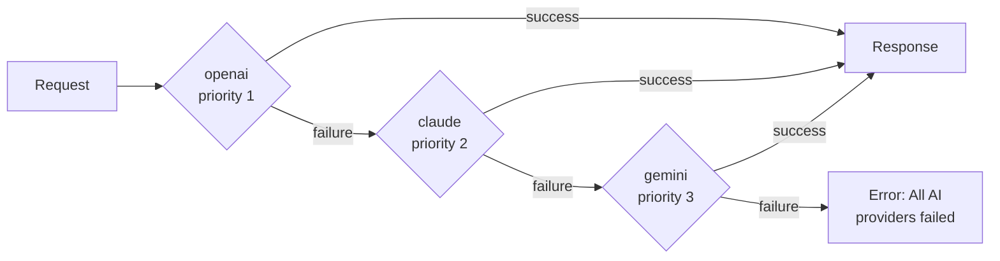

# Container Deployment

## 🔄 High Availability

### Provider Failover

```javascript
class {
    property name="providers" type="array";
    property name="currentProvider" type="numeric" default="1";

    function init() {
        variables.providers = [
            { name: "openai", priority: 1 },
            { name: "claude", priority: 2 },
            { name: "gemini", priority: 3 }
        ]
        return this
    }

    function callWithFailover( required string prompt, struct params = {} ) {
        for ( var provider in variables.providers ) {
            try {
                writeLog( "Attempting provider: #provider.name#" )

                return aiChat(
                    arguments.prompt,
                    arguments.params,
                    { provider: provider.name }
                )

            } catch ( any e ) {
                writeLog(
                    "Provider #provider.name# failed: #e.message#",
                    "warning"
                )

                // Continue to next provider
                if ( provider.priority == arrayLen( variables.providers ) ) {
                    throw "All AI providers failed"
                }
            }
        }
    }
}
```

The failover loop tries providers in priority order, falling through to the next one on any error:



### Load Balancing

```javascript
class {
    property name="providers" type="array";
    property name="currentIndex" type="numeric" default="1";

    function init() {
        variables.providers = [ "openai", "claude", "gemini" ]
        return this
    }

    function getNextProvider() {
        lock name="loadbalancer" type="exclusive" timeout="5" {
            var provider = variables.providers[ variables.currentIndex ]
            variables.currentIndex++

            if ( variables.currentIndex > arrayLen( variables.providers ) ) {
                variables.currentIndex = 1
            }

            return provider
        }
    }

    function callBalanced( required string prompt, struct params = {} ) {
        var provider = getNextProvider()
        return aiChat(
            arguments.prompt,
            arguments.params,
            { provider: provider }
        )
    }
}
```

***


## 📦 Container Deployment

### Docker Configuration

```dockerfile
# Dockerfile
FROM ortussolutions/boxlang:1.0.0

# Install module
RUN box install bx-ai

# Copy application
COPY . /app
WORKDIR /app

# Health check
HEALTHCHECK --interval=30s --timeout=10s --start-period=40s --retries=3 \
    CMD curl -f http://localhost:8080/health || exit 1

# Environment variables (override in deployment)
ENV OPENAI_API_KEY=""
ENV CLAUDE_API_KEY=""
ENV AI_TIMEOUT=10
ENV AI_MAX_RETRIES=3

EXPOSE 8080

CMD ["boxlang", "server.bxs"]
```

### Docker Compose

```yaml
# docker-compose.yml
version: '3.8'

services:
  app:
    build: .
    ports:
      - "8080:8080"
    environment:
      - OPENAI_API_KEY=${OPENAI_API_KEY}
      - CLAUDE_API_KEY=${CLAUDE_API_KEY}
      - DATABASE_URL=${DATABASE_URL}
      - REDIS_URL=${REDIS_URL}
    depends_on:
      - postgres
      - redis
    restart: unless-stopped

  postgres:
    image: pgvector/pgvector:pg16
    environment:
      - POSTGRES_DB=ai_db
      - POSTGRES_USER=aiuser
      - POSTGRES_PASSWORD=${DB_PASSWORD}
    volumes:
      - postgres_data:/var/lib/postgresql/data
    restart: unless-stopped

  redis:
    image: redis:7-alpine
    command: redis-server --appendonly yes
    volumes:
      - redis_data:/data
    restart: unless-stopped

  chroma:
    image: chromadb/chroma:latest
    ports:
      - "8000:8000"
    volumes:
      - chroma_data:/chroma/chroma
    restart: unless-stopped

volumes:
  postgres_data:
  redis_data:
  chroma_data:
```

### Kubernetes Deployment

```yaml
# deployment.yaml
apiVersion: apps/v1
kind: Deployment
metadata:
  name: boxlang-ai-app
spec:
  replicas: 3
  selector:
    matchLabels:
      app: boxlang-ai
  template:
    metadata:
      labels:
        app: boxlang-ai
    spec:
      containers:
      - name: app
        image: myregistry/boxlang-ai:latest
        ports:
        - containerPort: 8080
        env:
        - name: OPENAI_API_KEY
          valueFrom:
            secretKeyRef:
              name: ai-secrets
              key: openai-api-key
        - name: CLAUDE_API_KEY
          valueFrom:
            secretKeyRef:
              name: ai-secrets
              key: claude-api-key
        resources:
          requests:
            memory: "512Mi"
            cpu: "500m"
          limits:
            memory: "2Gi"
            cpu: "2000m"
        livenessProbe:
          httpGet:
            path: /health
            port: 8080
          initialDelaySeconds: 30
          periodSeconds: 10
        readinessProbe:
          httpGet:
            path: /health
            port: 8080
          initialDelaySeconds: 5
          periodSeconds: 5
---
apiVersion: v1
kind: Service
metadata:
  name: boxlang-ai-service
spec:
  selector:
    app: boxlang-ai
  ports:
  - protocol: TCP
    port: 80
    targetPort: 8080
  type: LoadBalancer
```

***

