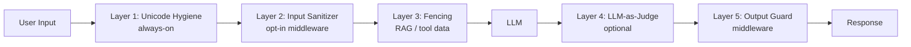

# Security Guide

Comprehensive security guide for BoxLang AI applications. Learn about API key management, input validation, prompt injection prevention, data privacy, multi-tenant security, and compliance best practices.

***

## 🛡️ Security Overview

### Security Principles

**Key security considerations for AI applications**:

1. **🔑 Credential Security** - Protect API keys and secrets
2. **🚫 Input Validation** - Sanitize all user inputs
3. **🛡️ Prompt Injection** - Defend against manipulation attacks
4. **🔒 Data Privacy** - Handle sensitive data appropriately
5. **👥 Multi-Tenancy** - Isolate user data completely
6. **📊 PII Protection** - Detect and redact personal information
7. **📝 Audit Trails** - Log all AI interactions
8. **⚖️ Compliance** - Meet regulatory requirements (GDPR, HIPAA, etc.)

### Threat Model

**Common AI application threats**:

| Threat            | Impact                               | Mitigation                                  |
| ----------------- | ------------------------------------ | -------------------------------------------- |
| API Key Exposure  | Unauthorized access, billing fraud   | Secrets manager, rotation                   |
| Prompt Injection  | Data leakage, unauthorized actions   | Input validation, system message protection |
| Data Leakage      | Privacy breach, compliance violation | PII detection, redaction                    |
| Excessive Usage   | Cost overruns, DoS                   | Rate limiting, quotas                       |
| Model Poisoning   | Incorrect responses                  | Output validation                           |
| Data Exfiltration | Sensitive data exposure              | Access controls, auditing                   |

### 🛡️ Built-In Guardrail Layers

BoxLang AI ships **five layered, configurable defenses** against prompt injection, applied in sequence from user input through to the response. See [Input Validation & Prompt Injection Prevention](input-validation-and-prompt-injection.md) for the full details of each layer.

***

## 📖 Sub-Pages

| Page | Description |
|---|---|
| [API Key Management](api-keys.md) | Secrets managers, key rotation, and environment-scoped keys |
| [Input Validation & Prompt Injection Prevention](input-validation-and-prompt-injection.md) | Sanitizing user input and the five built-in guardrail layers |
| [Tool & Function Calling Security](tool-calling-security.md) | Validating parameters and sandboxing tool execution |
| [Data Validation](data-validation.md) | Validating external data sources and web search results |
| [Output Validation](output-validation.md) | Output Guard middleware, application-level checks, structured output |
| [Data Privacy & Compliance](data-privacy-and-compliance.md) | PII detection, encryption, GDPR, and HIPAA |
| [Multi-Tenant Security](multi-tenant-security.md) | Complete isolation, namespace isolation, row-level security |
| [Audit Logging](audit-logging.md) | Comprehensive logging and the audit query API |
| [Network & Configuration Hardening](network-and-config-hardening.md) | Environment-specific settings, security headers, TLS |
| [Incident Response](incident-response.md) | Handling and triaging security incidents |
| [Appendix: Hand-Rolled Patterns](appendix-hand-rolled-patterns.md) | Pre-built-in patterns, for cases the built-ins don't cover |

***

## 📚 Additional Resources

* 🛡️ [Middleware](../../main-components/middleware.md) — every security middleware's full constructor reference
* 🧑‍⚖️ [Human-in-the-Loop](../../main-components/human-in-the-loop.md) — human approval for sensitive tool calls
* 🔌 [Gateways](../../main-components/gateways.md) — HMAC-signed HTTP delivery for approvals and events
* 🚀 [Production Deployment](../production.md)
* 📖 [Main Documentation](../../)
* 💬 [FAQ](../../readme/faq.md)
* 🧠 [Key Concepts](../../getting-started/concepts.md)
* 🎯 [Best Practices](../../main-components/chatting/advanced-chatting.md)

***

## ✅ Security Checklist

Before deploying:

* [ ] API keys in secrets manager (never hardcoded)
* [ ] Input validation on all user inputs
* [ ] Prompt injection prevention implemented
* [ ] Output validation and filtering
* [ ] PII detection and redaction
* [ ] Multi-tenant isolation verified
* [ ] Audit logging enabled
* [ ] Data encryption at rest and in transit
* [ ] GDPR/HIPAA compliance (if applicable)
* [ ] Rate limiting configured
* [ ] Security headers set
* [ ] HTTPS enforced
* [ ] Incident response plan documented
* [ ] Security testing completed
* [ ] Penetration testing performed
