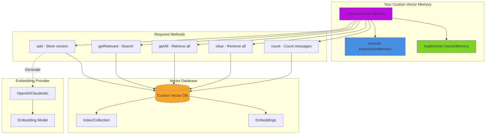

# Custom Vector Memory

This guide shows you how to create custom vector memory implementations by extending `BaseVectorMemory` and implementing the `IVectorMemory` interface. Custom vector memories allow you to integrate with any vector database or implement specialized semantic search behaviors.

## 🏗️ Custom Vector Memory Architecture




## 🎯 When to Build Custom Vector Memory

Consider building a custom vector memory when:

* **Integrating New Vector Databases**: Your organization uses a vector database not natively supported (e.g., Elasticsearch, MongoDB Atlas Vector Search, Redis Vector)
* **Custom Embedding Logic**: You need specialized embedding generation (e.g., custom models, pre-processing, caching)
* **Specialized Search**: You require advanced filtering, hybrid search, or custom ranking algorithms
* **Performance Optimization**: You need specific optimizations for your use case (e.g., approximate nearest neighbor tuning)
* **Multi-Collection Management**: You need to search across multiple collections with custom merging logic
* **Access Control**: You require row-level security or tenant isolation in vector search


## 📚 Understanding BaseVectorMemory

The `BaseVectorMemory` class provides most of the functionality you need:

### What BaseVectorMemory Provides

```js
// Automatic handling of:
- Message storage and retrieval
- Embedding generation via configured provider
- Basic configuration management
- Message counting and clearing
- Export/import functionality (partial)
- System message handling
```

### What You Need to Implement

When extending `BaseVectorMemory`, you must implement these key methods:

```js
/**
 * Store a message with its vector representation
 */
function add( required any message )

/**
 * Retrieve semantically relevant messages
 */
function getRelevant( required string query, numeric limit = 5 )

/**
 * Get all stored messages (for non-vector operations)
 */
function getAll()

/**
 * Remove all messages from vector storage
 */
function clear()

/**
 * Count total messages in vector storage
 */
function count()
```

### Key Properties in BaseVectorMemory

```js
variables.collection           // Collection/index name
variables.embeddingProvider    // AI provider for embeddings (openai, etc.)
variables.embeddingModel       // Model to use (text-embedding-3-small, etc.)
variables.dimensions           // Vector dimensions (1536, 768, etc.)
variables.metric               // Distance metric (cosine, euclidean, dot)
variables.key                  // Conversation/session identifier
```


## 🔌 IVectorMemory Interface

The complete interface you must implement:

```js
interface {
    /**
     * Configure the vector memory
     */
    function configure( required struct config );

    /**
     * Set the conversation key
     */
    function key( required string key );

    /**
     * Add a message to vector storage
     */
    function add( required any message );

    /**
     * Get semantically relevant messages
     */
    function getRelevant( required string query, numeric limit = 5 );

    /**
     * Get all stored messages
     */
    function getAll();

    /**
     * Clear all messages
     */
    function clear();

    /**
     * Count stored messages
     */
    function count();

    /**
     * Set system message
     */
    function setSystemMessage( required string message );

    /**
     * Get system message
     */
    function getSystemMessage();

    /**
     * Export memory state
     */
    function export();

    /**
     * Import memory state
     */
    function import( required struct data );
}
```


## 📖 Sub-Pages

| Page | Description |
|---|---|
| [Examples](examples.md) | Four complete implementations: Elasticsearch, Redis, Cached, and Multi-Collection vector memory |
| [Testing & Best Practices](testing-and-best-practices.md) | Unit testing strategies and best practices for custom vector memory |
| [Common Patterns](common-patterns.md) | Reusable patterns for custom vector memory implementations |

## Related Documentation

* [Vector Memory Overview](../../main-components/memory/vector-memory/README.md) - Learn about built-in vector memory types
* [Custom Memory](../custom-memory.md) - Create custom standard memory implementations
* [Memory Systems](../../main-components/memory/) - Understanding memory in BoxLang AI
* [Embeddings](../../rag/embeddings.md) - Working with vector embeddings

## Next Steps

1. **Start Simple**: Begin with BoxVector or extend an existing provider
2. **Test Thoroughly**: Write comprehensive unit tests
3. **Monitor Performance**: Track query times and cache hit rates
4. **Optimize**: Add caching, batching, and connection pooling
5. **Document**: Provide clear usage examples and configuration options

## Need Help?

* **Community**: [BoxLang Discord](https://discord.gg/boxlang)
* **Documentation**: [BoxLang AI Docs](https://github.com/ortus-boxlang/bx-ai)
* **Examples**: See `/examples/vector-memory/` for working examples
