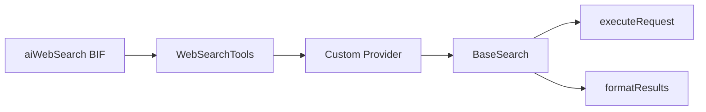

# Building Custom Web Search Providers

Create your own web search provider when you need to integrate an API that is not shipped with the module.

## Architecture

Custom providers implement `IWebSearch` by extending `BaseSearch`.



## Required Contract

Your provider must implement:

- `getName()` returning a unique provider name
- `configure( config )` to merge provider settings
- `doSearch( query, options )` to execute search and return normalized results

## Result Schema

Use `formatResults()` from `BaseSearch` to normalize raw provider payloads into:

- `title`
- `url`
- `snippet`
- `publishedDate`
- `domain`
- `score`
- `thumbnail`
- `language`

## API Key Resolution Pattern

Use `resolveApiKey( envVar, settingKey )` for this precedence:

1. Constructor config
2. Module settings
3. Environment variable

## Example: Custom News Provider

```javascript
class extends="BaseSearch" {

    property name="apiKey" type="string" default="";

    function getName() {
        return "newsapi"
    }

    function configure( required struct config ) {
        super.configure( arguments.config )
        variables.apiKey = resolveApiKey( "NEWS_API_KEY", "newsApiKey" )
        return this
    }

    array function doSearch( required string query, struct options = {} ) {
        if ( !isNull( arguments.options ) && arguments.options.count() ) {
            configure( arguments.options )
        }

        if ( !len( variables.apiKey ) ) {
            throw( type: "MissingAPIKey", message: "NEWS_API_KEY is required for newsapi provider" )
        }

        var limit = arguments.options.maxResults ?: variables.maxResults

        var response = executeRequest(
            url: "https://newsapi.example.com/search?q=#encodeSearchQuery( arguments.query )#&limit=#limit#",
            method: "GET",
            headers: {
                "Authorization": "Bearer #variables.apiKey#"
            }
        )

        if ( response.statusCode != 200 ) {
            throw(
                type: "NewsApiError",
                message: "News API returned HTTP #response.statusCode#"
            )
        }

        var payload = jsonDeserialize( response.fileContent ?: "{}" )
        var raw = payload.results ?: []

        return formatResults( raw )
    }
}
```

## Event Lifecycle

`BaseSearch` automatically fires these events:

- `beforeAIWebSearch`
- `onAIWebSearchRequest`
- `onAIWebSearchResponse`
- `afterAIWebSearch`
- `onAIWebSearchError`

This gives you observability and centralized interception without extra provider code.

## Registering Your Provider

Update provider map in `WebSearchTools`:

```javascript
static {
    PROVIDER_MAP = {
        "http"    : "bxModules.bxai.models.tools.search.HttpSearch",
        "newsapi" : "bxModules.bxai.models.tools.search.NewsApiSearch"
    }
}
```

## Testing Pattern

1. Add provider API key in test setup (module settings/env var).
2. Use assumption-based tests when key is optional in CI.
3. Assert normalized output fields, not raw provider fields.

```javascript
results = aiWebSearch( "BoxLang", { provider: "newsapi", maxResults: 3 } )
expect( results ).toBeArray()
expect( results.len() ).toBeGTE( 1 )
expect( results[ 1 ] ).toHaveKey( "title" )
expect( results[ 1 ] ).toHaveKey( "url" )
expect( results[ 1 ] ).toHaveKey( "score" )
```

## Security Notes

- Treat provider responses as untrusted input.
- Sanitize snippets before injecting into prompts.
- Apply domain allow/block filters for regulated workloads.
- Avoid logging full response payloads when sensitive data may appear.

## Related

- [Custom AI Providers](custom-providers.md)
- [Web Search Overview](../main-components/web-search/README.md)
- [Security Guide](../deployment/security.md)
