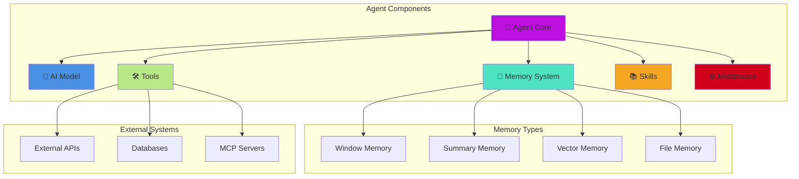
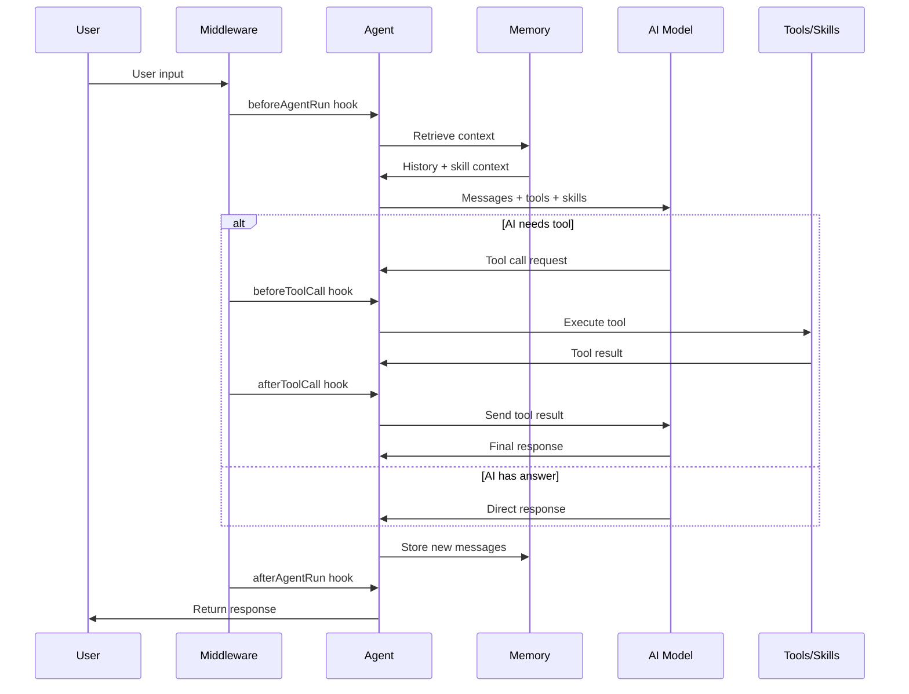

# AI Agents

AI Agents are autonomous entities that can reason, use tools, and maintain conversation memory. Inspired by LangChain agents but "Boxified" for simplicity and productivity, agents handle complex AI workflows by automatically managing state, context, and tool execution.

## 🎯 What are AI Agents?

An agent is more than a simple chat interface — it's an intelligent entity that:

* **Maintains Memory** — Remembers conversation history across interactions
* **Uses Tools** — Can call functions to access data, perform calculations, or interact with systems
* **Applies Skills** — Injects domain knowledge into the system context (v3.0+)
* **Runs Middleware** — Intercepts lifecycle events for logging, retry, and guardrails (v3.0+)
* **Reasons and Plans** — Determines when and how to use tools to accomplish tasks
* **Delegates to Sub-Agents** — Can orchestrate specialized sub-agents for complex tasks
* **Integrates with Pipelines** — Works seamlessly as a stage in BoxLang AI pipelines

## 🏗️ Agent Architecture



## 🔄 Agent Decision Flow



## 📖 Sub-Pages

| Page | Description |
|---|---|
| [Getting Started](getting-started.md) | Creating agents, configuration, model selection, return formats |
| [Class-Based Agents](class-based-agents.md) | Build encapsulated reusable agents by extending `AiAgent` |
| [Memory Management](memory.md) | Memory types, per-call identity routing, resume/suspend, multi-tenant |
| [Tools & MCP](tools-and-mcp.md) | Tool Registry, ClosureTool, MCP server seeding |
| [Skills](skills.md) | Always-on and lazy-loaded skills for domain knowledge injection |
| [Middleware](middleware.md) | Lifecycle hooks for logging, retry, guardrails, human-in-the-loop |
| [Sub-Agents & Hierarchy](hierarchy.md) | Parent-child agent delegation patterns |
| [Streaming](streaming.md) | Real-time streaming responses |
| [RAG & Document Loading](rag.md) | Knowledge base integration and document retrieval |
| [Transformers](transformers.md) | Input/output transformation and structured data extraction |
| [Advanced Patterns](advanced.md) | Pipelines, event interception, best practices |

## Quick Start

```javascript
// Minimal agent
agent = aiAgent(
    name: "Assistant",
    description: "A helpful AI assistant",
    instructions: "Be concise and friendly"
)

response = agent.run( "What is BoxLang?" )
println( response )
```

```javascript
// Full-featured agent (v3.0)
agent = aiAgent(
    name           : "SupportBot",
    description    : "Customer support specialist",
    instructions   : "Help customers with product questions",
    model          : aiModel( "openai" ),
    tools          : [ searchTool, ticketTool ],
    memory         : aiMemory( "cache" ),
    skills         : aiSkill( ".ai/skills" ),
    availableSkills: aiSkill( ".ai/advanced-skills" ),
    middleware     : [ new LoggingMiddleware(), new RetryMiddleware() ],
    mcpServers     : [ { url: "http://tools-server/mcp", toolNames: ["search"] } ]
)

response = agent.run( "My order hasn't arrived" )
```

## Related Documentation

* [AI Skills](../skills.md) — Full skills reference
* [Tool Registry](../tool-registry.md) — Global tool registry
* [Middleware](../middleware.md) — Full middleware reference
* [Human-in-the-Loop](../human-in-the-loop.md) — Suspend an agent for approval before sensitive tool calls
* [Memory Systems](../memory/README.md) — Memory configuration
* [Pipelines](../pipelines/README.md) — Using agents in pipelines
* [Security Guide](../../deployment/security.md) — Guardrails against prompt injection and data leakage
