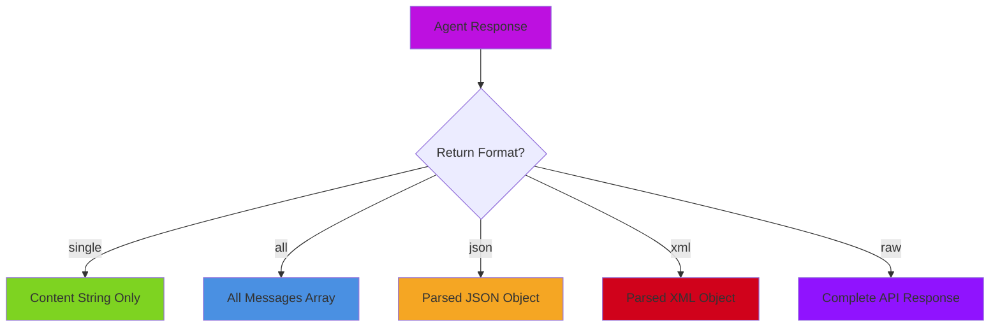

# Getting Started with Agents

## Basic Agent

```javascript
// Simple agent with default settings
agent = aiAgent(
    name: "Assistant",
    description: "A helpful AI assistant",
    instructions: "Be concise and friendly"
)

response = agent.run( "What is BoxLang?" )
println( response )
```

## Agent with a Custom Model

```javascript
// Agent with a specific AI model
model = aiModel( provider: "claude" )

agent = aiAgent(
    name  : "Claude Assistant",
    model : model,
    params: { temperature: 0.7 }
)
```

💡 Use [predefined providers](../../getting-started/installation/provider-setup.md) in your module configuration to centrally manage model defaults without repeating credentials everywhere.

## Agent with Tools

Tools enable agents to perform real-world actions:

```javascript
// Create tools
weatherTool = aiTool(
    "get_weather",
    "Get current weather for a location",
    location => getWeatherData( location )
).describeLocation( "City and country, e.g. Boston, MA" )

calculatorTool = aiTool(
    "calculate",
    "Perform mathematical calculations",
    expression => evaluate( expression )
).describeExpression( "Math expression to evaluate" )

// Create agent with tools
agent = aiAgent(
    name        : "TaskAgent",
    description : "An agent that can check weather and do math",
    instructions: "Use tools when needed. Be precise and helpful.",
    tools       : [ weatherTool, calculatorTool ]
)

// Agent automatically uses tools when needed
response = agent.run( "What's the weather in Boston and what's 15% of 250?" )
```

## Agent with Web Search (v3.2+)

Use the auto-registered `webSearch@bxai` tool when the agent needs current internet data.

```javascript
agent = aiAgent(
    name: "ResearchAssistant",
    instructions: "Use web search for current information and cite your sources.",
    tools: [ "webSearch@bxai" ]
)

response = agent.run( "Find the latest BoxLang AI release notes and summarize the key points." )
```

See [Web Search Tools](../web-search/README.md) for provider setup and options.

## Agent with Skills (v3.0+)

Skills inject domain knowledge into the agent's system context:

```javascript
// Always-on skills: content always injected into system context
// Lazy skills: only loaded when the AI requests them
agent = aiAgent(
    name           : "CodeReviewer",
    instructions   : "Review code for quality and security",
    skills         : aiSkill( ".ai/skills/security" ),       // always-on
    availableSkills: aiSkill( ".ai/skills/languages" )       // lazy-loaded
)

response = agent.run( "Review this Python function: ..." )
```

See [Skills](skills.md) for the full skills guide.

## Agent with MCP Servers (v3.0+)

Seed tools from external MCP servers:

```javascript
agent = aiAgent(
    name      : "ResearchAgent",
    mcpServers: [
        {
            url      : "http://localhost:3000/mcp",
            toolNames: [ "web_search", "fetch_page" ]
        }
    ]
)

response = agent.run( "Find recent news about BoxLang" )
```

See [Tools & MCP](tools-and-mcp.md) for the full MCP integration guide.

## Agent with the Agent Registry (v3.2.0+)

The **Agent Registry** provides centralized agent management for discoverability, observability, and analytics. Register agents once and resolve them anywhere.

```javascript
// Register at creation time
agent = aiAgent(
    name: "support-agent",
    description: "Customer support agent",
    instructions: "Help customers with their questions",
    register: true,       // Auto-register in the global registry
    module: "my-app"      // Optional module namespace
)

// Or register manually
aiAgentRegistry().register( agent, "my-app" )

// List all registered agents
agents = aiAgentRegistry().listAgents()

// Resolve agents by name
resolved = aiAgentRegistry().resolveAgents( [
    "support-agent@my-app",
    anotherAgentInstance
] )

// Get agent info
info = aiAgentRegistry().getAgentInfo( "support-agent@my-app" )
// Returns: { name: "support-agent", description: "...", module: "my-app" }

// Unregister when done
aiAgentRegistry().unregister( "support-agent@my-app" )

// Get an agent
agent = aiAgentRegistry().get( "support-agent@my-app" )
```

> 💡 **Default:** `register: false` — agents are NOT auto-registered by default to prevent memory leaks from sub-agents and throwaway agents.

See [Agent Registry](../tool-registry.md#agent-registry) for the full registry API.

## Fluent Configuration

For runtime changes, use setter methods:

```javascript
agent = aiAgent(
    name       : "Assistant",
    description: "Helpful assistant"
)
    .setModel( aiModel( provider: "claude" ) )
    .addTool( searchTool )
    .addMemory( customMemory )
    .setParam( "temperature", 0.7 )

response = agent.run( "Help me with this task" )
```

## Class-Based Agents

If you want reusable, encapsulated agents for larger applications, see:

* [Class-Based Agents](class-based-agents.md)

## ⚙️ Constructor Parameters

| Parameter | Type | Description |
| --- | --- | --- |
| `name` | string | Agent name (also used as identifier) |
| `description` | string | What this agent does (used in sub-agent delegation) |
| `instructions` | string | System-level instructions for the agent |
| `model` | AiModel / string | AI model instance or provider name |
| `tools` | array | Array of `Tool` / `ITool` instances |
| `memory` | IAiMemory / array | Memory instance(s) for conversation history |
| `params` | struct | Model parameters (temperature, max_tokens, etc.) |
| `options` | struct | Execution options (returnFormat, etc.) |
| `subAgents` | array | Child agents for delegation |
| `skills` | array | Always-on skills (v3.0+) |
| `availableSkills` | array | Lazy-loaded skills (v3.0+) |
| `middleware` | array | Middleware instances or structs (v3.0+) |
| `mcpServers` | array | MCP server configs `{ url, toolNames }` (v3.0+) |
| `register` | boolean | Auto-register in the Agent Registry (v3.2.0+, default: `false`) |
| `module` | string | Module namespace for the registry (v3.2.0+) |
| `checkpointer` | IAiMemory | Memory backend for suspend/resume (v3.0+) |

## 📤 Return Formats

Agents support five return formats: `single` (default), `all`, `json`, `xml`, and `raw`.



### `single` (Default)

Returns just the assistant's content as a string:

```javascript
content = agent.run( "Hello" )
println( content )  // "Hello! How can I help you?"

// Explicitly specify (same result)
content = agent.run( "Hello", {}, { returnFormat: "single" } )
```

### `all`

Returns all messages including system, memory context, and response:

```javascript
allMessages = agent.run( "Hello", {}, { returnFormat: "all" } )
// Returns array of { role, content } structs
```

### `raw`

Returns the full provider response structure with metadata:

```javascript
rawResponse = agent.run( "Hello", {}, { returnFormat: "raw" } )
println( rawResponse.usage.total_tokens )
println( rawResponse.model )
```

### `json` / `xml`

Asks the agent to return its response in the specified format and parses it:

```javascript
jsonResponse = agent.run( "List top 3 cities", {}, { returnFormat: "json" } )
xmlResponse  = agent.run( "List top 3 cities", {}, { returnFormat: "xml" } )
```

## Agent Introspection

```javascript
config = agent.getConfig()

println( config.name )                    // "Inspector"
println( config.description )             // "Analysis agent"
println( config.model.provider )          // "openai"
println( config.model.toolCount )         // 2
println( config.activeSkillCount )        // Skills injected into context
println( config.availableSkillCount )     // Lazy skills in the pool
config.memories.each( mem => {
    println( mem.type )                   // "SessionMemory"
    println( mem.messageCount )           // Number of stored messages
} )
```

## Set Appropriate Parameters

```javascript
// For creative tasks: higher temperature
creativeAgent = aiAgent(
    name  : "Writer",
    params: { temperature: 0.8, max_tokens: 1000 }
)

// For factual tasks: lower temperature
factualAgent = aiAgent(
    name  : "Analyzer",
    params: { temperature: 0.2, max_tokens: 500 }
)
```

## Related Pages

* [Memory Management](memory.md)
* [Tools & MCP](tools-and-mcp.md)
* [Skills](skills.md)
* [Middleware](middleware.md)
* [Run Control](run-control.md)
* [Streaming](streaming.md)
* [Sub-Agents & Hierarchy](hierarchy.md)
