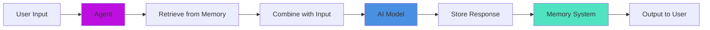

# Agent Memory Management

Agents automatically maintain conversation history through their memory system. Memory is retrieved before each model call and stored after each response.

## 🔄 Memory Flow



## Basic Memory (Window Memory)

```javascript
// Agent with conversation memory
agent = aiAgent(
    name       : "ChatBot",
    description: "A conversational assistant",
    memory     : aiMemory( "window" )
)

// First interaction
agent.run( "My name is Luis" )

// Second interaction — agent remembers
agent.run( "What's my name?" )
// → "Your name is Luis"

// Access memory messages
messages = agent.getMemoryMessages()

// Clear memory when needed
agent.clearMemory()
```

## Multiple Memory Systems

Agents can use multiple memory instances simultaneously — useful for combining conversation history with vector/semantic memory:

```javascript
agent = aiAgent(
    name   : "SmartAgent",
    memory : [
        aiMemory( "window" ),          // Recent conversation history
        aiMemory( memory: "pinecone", config: {        // Semantic long-term memory
            collection        : "projects",
            embeddingProvider : "openai"
        } )
    ]
)

// Agent stores to all memory systems and retrieves from all
agent.run( "Remember this: BoxLang is awesome" )
```

## Per-Call Identity Routing (v3.0+)

In v3.0, you can route memory operations to specific users and conversations by passing `userId` and `conversationId` per call — one agent instance can serve multiple users without sharing state:

```javascript
// Single shared agent instance
agent = aiAgent(
    name  : "SupportBot",
    memory: aiMemory( "cache" )
)

// Route to user Alice, conversation #1
agent.run(
    input  : "What is BoxLang?",
    options: { userId: "alice", conversationId: "conv-001" }
)

// Route to user Bob, separate conversation
agent.run(
    input  : "Help me with billing",
    options: { userId: "bob", conversationId: "conv-002" }
)

// Alice's next message — picks up exactly where she left off
agent.run(
    input  : "Tell me more",
    options: { userId: "alice", conversationId: "conv-001" }
)
```

The underlying memory operations (`add`, `getAll`, `clear`, `trim`, `seed`) all accept `userId` and `conversationId` as optional per-call overrides, so routing happens transparently.

## Suspend & Resume (v3.0+)

Agents can be suspended mid-run (e.g., by `HumanInTheLoopMiddleware`) and resumed later. A `checkpointer` memory backend stores the agent's state:

```javascript
import bxModules.bxai.models.middleware.core.HumanInTheLoopMiddleware;

agent = aiAgent(
    name        : "ApprovalAgent",
    tools       : [ deployTool ],
    checkpointer: aiMemory( "cache" ),  // Stores suspend state
    middleware  : [ new HumanInTheLoopMiddleware(
        mode                  : "web",
        toolsRequiringApproval: [ "deploy" ]
    ) ]
)

// YOU supply the threadId — it is how you find this run again later
threadId = "deploy-#createUUID()#"

result = agent.run( "Deploy to production", {}, { threadId: threadId } )

if ( result.isSuspended() ) {
    // Every tool call awaiting a decision
    pending = result.getData().pendingActions
    println( "Waiting for approval on #pending.len()# tool call(s). Thread: #threadId#" )
}

// Later — resume with a human decision
finalResponse = agent.resume( "approve", threadId )
```


The suspension result does **not** carry a thread id — you pass `threadId` into `run()` and reuse it in `resume()`. Valid decisions are `approve`, `approve_always`, `approve_session`, `reject`, `edit`, and `cancel`.


For streaming agents use `resumeStream( onChunk, decision, threadId )`. See [Human-in-the-Loop](../human-in-the-loop.md) for approval policies, durable grants, and batched approvals.

## 🏢 Multi-Tenant Usage Tracking

Track AI usage per tenant for billing and cost allocation:

```javascript
// Run with tenant context
response = agent.run(
    input  : "How do I reset my password?",
    options: {
        tenantId     : "customer_acme",
        usageMetadata: {
            department : "support",
            ticketId   : "TICK-12345",
            userId     : "john@acme.com"
        }
    }
)
```

Usage data (tokens, model, tenant) is fired as an `onAITokenCount` event on every call:

```javascript
// Listen for token usage across all tenants
BoxRegisterInterceptor( "onAITokenCount", function( data ) {
    cost = calculateCost( data.totalTokens, data.model )
    billingService.record( data.tenantId, cost, data.usageMetadata )
} )
```

See [Multi-Tenant Memory Guide](../memory/multi-tenant-memory.md) for a comprehensive multi-tenancy setup.

## Memory Types Quick Reference

| Type | Best For |
|---|---|
| `window` | Simple session conversations (in-memory, lost on restart) |
| `cache` | Persistent across requests within cache TTL |
| `file` | Long-lived conversations stored to disk as JSON |
| `session` | Web applications tied to HTTP session |
| `summary` | Long conversations (older messages are AI-summarized) |
| `jdbc` | Full database persistence with SQL queries |
| `hybrid` | Recent window + semantic retrieval combined |
| `box` / `chroma` / `pinecone` / etc. | Vector-backed semantic memory |

See [Memory Systems](../memory/README.md) for complete configuration options.

## Related Pages

* [Memory Systems](../memory/README.md) — All memory types, configuration
* [Multi-Tenant Memory Guide](../memory/multi-tenant-memory.md) — Multi-tenant patterns
* [Vector Memory Systems](../memory/vector-memory.md) — Vector/semantic memory
* [Middleware](middleware.md) — HumanInTheLoopMiddleware for suspend/resume
