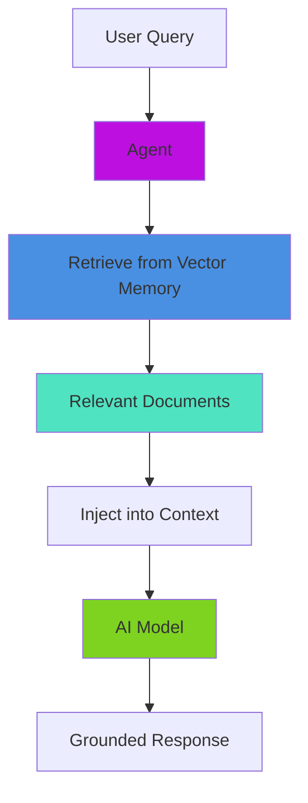

# RAG & Document Loading

Agents can leverage document loaders and vector memory to access knowledge bases and provide grounded, factual responses.

## 🔄 Agent RAG Workflow



## Basic RAG Agent

```javascript
// Step 1: Create vector memory
vectorMemory = aiMemory( memory: "chroma", config: {
    collection       : "product_docs",
    embeddingProvider: "openai",
    embeddingModel   : "text-embedding-3-small"
} )

// Step 2: Ingest documents
result = aiDocuments( "/docs/products", {
    type      : "directory",
    recursive : true,
    extensions: [ "md", "txt", "pdf" ]
} ).toMemory(
    memory  : vectorMemory,
    options : { chunkSize: 1000, overlap: 200 }
)

println( "Loaded #result.documentsIn# documents as #result.chunksOut# chunks" )

// Step 3: Create agent with vector memory
agent = aiAgent(
    name        : "Product Support",
    description : "Product documentation specialist",
    instructions: "Answer questions using the product documentation. Always cite sources.",
    memory      : vectorMemory
)

// Step 4: Query — agent automatically retrieves relevant docs
response = agent.run( "How do I configure SSL certificates?" )
```

## Multi-Source RAG Agent

Combine multiple knowledge bases by passing an array of memories:

```javascript
productDocs = aiMemory( memory: "chroma", config: { collection: "product_docs" } )
apiDocs     = aiMemory( memory: "chroma", config: { collection: "api_docs" } )
faqMemory   = aiMemory( memory: "chroma", config: { collection: "faq" } )

// Ingest each source
aiDocuments( "/docs/products", { type: "directory" } ).toMemory( productDocs )
aiDocuments( "/docs/api",      { type: "directory" } ).toMemory( apiDocs )
aiDocuments( "/docs/faq.md",   { type: "markdown"  } ).toMemory( faqMemory )

// Agent searches across all knowledge bases
agent = aiAgent(
    name    : "Knowledge Assistant",
    memories: [ productDocs, apiDocs, faqMemory ]
)

response = agent.run( "Explain the authentication API" )
```

## RAG Agent with Real-Time Tools

Combine document retrieval with live data access:

```javascript
docMemory = aiMemory( memory: "chroma", config: { collection: "documentation" } )
aiDocuments( "/docs", { type: "directory" } ).toMemory( docMemory )

statusTool = aiTool(
    "check_system_status",
    "Check current system status and metrics",
    () => getCurrentSystemStatus()
)

agent = aiAgent(
    name        : "System Assistant",
    instructions: "Use docs for general questions. Use the status tool for real-time data.",
    memory      : docMemory,
    tools       : [ statusTool ]
)

// Agent selects the right approach per query
agent.run( "What are the system requirements?" )  // → uses docs
agent.run( "Is the system currently running?" )   // → uses statusTool
```

## 📚 For Full RAG Capabilities

This page covers agent-level RAG setup. For deeper detail on:

* **Document loaders** (PDF, CSV, JSON, XML, HTTP, web crawlers, SQL, etc.) — see [Document Loaders](../../rag/document-loaders.md)
* **Chunking strategies, batch loading, async ingestion** — see [RAG Guide](../../rag/rag.md)
* **Vector memory configuration** (Pinecone, Chroma, Qdrant, pgvector, etc.) — see [Vector Memory Systems](../memory/vector-memory/README.md)

## Related Pages

* [Memory Management](memory.md) — Memory types and per-call identity routing
* [Vector Memory Systems](../memory/vector-memory/README.md) — Full vector store configuration
* [Document Loaders](../../rag/document-loaders.md) — All loader types
* [RAG Guide](../../rag/rag.md) — End-to-end RAG implementation
