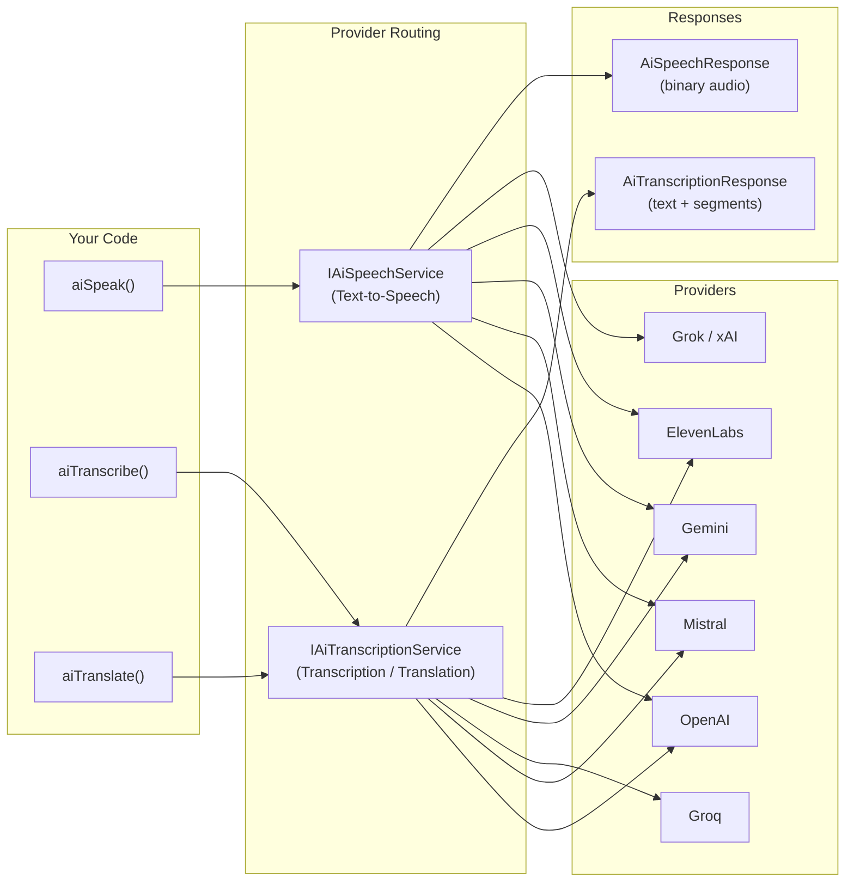

# 🔊 Audio — Speech & Transcription

BoxLang AI provides three first-class audio operations through a unified BIF interface: **Text-to-Speech** (`aiSpeak`), **Speech-to-Text** (`aiTranscribe`), and **Audio Translation** (`aiTranslate`). Each BIF works across all supported providers with consistent parameters and return values, so you can switch providers without rewriting application code.

## 🏗️ Architecture



## 📊 Provider Support Matrix

| Provider | TTS (`aiSpeak`) | STT (`aiTranscribe`) | Translation (`aiTranslate`) | Env Var |
|---|---|---|---|---|
| **OpenAI** | ✅ `tts-1` | ✅ `whisper-1` | ✅ | `OPENAI_API_KEY` |
| **Mistral** | ✅ `voxtral-mini-tts-2603` | ✅ `voxtral-mini-latest` | ❌ | `MISTRAL_API_KEY` |
| **Groq / Whisper** | ❌ | ✅ `whisper-large-v3` | ✅ | `GROQ_API_KEY` |
| **Grok / xAI** | ✅ custom | ❌ | ❌ | `GROK_API_KEY` |
| **Gemini** | ✅ `gemini-2.5-flash-preview-tts` | ✅ `gemini-2.5-flash` | ❌ | `GEMINI_API_KEY` |
| **ElevenLabs** | ✅ `eleven_multilingual_v2` | ✅ `scribe_v1` | ❌ | `ELEVENLABS_API_KEY` |

## ⚡ Quick Start

### 🗣️ Text-to-Speech

```javascript
// Traditional syntax
audio = aiSpeak( "Hello, welcome to BoxLang AI!" )
audio.saveToFile( "welcome.mp3" )

// Fluent builder (v3.2.0+)
audio = aiSpeak()
    .of( "Hello, welcome to BoxLang AI!" )
    .voice( "nova" )
    .asMP3()
    .speak()
```

### 🎙️ Speech-to-Text

```javascript
// Traditional syntax
transcript = aiTranscribe( "recording.mp3" )
println( transcript )

// Fluent builder (v3.2.0+)
transcript = aiTranscribe()
    .file( "recording.mp3" )
    .withWordTimestamps()
    .transcribe()
```

### 🌐 Audio Translation

```javascript
// Traditional syntax
englishText = aiTranslate( "audio-in-spanish.mp3" )
println( englishText )

// Fluent builder (v3.2.0+)
englishText = aiTranslate()
    .file( "audio-in-spanish.mp3" )
    .translate()
```

> **Note:** `aiTranslate` always outputs **English text**. It is speech-to-English transcription, not general text-to-text translation.

## 🧱 Fluent Builder API (v3.2.0+)

All three audio BIFs now support a **fluent builder API**. Calling any of them with no arguments returns the request object for method chaining.

### `aiSpeak()` Builder

```javascript
audio = aiSpeak()
    .of( "Welcome to BoxLang!" )
    .voice( "nova" )
    .provider( "openai" )
    .speed( 1.2 )
    .asMP3()
    .speak()
```

| Method | Description |
|---|---|
| `of( text )` / `.text( text )` | Set the text to synthesize |
| `.model( name )` | Set the TTS model |
| `.provider( name )` | Set the provider |
| `.apiKey( key )` | Set the API key |
| `.voice( name )` | Set the voice |
| `.male()` / `.female()` | Gender shortcut (resolved per provider) |
| `.speed( n )` | Set playback speed |
| `.instructions( text )` | Set voice instructions |
| `.outputFile( path )` | Set output file path |
| `.asMP3()` / `.asWav()` / `.asFlac()` / `.asOpus()` / `.asPCM()` | Format shortcuts |
| `.withParams( struct )` | Set provider params |
| `.withOptions( struct )` | Set module options |
| `.withLogging()` | Enable request/response logging |
| `.speak()` | Execute and return `AiSpeechResponse` |

### `aiTranscribe()` Builder

```javascript
transcript = aiTranscribe()
    .file( "/audio/meeting.mp3" )
    .language( "en" )
    .withWordTimestamps()
    .asVerboseJSON()
    .transcribe()
```

| Method | Description |
|---|---|
| `of( audio )` | Static factory — set audio input |
| `.file( path )` | Set audio file path |
| `.url( url )` | Set audio URL |
| `.data( binary )` | Set raw binary audio data |
| `.model( name )` | Set the STT model |
| `.provider( name )` | Set the provider |
| `.apiKey( key )` | Set the API key |
| `.language( code )` | Set input audio language (BCP-47) |
| `.inputFormat( fmt )` | Set input audio format |
| `.withWordTimestamps()` | Enable word-level timestamps |
| `.withSegmentTimestamps()` | Enable segment-level timestamps |
| `.withTimestamps()` | Enable all timestamps |
| `.diarize( bool )` | Enable speaker diarization |
| `.asJSON()` / `.asText()` / `.asVerboseJSON()` / `.asSRT()` / `.asVTT()` | Output format shortcuts |
| `.withParams( struct )` | Set provider params |
| `.withOptions( struct )` | Set module options |
| `.withLogging()` | Enable request/response logging |
| `.transcribe()` | Execute transcription |
| `.translate()` | Execute translation (audio → English) |

### `aiTranslate()` Builder

```javascript
english = aiTranslate()
    .file( "/audio/german-meeting.mp3" )
    .asText()
    .translate()
```

The `aiTranslate()` builder shares the same methods as `aiTranscribe()`. The `.translate()` terminator executes the translation operation.

> 💡 **Backward Compatible:** The traditional `aiSpeak( text, params, options )` syntax continues to work unchanged. The fluent builder is an **additional** option — no migration required.

## ⚙️ Module Configuration

Configure global audio defaults in `boxlang.json` to avoid repeating options on every call:

```json
{
  "modules": {
    "bxai": {
      "settings": {
        "audio": {
          "defaultVoice": "nova",
          "defaultOutputFormat": "mp3",
          "defaultSpeechModel": "",
          "defaultTranscriptionModel": ""
        }
      }
    }
  }
}
```

| Setting | Description |
|---|---|
| `defaultVoice` | Default voice name/ID for `aiSpeak` when no `voice` option is provided |
| `defaultOutputFormat` | Default audio output format: `mp3`, `wav`, `flac`, `opus`, `pcm` |
| `defaultSpeechModel` | Default TTS model (leave blank to use the provider's default) |
| `defaultTranscriptionModel` | Default model for `aiTranscribe` and `aiTranslate` calls |

## 📡 Audio Events

The module fires interception points around every audio operation, giving you full observability and extensibility.

| Event | When Fired |
|---|---|
| `beforeAISpeech` | Before sending a TTS request to the provider |
| `afterAISpeech` | After receiving TTS audio from the provider |
| `beforeAITranscription` | Before sending a transcription request to the provider |
| `afterAITranscription` | After receiving a transcription response from the provider |
| `beforeAITranslation` | Before sending an audio translation request to the provider |
| `afterAITranslation` | After receiving an audio translation response from the provider |

Register interceptors in your application or script using `BoxRegisterInterceptor()`:

```javascript
BoxRegisterInterceptor( "afterAISpeech", event => {
    println( "TTS complete — provider: #event.service.getName()#, size: #event.result.getSize()# bytes" )
})
```

***

## 📖 In This Section

* [Text-to-Speech](text-to-speech.md) — Convert text to audio with `aiSpeak()` (traditional + fluent builder)
* [Speech-to-Text](speech-to-text.md) — Transcribe audio files with `aiTranscribe()` (traditional + fluent builder)
* [Audio Translation](audio-translation.md) — Translate spoken audio to English with `aiTranslate()` (traditional + fluent builder)
