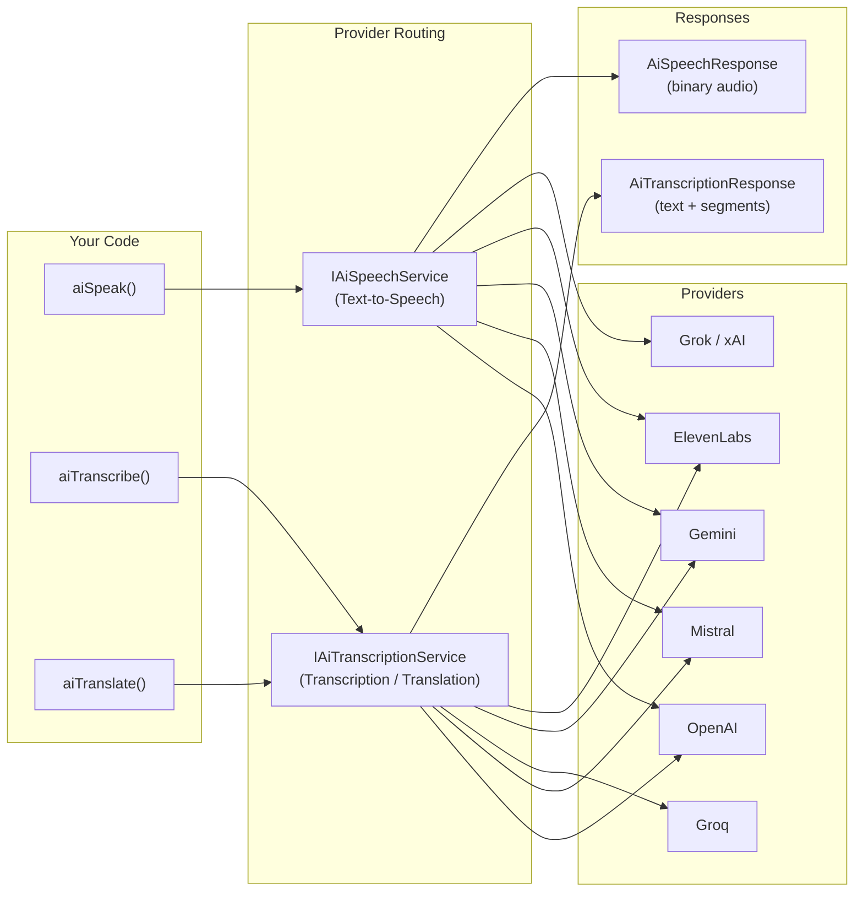

# 🔊 Audio — Speech & Transcription

BoxLang AI provides three first-class audio operations through a unified BIF interface: **Text-to-Speech** (`aiSpeak`), **Speech-to-Text** (`aiTranscribe`), and **Audio Translation** (`aiTranslate`). Each BIF works across all supported providers with consistent parameters and return values, so you can switch providers without rewriting application code.

## 🏗️ Architecture



## 📊 Provider Support Matrix

| Provider | TTS (`aiSpeak`) | STT (`aiTranscribe`) | Translation (`aiTranslate`) | Env Var |
|---|---|---|---|---|
| **OpenAI** | ✅ `tts-1` | ✅ `whisper-1` | ✅ | `OPENAI_API_KEY` |
| **Mistral** | ✅ `voxtral-mini-tts-2603` | ✅ `voxtral-mini-latest` | ❌ | `MISTRAL_API_KEY` |
| **Groq / Whisper** | ❌ | ✅ `whisper-large-v3` | ✅ | `GROQ_API_KEY` |
| **Grok / xAI** | ✅ custom | ❌ | ❌ | `GROK_API_KEY` |
| **Gemini** | ✅ `gemini-2.5-flash-preview-tts` | ✅ `gemini-2.5-flash` | ❌ | `GEMINI_API_KEY` |
| **ElevenLabs** | ✅ `eleven_multilingual_v2` | ✅ `scribe_v1` | ❌ | `ELEVENLABS_API_KEY` |

## ⚡ Quick Start

### 🗣️ Text-to-Speech

```javascript
// Synthesize speech and save to disk
audio = aiSpeak( "Hello, welcome to BoxLang AI!" )
audio.saveToFile( "welcome.mp3" )
println( "Audio size: #audio.getSize()# bytes" )
```

### 🎙️ Speech-to-Text

```javascript
// Transcribe an audio file to plain text
transcript = aiTranscribe( "recording.mp3" )
println( transcript )
// "Hello, welcome to BoxLang AI!"
```

### 🌐 Audio Translation

```javascript
// Translate spoken audio from any language — always returns English text
englishText = aiTranslate( "audio-in-spanish.mp3" )
println( englishText )
```

> **Note:** `aiTranslate` always outputs **English text**. It is speech-to-English transcription, not general text-to-text translation.

## ⚙️ Module Configuration

Configure global audio defaults in `boxlang.json` to avoid repeating options on every call:

```json
{
  "modules": {
    "bxai": {
      "settings": {
        "audio": {
          "defaultVoice": "nova",
          "defaultOutputFormat": "mp3",
          "defaultSpeechModel": "",
          "defaultTranscriptionModel": ""
        }
      }
    }
  }
}
```

| Setting | Description |
|---|---|
| `defaultVoice` | Default voice name/ID for `aiSpeak` when no `voice` option is provided |
| `defaultOutputFormat` | Default audio output format: `mp3`, `wav`, `flac`, `opus`, `pcm` |
| `defaultSpeechModel` | Default TTS model (leave blank to use the provider's default) |
| `defaultTranscriptionModel` | Default model for `aiTranscribe` and `aiTranslate` calls |

## 📡 Audio Events

The module fires interception points around every audio operation, giving you full observability and extensibility.

| Event | When Fired |
|---|---|
| `beforeAISpeech` | Before sending a TTS request to the provider |
| `afterAISpeech` | After receiving TTS audio from the provider |
| `beforeAITranscription` | Before sending a transcription request to the provider |
| `afterAITranscription` | After receiving a transcription response from the provider |
| `beforeAITranslation` | Before sending an audio translation request to the provider |
| `afterAITranslation` | After receiving an audio translation response from the provider |

Register interceptors in your application or script using `BoxRegisterInterceptor()`:

```javascript
BoxRegisterInterceptor( "afterAISpeech", function( event ) {
    println( "TTS complete — provider: #event.service.getName()#, size: #event.result.getSize()# bytes" )
})
```

***

## 📖 In This Section

* [Text-to-Speech](text-to-speech.md) — Convert text to audio with `aiSpeak()`
* [Speech-to-Text](speech-to-text.md) — Transcribe audio files with `aiTranscribe()`
* [Audio Translation](audio-translation.md) — Translate spoken audio to English with `aiTranslate()`
