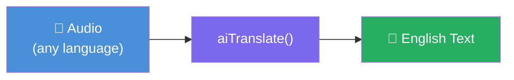

# 🌐 Audio Translation

`aiTranslate()` converts spoken audio in **any language** directly into **English text**. This is distinct from text-to-text language translation — think of it as "transcribe and translate in one step."

> 🚨 **Important:** `aiTranslate()` does **NOT** translate between arbitrary languages. It always produces **English** output regardless of the source language. If you need to transcribe audio and preserve the original language, use [`aiTranscribe()`](speech-to-text.md) instead.

## How It Works



## `aiTranscribe()` vs `aiTranslate()`

| | `aiTranscribe()` | `aiTranslate()` |
|---|---|---|
| **Output language** | Same as input audio | Always English |
| **Source audio** | Any language | Any language |
| **Use case** | Preserve original speech | Understand any-language audio in English |
| **Providers** | OpenAI, Groq | OpenAI, Groq |

## Provider Support

| Provider | Supported |
|---|---|
| **OpenAI** | ✅ Yes |
| **Groq** | ✅ Yes |
| **Mistral** | ❌ No |
| **Gemini** | ❌ No |
| **ElevenLabs** | ❌ No |
| **Grok / xAI** | ❌ No |

## 🔧 The `aiTranslate()` Function

### Syntax

```javascript
aiTranslate( audio, params={}, options={} )
```

The signature is identical to [`aiTranscribe()`](speech-to-text.md). All parameters, options, and returns are the same.

### Parameters

| Parameter | Type | Required | Description |
|---|---|---|---|
| `audio` | string or binary | ✅ Yes | File path, URL, or raw binary audio data |
| `params` | struct | No | Provider API parameters (model, temperature, etc.) |
| `options` | struct | No | Module-level options (provider, returnFormat, responseFormat, etc.) |

### Options

| Option | Type | Default | Description |
|---|---|---|---|
| `provider` | string | (config) | `openai` or `groq` |
| `apiKey` | string | (env var) | Provider API key |
| `returnFormat` | string | `"text"` | `"text"` — plain string; `"response"` — `AiTranscriptionResponse` |
| `responseFormat` | string | `"json"` | `json`, `text`, `verbose_json`, `srt`, `vtt` |
| `timeout` | numeric | `30` | HTTP timeout in seconds |
| `logRequest` | boolean | `false` | Log requests to the module log file |
| `logRequestToConsole` | boolean | `false` | Print request payload to console |
| `logResponse` | boolean | `false` | Log responses |
| `logResponseToConsole` | boolean | `false` | Print raw provider response to console |

> The `language` option does **not apply** to `aiTranslate()` — the output language is always English.

## 💡 Examples

### Basic — translate any-language audio to English

```javascript
english = aiTranslate( "/recordings/french-meeting.mp3" )
println( english )
// "Good morning everyone. Today we will discuss the quarterly results."
```

### Transcribe vs translate — side by side

```javascript
spanishAudio = "/recordings/hola-mundo.mp3"

// Transcribes — keeps original Spanish
spanish = aiTranscribe( spanishAudio )
println( "Original: #spanish#" )
// "Hola mundo, bienvenido a BoxLang AI."

// Translates — always returns English
english = aiTranslate( spanishAudio )
println( "English: #english#" )
// "Hello world, welcome to BoxLang AI."
```

### Full response object

```javascript
result = aiTranslate(
    "/recordings/german-presentation.mp3",
    {},
    { returnFormat: "response", responseFormat: "verbose_json" }
)

println( "English text: #result.getText()#" )
println( "Duration: #result.getFormattedDuration()#" )
println( "Words: #result.getWordCount()#" )
```

### Fast translation with Groq

```javascript
english = aiTranslate(
    "/recordings/japanese-interview.mp3",
    { model: "whisper-large-v3" },
    { provider: "groq" }
)
println( english )
```

### Translate from a URL

```javascript
english = aiTranslate( "https://cdn.example.com/audio/portuguese-speech.mp3" )
println( english )
```

### Translate binary audio data

```javascript
binaryAudio = fileReadBinary( "/tmp/upload.m4a" )
english = aiTranslate( binaryAudio )
println( english )
```

## 📡 Events

| Event | Data Available |
|---|---|
| `beforeAITranslation` | `transcriptionRequest`, `service` |
| `afterAITranslation` | `transcriptionRequest`, `service`, `result` |

```javascript
BoxRegisterInterceptor( "afterAITranslation", event => {
    println( "Translated #event.result.getWordCount()# English words via #event.service.getName()#" )
})
```

***

## 📖 Related Pages

* [Audio Overview](README.md)
* [Text-to-Speech](text-to-speech.md)
* [Speech-to-Text](speech-to-text.md)
* [aiTranslate BIF Reference](../../advanced/reference/built-in-functions/aitranslate.md)
