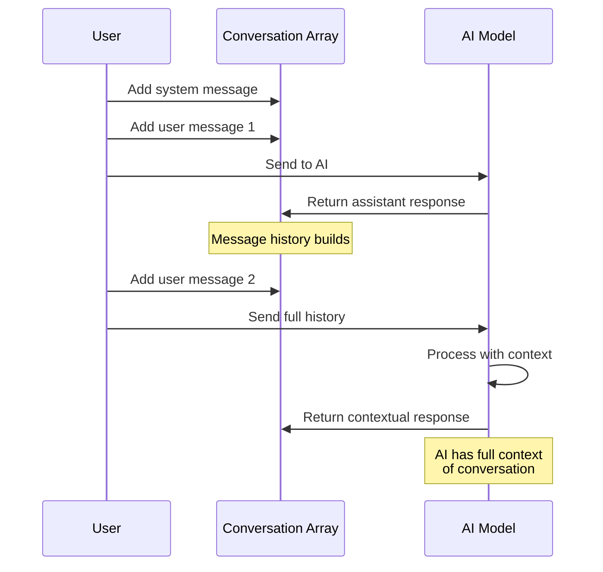

# Advanced Chatting

Master advanced AI interaction techniques including multi-turn conversations, AI tools, async operations, and streaming responses.

## 📋 Table of Contents

* [Multi-Message Conversations](advanced-chatting.md#-multi-message-conversations)
* [AI Tools (Function Calling)](advanced-chatting.md#-ai-tools-function-calling)
* [Async Requests](advanced-chatting.md#-async-requests)
* [Streaming Responses](advanced-chatting.md#-streaming-responses)
* [Multimodal Content](advanced-chatting.md#-multimodal-content)
* [JSON Mode](advanced-chatting.md#-json-mode)
* [Advanced Parameters](advanced-chatting.md#-advanced-parameters)
* [Multi-Tenant Usage Tracking](advanced-chatting.md#-multi-tenant-usage-tracking-v210)
* [Best Practices](advanced-chatting.md#-best-practices)

***

## 💬 Multi-Message Conversations

Create rich, contextual conversations with system prompts and conversation history.

### 🔄 Conversation Flow



### Conversation Arrays

```java
conversation = [
    { role: "system", content: "You are a helpful coding tutor" },
    { role: "user", content: "What is a variable?" },
    { role: "assistant", content: "A variable is a named container for storing data..." },
    { role: "user", content: "Show me an example in BoxLang" }
]

answer = aiChat( conversation )
```

### Message Roles

* **system**: Sets AI behavior and personality
* **user**: Your messages/questions
* **assistant**: AI's responses (for conversation history)

### Building Conversations Dynamically

```java
messages = [
    { role: "system", content: "You are a helpful assistant" }
]

// Add user question
messages.append( { role: "user", content: "What is BoxLang?" } )

// Get response
answer = aiChat( messages )

// Add AI response to history
messages.append( { role: "assistant", content: answer } )

// Continue conversation
messages.append( { role: "user", content: "Show me an example" } )
answer = aiChat( messages )
```

### Conversation Manager

```java
class {
    property name="messages" type="array";
    property name="systemPrompt" type="string";

    function init( required string systemPrompt ) {
        variables.systemPrompt = arguments.systemPrompt
        variables.messages = [
            { role: "system", content: arguments.systemPrompt }
        ]
        return this
    }

    function ask( required string question ) {
        // Add user message
        variables.messages.append({
            role: "user",
            content: arguments.question
        })

        // Get AI response
        answer = aiChat( variables.messages )

        // Add to history
        variables.messages.append({
            role: "assistant",
            content: answer
        })

        return answer
    }

    function reset() {
        variables.messages = [
            { role: "system", content: variables.systemPrompt }
        ]
    }
}

// Usage
chat = new ConversationManager( "You are a coding tutor" )
answer1 = chat.ask( "What is a function?" )
answer2 = chat.ask( "Show me an example" )  // Has context from answer1
```

**If you get to this point, we would highly suggest to use Agents instead of building your own conversation manager. Agents are built on top of the chatting capabilities and provide a lot of additional features such as memory management, tool calling, and more. You can learn more about Agents in the [Agents documentation](../agents/README.md).**

## 🛠️ AI Tools

Enable AI to call functions and access real-time data.

### Creating Tools

```java
weatherTool = aiTool(
    "get_weather",
    "Get current weather for a location",
    ( required location ) => {
        // Your weather API call here
        return {
            location: location,
            temp: 72,
            condition: "sunny"
        }
    }
).describeLocation( "City name" )
```

### Using Tools

```java
answer = aiChat(
    "What's the weather in San Francisco?",
    { tools: [ weatherTool ] }
)
// AI will call the tool and use the data in its response
```

### Multiple Tools

```java
// Weather tool
weatherTool = aiTool(
    "get_weather",
    "Get weather for a location",
    ( required location ) => getWeatherData( location )
).describeLocation( "City name" )

// Calculator tool
calcTool = aiTool(
    "calculate",
    "Perform calculations",
    ( required expression ) => evaluateMathExpression( expression )
).describeExpression( "Math expression" )

// Search tool
searchTool = aiTool(
    "search",
    "Search for information",
    ( required query ) => searchDatabase( query )
).describeQuery( "Search query" )

// Use all tools
answer = aiChat(
    "What's 25 * 34 plus the temperature in NYC?",
    { tools: [ weatherTool, calcTool ] }
)
```

### Tool Examples

**Database Query Tool:**

```java
dbTool = aiTool(
    "query_database",
    "Query the customer database",
    ( required field, required value ) => {
        query = queryExecute(
            "SELECT * FROM customers WHERE #field# = :value",
            { value: value }
        )
        return query
    }
)

answer = aiChat(
    "Find all customers in California",
    { tools: [ dbTool ] }
)
```

**API Integration Tool:**

```java
apiTool = aiTool(
    "fetch_data",
    "Fetch data from external API",
    ( required endpoint ) => {
        result = cfhttp(
            url: "https://api.example.com/" & endpoint,
            method: "GET"
        )
        return deserializeJSON( result.fileContent )
    }
).describeEndpoint( "API endpoint to fetch data from" )
```

## Message Builder

Use `aiMessage()` for structured message composition:

### Basic Usage

```java
message = aiMessage()
    .system( "You are a code reviewer" )
    .user( "Review this code: function test() { }" )

answer = aiChat( message.getMessages() )
```

### Chaining Messages

```java
message = aiMessage()
    .system( "You are a technical writer" )
    .user( "Explain variables" )
    .assistant( "Variables store data..." )
    .user( "Give me an example" )
    .assistant( "var name = 'John'" )
    .user( "Another example?" )

answer = aiChat( message.getMessages() )
```

### Reusable Templates

```java
// Create template
reviewTemplate = aiMessage()
    .system( "You are an expert code reviewer" )
    .user( "Review this ${language} code:\n${code}" )

// Use with different values
review1 = aiChat(
    reviewTemplate.format({
        language: "BoxLang",
        code: "function add(a,b) { return a+b }"
    })
)

review2 = aiChat(
    reviewTemplate.format({
        language: "Java",
        code: "public int add(int a, int b) { return a + b; }"
    })
)
```

## Async Chat Requests

Perform non-blocking AI operations.

### Basic Async

```java
// Start request
future = aiChatAsync( "Explain quantum computing" )

// Do other work
println( "Request sent, doing other work..." )
doOtherStuff()

// Get result when ready
answer = future.get()
println( answer )
```

### With Callbacks

```java
aiChatAsync( "What is BoxLang?" )
    .then( ( result ) => {
        println( "Success: " & result )
    } )
    .onError( ( error ) => {
        println( "Error: " & error.message )
    } )
```

### Multiple Concurrent Requests

```java
// Start multiple requests
future1 = aiChatAsync( "Explain AI" )
future2 = aiChatAsync( "Explain ML" )
future3 = aiChatAsync( "Explain DL" )

// Wait for all
answer1 = future1.get()
answer2 = future2.get()
answer3 = future3.get()

println( "AI: " & answer1 )
println( "ML: " & answer2 )
println( "DL: " & answer3 )
```

### Timeout Handling

```java
future = aiChatAsync( "Complex question" )

try {
    // Wait max 30 seconds
    answer = future.get( 30 )
} catch( "TimeoutException" e ) {
    println( "Request took too long" )
}
```

## Multimodal Content

Work with images, audio, video, and documents in your AI conversations — see [Multimodal Content](multimodal-content.md) for the complete guide.

## Streaming Responses

Get real-time responses as they're generated.

### Basic Streaming

```java
aiChatStream(
    "Tell me a story about a robot",
    ( chunk ) => {
        content = chunk.choices?.first()?.delta?.content ?: ""
        print( content )
    }
)
println( "\nDone!" )
```

### With Parameters

```java
aiChatStream(
    "Write a detailed explanation of AI",
    ( chunk ) => {
        content = chunk.choices?.first()?.delta?.content ?: ""
        print( content )
    },
    {
        model: "gpt-4",
        temperature: 0.7,
        max_tokens: 1000
    }
)
```

### Collecting Stream Data

```java
fullResponse = ""
chunkCount = 0

aiChatStream(
    "Explain AI pipelines",
    ( chunk ) => {
        content = chunk.choices?.first()?.delta?.content ?: ""
        fullResponse &= content
        chunkCount++
        print( content )
    }
)

println( "\n\nReceived " & chunkCount & " chunks" )
println( "Total: " & len( fullResponse ) & " characters" )
```

### Web Streaming Example

```java
// In a web handler
function streamResponse( required string question ) {
    response.setContentType( "text/event-stream" )
    response.setHeader( "Cache-Control", "no-cache" )

    aiChatStream(
        arguments.question,
        ( chunk ) => {
            content = chunk.choices?.first()?.delta?.content ?: ""
            writeOutput( "data: " & content & "\n\n" )
            flush()
        }
    )

    writeOutput( "data: [DONE]\n\n" )
}
```

### Markdown Streaming Parser

````java
markdown = ""
inCodeBlock = false

aiChatStream(
    "Explain quicksort with code",
    ( chunk ) => {
        content = chunk.choices?.first()?.delta?.content ?: ""
        markdown &= content

        // Detect code blocks
        if( content contains "```" ) {
            inCodeBlock = !inCodeBlock
        }

        // Style output
        if( inCodeBlock ) {
            print( chr(27) & "[32m" & content & chr(27) & "[0m" )  // Green
        } else {
            print( content )
        }
    }
)
````

## Structured Data with JSON and XML

### JSON Return Format for Complex Data

Use `returnFormat: "json"` to automatically parse structured responses:

```java
// Generate complex user profile
profile = aiChat(
    "Create a user profile with name, email, age, skills array, and preferences object",
    {},
    { returnFormat: "json" }
)

// Direct access to parsed data
println( "Name: #profile.name#" )
println( "Email: #profile.email#" )
println( "Skills:" )
profile.skills.each( skill => println( "  - #skill#" ) )
println( "Theme: #profile.preferences.theme#" )
```

### Multi-Turn Conversation with JSON

```java
conversation = [
    { role: "system", content: "You are a data generator. Always respond with valid JSON." },
    { role: "user", content: "Create 3 products with id, name, and price" }
]

products = aiChat(
    conversation,
    { temperature: 0.3 },
    { returnFormat: "json" }
)

// Use the structured data
products.each( product => {
    println( "##product.id#: #product.name# - $#product.price#" )
} )

// Continue conversation with context
conversation.append({
    role: "assistant",
    content: serializeJSON( products )
})
conversation.append({
    role: "user",
    content: "Now add a 'category' field to each"
})

updatedProducts = aiChat(
    conversation,
    {},
    { returnFormat: "json" }
)
```

### JSON with Tools

```java
// Tool returns structured data
dataTool = aiTool(
    "get_user_data",
    "Fetch user data from database",
    ( args ) => {
        return {
            id: args.userId,
            name: "John Doe",
            email: "john@example.com",
            purchases: [ "item1", "item2" ]
        }
    }
).addParameter( "userId", "string", "User ID", true )

// AI response will be JSON formatted
userData = aiChat(
    "Get data for user 123 and format as JSON",
    { tools: [ dataTool ] },
    { returnFormat: "json" }
)

println( "User: #userData.name#" )
println( "Purchases: #userData.purchases.len()#" )
```

## Structured Output

Get type-safe, validated responses using BoxLang classes or struct templates — see the [Structured Output](structured-output.md) guide for the complete documentation.

## Practical Examples

### Interactive Chat Application

```java
class {
    property name="conversation";

    function init() {
        variables.conversation = [
            { role: "system", content: "You are a helpful assistant" }
        ]
        return this
    }

    function chat( required string message ) {
        // Add user message
        variables.conversation.append({
            role: "user",
            content: arguments.message
        })

        // Get response
        response = aiChat( variables.conversation )

        // Add to history
        variables.conversation.append({
            role: "assistant",
            content: response
        })

        return response
    }

    function streamChat( required string message, required function onChunk ) {
        variables.conversation.append({
            role: "user",
            content: arguments.message
        })

        fullResponse = ""

        aiChatStream(
            variables.conversation,
            ( chunk ) => {
                content = chunk.choices?.first()?.delta?.content ?: ""
                fullResponse &= content
                arguments.onChunk( content )
            }
        )

        variables.conversation.append({
            role: "assistant",
            content: fullResponse
        })

        return fullResponse
    }
}
```

### Smart Document Analyzer

```java
function analyzeDocument( required string document ) {
    // Extract key points async
    keyPointsFuture = aiChatAsync(
        "List key points from:\n" & arguments.document,
        { max_tokens: 200 }
    )

    // Generate summary async
    summaryFuture = aiChatAsync(
        "Summarize in 3 sentences:\n" & arguments.document,
        { max_tokens: 150 }
    )

    // Generate questions async
    questionsFuture = aiChatAsync(
        "Generate 5 questions about:\n" & arguments.document,
        { max_tokens: 200 }
    )

    return {
        keyPoints: keyPointsFuture.get(),
        summary: summaryFuture.get(),
        questions: questionsFuture.get()
    }
}
```

### Real-Time Code Assistant

```java
function codeAssistant( required string task ) {
    print( "Generating code" )

    code = ""

    aiChatStream(
        "Write BoxLang code to: " & arguments.task,
        ( chunk ) => {
            content = chunk.choices?.first()?.delta?.content ?: ""
            code &= content
            print( "." )
        },
        { model: "gpt-4", temperature: 0.4 }
    )

    println( " Done!" )
    return code
}
```

***

## 🏢 Multi-Tenant Usage Tracking (v2.1.0+)

Track AI usage per tenant for accurate billing, cost allocation, and quota management.

### Basic Usage

```javascript
// Single chat with tenant context
result = aiChat(
    messages: "Analyze customer data",
    options: {
        tenantId: "customer_acme",
        usageMetadata: {
            costCenter: "analytics",
            projectId: "proj-2026-insights",
            userId: "analyst@acme.com"
        }
    }
)
```

### Async Requests with Tenant Tracking

```javascript
// Track tenant usage in async operations
future = aiChatAsync(
    messages: "Generate monthly report",
    params: { model: "gpt-4o" },
    options: {
        tenantId: "org_finance",
        usageMetadata: {
            department: "accounting",
            reportType: "monthly",
            fiscalYear: 2026
        }
    }
)

result = future.get()
```

### Streaming with Tenant Context

```javascript
// Stream responses with tenant tracking
aiChatStream(
    messages: "Write a detailed analysis",
    ( chunk ) => {
        print( chunk.choices?.first()?.delta?.content ?: "" )
    },
    params: { temperature: 0.7 },
    options: {
        tenantId: "client_enterprise_500",
        usageMetadata: {
            clientTier: "enterprise",
            feature: "ai-reports",
            billable: true
        }
    }
)
```

### Multi-Tenant Conversation Manager

```javascript
class TenantConversationManager {

    property name="tenantId";
    property name="usageMetadata";
    property name="messages" type="array";

    function init(
        required string tenantId,
        struct usageMetadata = {}
    ) {
        variables.tenantId = arguments.tenantId
        variables.usageMetadata = arguments.usageMetadata
        variables.messages = []
        return this
    }

    function chat( required string message ) {
        // Add user message
        variables.messages.append({
            role: "user",
            content: arguments.message
        })

        // Send with tenant context
        response = aiChat(
            variables.messages,
            options: {
                tenantId: variables.tenantId,
                usageMetadata: variables.usageMetadata
            }
        )

        // Add assistant response
        variables.messages.append({
            role: "assistant",
            content: response
        })

        return response
    }

    function getConversationHistory() {
        return variables.messages
    }
}

// Usage
tenantChat = new TenantConversationManager(
    tenantId: "customer_xyz",
    usageMetadata: {
        costCenter: "CC-2501",
        department: "marketing"
    }
)

response1 = tenantChat.chat( "What's our customer retention rate?" )
response2 = tenantChat.chat( "How can we improve it?" )
```

### Benefits

* ✅ **Accurate Billing**: Attribute AI costs to specific tenants/customers
* ✅ **Cost Allocation**: Track usage by department, project, or cost center
* ✅ **Quota Management**: Enforce per-tenant usage limits via interceptors
* ✅ **Analytics**: Understand which tenants/projects use AI most
* ✅ **Chargeback**: Generate detailed usage reports for internal billing

**See Also**: [Event System - onAITokenCount](../../advanced/events/token-usage-events.md#multi-tenant-usage-tracking-v210) for interceptor-based billing logic.

***

## Best Practices

1. **Use System Prompts**: Set clear context and behavior
2. **Manage Context Window**: Trim old messages for long conversations
3. **Handle Errors Gracefully**: Always use try/catch
4. **Stream Long Responses**: Better UX for detailed answers
5. **Cache When Possible**: Save costs and time
6. **Use Tools Wisely**: Only when real-time data is needed
7. **Test Async Operations**: Handle timeouts and failures

## Next Steps

* [**Service-Level Chatting**](service-chatting.md) - Direct service control
* [**Pipeline Overview**](../pipelines/README.md) - Learn about AI pipelines
* [**Message Templates**](../messages/) - Advanced templating
* [**Message Context**](../messages/message-context.md) - Inject security and RAG data
