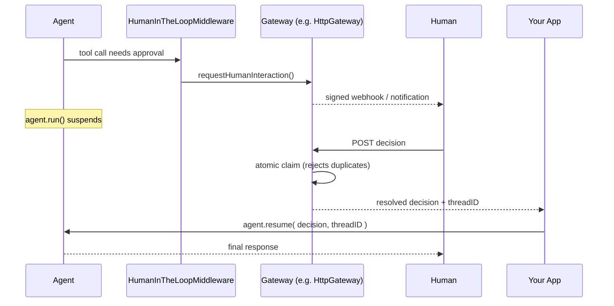

# Gateways

A **gateway** is a bidirectional human-interaction adapter. It translates platform events (a CLI keystroke, an HTTP webhook, a chat-platform button click) into normalized agent input, and translates agent events — including a suspended [human-in-the-loop](human-in-the-loop.md) approval — back into a platform-native experience.

It is more than a message transport: a gateway also handles identity, threads, interactive actions, streaming, approvals, and resuming suspended runs.



`CliGateway` collapses this to one synchronous prompt; `MockGateway` lets you script the same flow in tests with no I/O. See [Human-in-the-Loop](human-in-the-loop.md) for the suspend/resume mechanics this builds on.

## 🚀 Resolving a Gateway

```javascript
cli  = aiGateway( "cli" )
http = aiGateway( "http", { secret: "shared-hmac-secret" } )
mock = aiGateway( "mock" )
```

| BIF | Purpose |
|---|---|
| `aiGateway( name, options )` | Resolve a gateway — a core name, or one registered by a module |
| `gatewayRegistry()` | The singleton registry external gateway modules register into |

Attach one to HITL middleware and approvals are presented there:

```javascript
import bxModules.bxai.models.middleware.core.HumanInTheLoopMiddleware;

agent = aiAgent(
    tools       : [ deployTool ],
    middleware  : [ new HumanInTheLoopMiddleware(
        toolsRequiringApproval: [ "deploy" ],
        gateway               : aiGateway( "http", { secret: getSecret() } )
    ) ],
    checkpointer: aiMemory( "cache" )
)
```

## 📦 Core Gateways

| Gateway | Capabilities | Use it for |
|---|---|---|
| `cli` | `humanApproval` | The reference implementation — a blocking stdin/stdout approval prompt |
| `http` | `inboundMessages`, `outboundMessages`, `humanApproval` | Network-reachable approvals via signed webhooks |
| `mock` | `inboundMessages`, `outboundMessages`, `humanApproval` | Tests and examples — scriptable, fully offline |

### CliGateway

Prints an approval banner and reads a decision from stdin. It resolves **synchronously**, so the run blocks rather than suspending. Offers approve / approve-always / approve-for-session / reject, plus quit as an always-available escape hatch, and re-prompts up to three times on unrecognised input before cancelling.

```javascript
// Attached automatically when no gateway is supplied
agent = aiAgent( middleware: [ new HumanInTheLoopMiddleware( toolsRequiringApproval: [ "deleteRecord" ] ) ] )
```

### HttpGateway

The first gateway with real network exposure, so every inbound mutation is signed (HMAC-SHA256), timestamp-bounded and nonce-deduplicated; every pending interaction has a TTL; and resolving a decision is an **atomic claim**, so a duplicate decision POST for an already-resolved interaction is rejected rather than silently overwriting it.

```javascript
http = aiGateway( "http", {
    secret           : getSecret(),   // shared HMAC secret
    callbackUrl      : "https://ops.example.com/bxai-events",  // optional
    toleranceSeconds : 300,           // max clock skew / request age
    requestTTLSeconds: 900            // how long an interaction stays open
} )
```

It exposes three endpoints through the `gateway.bxm` front controller:

| Method | Route | Purpose |
|---|---|---|
| `POST` | `/bxai/gateways/{gatewayName}/events` | Inbound platform event |
| `GET` | `/bxai/interactions/{requestID}` | Poll a pending interaction |
| `POST` | `/bxai/interactions/{requestID}/decisions` | Submit a human's decision |


`HttpGateway` does **not** call `agent.resume()` itself — that would require knowing which agent and checkpointer an interaction belongs to, which is application state this module doesn't own. Set `GatewayContext.threadID` when presenting a request; it is persisted alongside the interaction and returned by both the GET and the decision POST, so your application can correlate the decision back to `agent.resume( decision, threadID )`.


### MockGateway

The reference implementation for tests — records what was delivered and lets you script decisions, with no I/O at all.

```javascript
mock = aiGateway( "mock" )
mock.setScriptedDecisions( [ "approve", "reject" ] )

// Or resolve a pending interaction out-of-band, like an async gateway would
mock.simulateDecision( requestID, "approve" )
```

## 🧩 Capabilities

A gateway declares only what it actually supports. Every capability method on `IGateway` has a safe default — a failed `GatewayDeliveryResult`, or a thrown `GatewayCapabilityNotSupported` — so implementations stay small.

```javascript
gateway = aiGateway( "http" )

gateway.getCapabilities()             // [ "inboundMessages", "outboundMessages", "humanApproval" ]
gateway.supports( "humanApproval" )   // true
gateway.supports( "streaming" )       // false
```

| Capability | Meaning |
|---|---|
| `inboundMessages` | Can parse platform payloads into agent input |
| `outboundMessages` | Can deliver agent events to the platform |
| `streaming` | Can deliver response deltas as they arrive |
| `threads` | Understands platform-native threading |
| `attachments` | Can send/receive files |
| `messageEditing` | Can edit a message it already sent |
| `interactiveActions` | Supports native buttons/actions |
| `humanApproval` | Can present a HITL approval and collect a decision |
| `argumentEditing` | Can collect corrected tool arguments |
| `authentication` | Verifies inbound payload authenticity |

Check `supports()` before calling a capability method rather than relying on the fallback.

## ⚙️ Configuration

Per-gateway settings live under `settings.gateways`, keyed by gateway name:

```json
{
  "modules": {
    "bxai": {
      "settings": {
        "gateways": {
          "http": { "secret": "...", "requestTTLSeconds": 900 }
        }
      }
    }
  }
}
```

## 🌍 External Gateway Modules

Platform gateways — Slack, Discord, Teams, Telegram — ship as **their own modules**, not in bx-ai core. A module registers its gateway when it loads, and `aiGateway()` finds it by name:

```javascript
// Inside the gateway module's ModuleConfig onLoad()
gatewayRegistry().register( new MyPlatformGateway(), "bx-ai-gateway-myplatform" )

// Anywhere in your application
gateway = aiGateway( "myplatform" )
```

Registry keys are `name` or `name@module`, so two modules can provide same-named gateways without colliding:

```javascript
gatewayRegistry().has( "myplatform" )
gatewayRegistry().get( "myplatform@bx-ai-gateway-myplatform" )
gatewayRegistry().listGateways()
gatewayRegistry().unregisterByModule( "bx-ai-gateway-myplatform" )
```

If nothing is registered under the name, `aiGateway()` falls back to treating it as a directly-instantiable class path, and throws `GatewayNotSupported` if that fails too.

## 🛠️ Building a Custom Gateway

Extend `BaseGateway`, declare your capabilities, and override only the methods you support.

```javascript
import bxModules.bxai.models.gateway.BaseGateway;
import bxModules.bxai.models.gateway.contracts.GatewayDeliveryResult;

class extends="BaseGateway" {

    function init() {
        variables.name        = "myplatform"
        variables.description = "Presents approvals as MyPlatform cards"
        return this
    }

    array function getDeclaredCapabilities() {
        return [ "humanApproval", "outboundMessages", "interactiveActions" ]
    }

    GatewayDeliveryResult function requestHumanInteraction( required humanRequest, required context ) {
        // Shared title/body/button vocabulary — don't re-derive it per platform
        var presentation = this.presentInteraction( humanRequest )

        var messageId = myPlatformClient.postCard(
            title  : presentation.getTitle(),
            body   : presentation.getBody(),
            buttons: presentation.getButtons()
        )

        // Async: return once accepted; the decision arrives later as an inbound event
        return new GatewayDeliveryResult( deliveryID: messageId )
    }

    function parseHumanDecision( required event ) {
        // Turn the platform's button-click payload into a HumanInteractionDecision
    }
}
```

**`presentInteraction( humanRequest, maxBodyLength )`** gives you a normalized title, body, and one button per allowed decision — including labels and styles for `approve_always`/`approve_session` — so every chat-native gateway renders consistently. **`presentResolution( decision )`** gives you a short summary ("Approved by alice", "Rejected: not now") for the follow-up message.

For a gateway whose pending state must outlive the process, override `setCheckpointer()`; `HumanInTheLoopMiddleware.onAttach()` passes the owning agent's checkpointer automatically.

## 🎯 Events

| Event | Fired when |
|---|---|
| `onGatewayCreate` | `aiGateway()` resolves or creates a gateway |
| `onGatewayRegistryRegister` | A gateway is registered into the registry |
| `onGatewayRegistryUnregister` | A gateway is removed |

See [Event System](../advanced/events.md).

## Related Pages

* [Human-in-the-Loop](human-in-the-loop.md) — approvals, policies, durable grants
* [aiGateway()](../advanced/reference/built-in-functions/aigateway.md) · [gatewayRegistry()](../advanced/reference/built-in-functions/gatewayregistry.md)
* [Security Guide](../deployment/security.md) — signing, secrets, and network exposure
