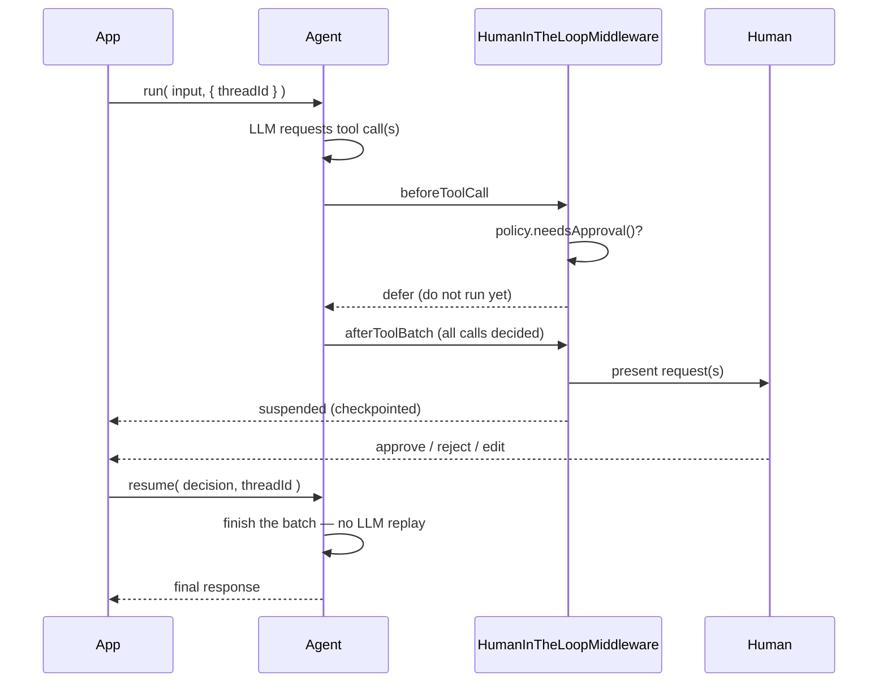

# Human-in-the-Loop (HITL)

Some tool calls should never run unsupervised. Deleting records, transferring funds, deploying to production, emailing a customer — you want a person to see the call and its arguments, and say yes.

**Human-in-the-Loop** puts that gate in front of any tool, without changing the tool or the agent's logic. It's `HumanInTheLoopMiddleware`, plus three collaborators you can swap independently:

| Piece | Decides | Default |
|---|---|---|
| **`IApprovalPolicy`** | *whether* a call needs approval | match by tool name |
| **`IGateway`** | *how* the request reaches a human | blocking CLI prompt |
| **`IDecisionStore`** | *whether a past "always allow" still applies* | `settings.hitl.decisionStore` (cache) |

## 🚦 The Flow



## 🖥️ CLI Mode (the default)

With no gateway supplied, a blocking terminal prompt is attached. Good for scripts, CLI tools, and local development.

```javascript
import bxModules.bxai.models.middleware.core.HumanInTheLoopMiddleware;

agent = aiAgent(
    tools     : [ deleteRecordTool ],
    middleware: [ new HumanInTheLoopMiddleware( toolsRequiringApproval: [ "deleteRecord" ] ) ]
)

agent.run( "Delete record 42" )
```

The prompt offers **approve**, **approve always**, **approve for session**, **reject**, and **quit**. Unrecognised input re-prompts (up to three attempts) before cancelling, so a mistyped key doesn't abort the run.

## 🌐 Web / Async Mode

For web apps and anything where a human isn't sitting at a terminal, run in `web` mode. The run **suspends** and checkpoints instead of blocking, and you resume it whenever the decision arrives — minutes or days later.

A `checkpointer` is **required** in this mode; without one there is nowhere to save the suspended state.

```javascript
agent = aiAgent(
    tools       : [ deployTool ],
    middleware  : [ new HumanInTheLoopMiddleware(
        mode                  : "web",
        toolsRequiringApproval: [ "deploy" ]
    ) ],
    checkpointer: aiMemory( "cache" )
)

// You choose the threadId — it's how you find this run again
threadId = "deploy-#createUUID()#"

result = agent.run( "Deploy the new version to production", {}, { threadId: threadId } )

if ( result.isSuspended() ) {
    pending = result.getData().pendingActions   // every call awaiting a decision
    notifyApprovers( threadId, pending )
}
```

Later, once a human has decided:

```javascript
finalResponse = agent.resume( "approve", threadId )
```


The suspension result does **not** carry a thread id. You supply `threadId` to `run()` and reuse the same value in `resume()`.


### Decisions

| Decision | Effect |
|---|---|
| `approve` | Run the tool call as requested |
| `approve_always` | Run it, and record a **durable** grant so this tool is auto-approved in future |
| `approve_session` | Run it, and auto-approve this tool for the rest of the session |
| `reject` | Skip this call; the reason is fed back to the model as the tool result |
| `edit` | Replace the call's arguments, then run it |
| `cancel` | Stop the whole run |

```javascript
// Reject with a reason the model can act on
agent.resume( "reject", threadId, {}, "", "Wrong environment — use staging" )

// Approve with corrected arguments
agent.resume( "edit", threadId, { environment: "staging" } )
```

`resume()` takes `( decision, threadId, editedData, decidedBy, reason )`. For streaming, `resumeStream()` takes the same arguments with `onChunk` first.

## 📦 Batched Approvals

When a single turn asks for **several** tool calls that need approval, they suspend **together as one checkpoint** — you get one notification listing every pending call, not a drip-feed of one-at-a-time interruptions.

Resuming finishes the whole batch directly against the saved assistant message: **the LLM call is not replayed**, and nothing that already ran (or was already blocked) happens twice.

```javascript
result = agent.run( "Check the weather in KC and email the result to ops", {}, { threadId: "t1" } )

// result.getData().pendingActions -> [ get_weather, send_email ]

// One decision applies to every pending call...
agent.resume( "approve", "t1" )

// ...or resolve each one individually, in the order presented
agent.resume(
    [
        { decision: "approve" },
        { decision: "reject", reason: "ops list is stale" }
    ],
    "t1"
)
```

Per-call structs accept `decision`, `editedData`, `decidedBy` and `reason`; anything omitted falls back to the top-level argument.


Batching works across OpenAI, Claude, Bedrock and Cohere. Streaming batches are supported on **OpenAI and Claude** — the two providers with streaming tool-call support today.


## 🧭 Approval Policies

The default policy matches tool names. Pass a `policy` instead when "which calls are risky" is more nuanced than a name list.

| Policy | Approves based on | Constructor |
|---|---|---|
| `ToolNameApprovalPolicy` | Tool name (default) | `( array toolNames = [] )` |
| `RiskLevelApprovalPolicy` | A `@riskLevel` annotation on the tool | `( minLevel = "high", defaultLevel = "low" )` |
| `AnnotationApprovalPolicy` | Presence of an annotation | `( annotationName = "requiresApproval" )` |
| `CallbackApprovalPolicy` | Your own closure | `( required function callback )` |
| `CompositeApprovalPolicy` | Combining several policies | `( array policies = [], mode = "any" )` |

```javascript
import bxModules.bxai.models.hitl.policies.RiskLevelApprovalPolicy;
import bxModules.bxai.models.hitl.policies.CallbackApprovalPolicy;
import bxModules.bxai.models.hitl.policies.CompositeApprovalPolicy;

// Anything the tool declares as high or critical risk
hitl = new HumanInTheLoopMiddleware( policy: new RiskLevelApprovalPolicy( minLevel: "high" ) )

// Your own rule — the closure receives the tool-call context
bigMoney = new CallbackApprovalPolicy( ( context ) => ( context.toolArgs.amount ?: 0 ) > 10000 )

// Combine them: "any" requires approval if EITHER flags the call
hitl = new HumanInTheLoopMiddleware(
    policy: new CompositeApprovalPolicy( [ new RiskLevelApprovalPolicy(), bigMoney ], "any" )
)
```

Risk levels are `low`, `medium`, `high`, `critical`. `RiskLevelApprovalPolicy` and `AnnotationApprovalPolicy` both read annotations off the tool class's `doInvoke()` method:

```javascript
import bxModules.bxai.models.tools.BaseTool;

class extends="BaseTool" {

    function init() {
        variables.name        = "dropTable"
        variables.description = "Drops a database table."
        return this
    }

    @riskLevel( "critical" )
    any function doInvoke( required struct args, chatRequest ) {
        return dropDatabase( args.tableName )
    }
}
```


`mode: "any"` (the default) is the safer choice — one policy flagging a call is enough to require a human. `"all"` requires every policy to agree.


## 🔐 Durable Grants

`approve_always` and `approve_session` are only useful if they're remembered. Grants are persisted through a pluggable `IDecisionStore`, so "always allow this tool for this user" survives the run — and, for `approve_always`, a restart.

```javascript
// Explicit store
hitl = new HumanInTheLoopMiddleware(
    toolsRequiringApproval: [ "placeOrder" ],
    decisionStore         : aiDecisionStore( "jdbc", { datasource: "myDSN" } )
)
```

With no `decisionStore`, the application-wide default from `settings.hitl.decisionStore` is used:

```json
{
  "modules": {
    "bxai": {
      "settings": {
        "hitl": {
          "decisionStore": { "provider": "cache", "config": {} }
        }
      }
    }
  }
}
```

| Store | Backing | Constructor |
|---|---|---|
| `cache` | CacheBox | `( cacheName )` |
| `jdbc` | Any datasource | `( required datasource, table )` |
| `file` | JSON on disk | `( directoryPath )` |

The store contract is small enough to implement yourself — `grant()`, `isGranted()`, `revoke()`, `listGrants()`. See [aiDecisionStore()](../advanced/reference/built-in-functions/aidecisionstore.md).


Every `HumanInTheLoopMiddleware` in an application shares one store by design — an application only ever attaches one HITL middleware.


## 🔎 Inspecting Pending Approvals

Query the middleware directly when you need to build an approvals dashboard:

```javascript
hitl = new HumanInTheLoopMiddleware( mode: "web", toolsRequiringApproval: [ "deploy" ] )
agent = aiAgent( middleware: [ hitl ], checkpointer: aiMemory( "cache" ) )

all        = hitl.getAllPending()                       // array of AgentSuspension
suspension = hitl.getSuspensionByThread( "deploy-42" )  // one thread's suspension
isOpen     = hitl.hasPending( suspension.getSuspensionID() )

hitl.clearSuspension( suspension.getSuspensionID() )    // abandon one
hitl.clearAllPending()                                  // abandon everything
```

An `AgentSuspension` exposes `getSuspensionID()`, `getThreadID()`, `getStatus()`, `getReason()`, `getInteraction()`, `isPending()`, `isTerminal()`, `isExpired()` and `toStruct()`.

## 🔌 Presenting Through a Gateway

CLI and web are the two built-in ends of the spectrum. To present approvals somewhere else — a webhook, a chat platform — attach a [gateway](gateways.md):

```javascript
hitl = new HumanInTheLoopMiddleware(
    toolsRequiringApproval: [ "deploy" ],
    gateway               : aiGateway( "http", { secret: "shared-hmac-secret" } )
)
```


`mode: "cli"` and `mode: "web"` still work exactly as before. When you're attaching a specific gateway anyway, prefer `gateway:` over `mode:` — an unrecognised `mode` falls back to a CLI gateway with a console warning.


## Related Pages

* [Gateways](gateways.md) — presenting interactions on a platform
* [Middleware](middleware.md) — the full middleware pipeline and hooks
* [Agent Memory Management](agents/memory.md) — checkpointers and suspend/resume
* [Security Guide](../deployment/security/README.md) — guardrails around prompts and responses
