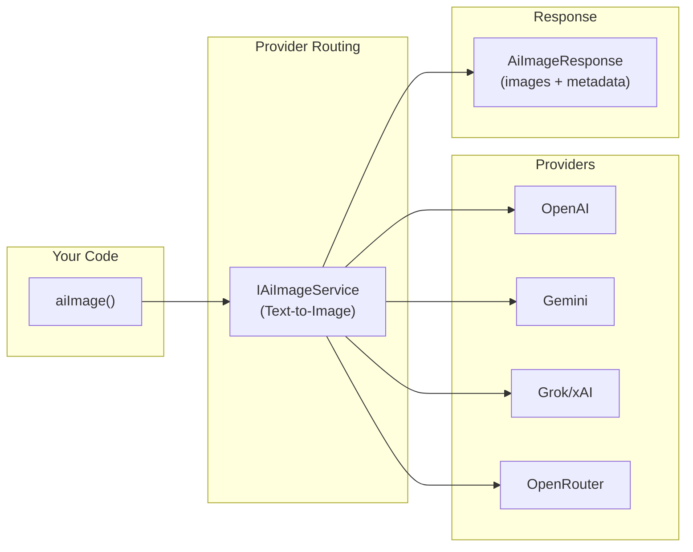

# 🖼️ Image Generation

BoxLang AI provides first-class **image generation** through the `aiImage()` BIF. Generate images from text descriptions using any provider that implements `IAiImageService` — OpenAI, Gemini, Grok, and OpenRouter — all through a unified interface.

## 🏗️ Architecture



## 📊 Provider Support Matrix

| Provider | Model | Size Control | Quality | Style | Format | Env Var |
|---|---|---|---|---|---|---|
| **OpenAI** | `gpt-image-1` (default), DALL-E 3 | ✅ | ✅ | ✅ | ✅ (png/jpeg/webp) | `OPENAI_API_KEY` |
| **Gemini** | `imagen-3.0-generate-008` | ✅ (aspect ratio) | ❌ | ❌ | ❌ | `GEMINI_API_KEY` |
| **Grok / xAI** | `grok-2-image` | ✅ | ❌ | ❌ | ❌ | `GROK_API_KEY` |
| **OpenRouter** | FLUX Schnell (default), many | ✅ | ❌ | ❌ | ❌ | `OPENROUTER_API_KEY` |

## ⚡ Quick Start

### Basic Image Generation

```javascript
// Generate an image from a text prompt
response = aiImage( "A futuristic cityscape at sunset" )

// Save to file
response.saveToFile( "/images/cityscape.png" )
println( "Generated #response.getCount()# image(s)" )
```

### Multiple Images with Custom Parameters

```javascript
response = aiImage(
    "A watercolor painting of a mountain lake",
    { n: 2, size: "1024x1024", quality: "hd" },
    { provider: "openai" }
)

// Save all images to a directory
paths = response.saveAllToDirectory( "/images/watercolors/" )
```

### Fluent Builder API

```javascript
// Chain expressive methods and terminate with .generate()
response = aiImage()
    .prompt( "a breathtaking mountain sunrise" )
    .provider( "openai" )
    .landscape()
    .high()
    .style( "vivid" )
    .generate()

// Or use the static factory
response = AiImageRequest
    .of( "a red fox in an autumn forest" )
    .provider( "gemini" )
    .landscape()
    .generate()

// With format conversion and compression
path = aiImage()
    .prompt( "a minimalist logo" )
    .asWebp()
    .outputCompression( 80 )
    .outputFile( "/images/logo.webp" )
    .generate()
// Returns the file path string
```

### Embed in HTML with Data URI

```javascript
response = aiImage( "A cute robot reading a book" )
dataURI = response.toDataURI()

// Use in HTML
html = ''
```

### Using the Built-in Agent Tool

```javascript
// The generateImage@bxai tool is auto-registered
agent = aiAgent(
    name: "creative-assistant",
    tools: [ "generateImage@bxai" ]
)

// Agent can now generate images on request
result = agent.run( "Create an image of a sunset over the ocean" )
```

## ⚙️ Module Configuration

Configure global image defaults in `boxlang.json`:

```json
{
  "modules": {
    "bxai": {
      "settings": {
        "image": {
          "defaultProvider": "openai",
          "defaultApiKey": "",
          "defaultModel": "gpt-image-1",
          "defaultSize": "1024x1024",
          "defaultQuality": "standard",
          "defaultStyle": "vivid",
          "defaultInstructions": ""
        }
      }
    }
  }
}
```

## 📋 In This Section

| Page | What's covered |
|---|---|
| [Generating Images](generating.md) | Parameters, options, provider-specific settings |
| [Image Response & Formats](response-formats.md) | `AiImageResponse` methods, saving, encoding |
| [Image Agent Tools](agent-tools.md) | `generateImage@bxai` built-in tool |
