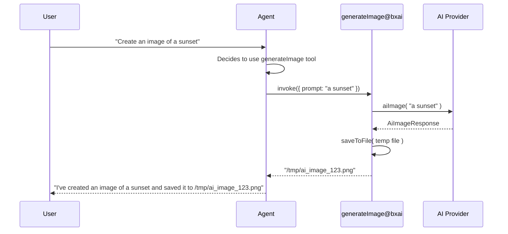

# Image Agent Tools

BoxLang AI ships with a built-in **`generateImage@bxai`** agent tool that enables AI agents to generate images from text prompts during conversations.

## 🤖 `generateImage@bxai`

The `ImageTools` class (`models/tools/image/ImageTools.bx`) is auto-registered in the global tool registry at module startup. It generates an image from a text prompt, saves it to a file, and returns the absolute file path.

### How It Works



### Usage

```javascript
// Opt-in by name — the tool is auto-registered
agent = aiAgent(
    name: "creative-assistant",
    description: "An agent that can generate images",
    tools: [ "generateImage@bxai" ]
)

// Agent can now generate images on request
result = agent.run( "Create an image of a futuristic city" )
// Agent will call generateImage@bxai and return the file path
```

### Tool Parameters

| Parameter | Type | Required | Default | Description |
|---|---|---|---|---|
| `prompt` | string | ✅ Yes | — | Text description of the image to generate |
| `size` | string | No | `1024x1024` | Image dimensions |
| `quality` | string | No | `standard` | Quality level (`standard`, `hd`) |
| `style` | string | No | `""` | Visual style (`vivid`, `natural`) |
| `outputFile` | string | No | (temp file) | File path to save the image (auto-generates temp file if omitted) |

### Return Value

Returns the **absolute file path** of the saved image as a string.

### Auto-Generated Temp Files

When no `outputFile` is supplied, the tool auto-generates a temporary file in the system's temp directory:

```javascript
// Without outputFile — temp file auto-generated
// Returns: "/var/folders/xx/ai_image_abc123.png"
```

### Full Parameter Example

When an agent calls the tool with optional parameters, the generated image uses those settings:

```javascript
// Agent might invoke: generateImage@bxai(prompt: "a futuristic city", size: "1792x1024", quality: "hd")
// The tool creates an HD landscape image at the specified size
```

## 📋 Using with Multiple Agents

```javascript
// Research agent with image generation
researchAgent = aiAgent(
    name: "researcher",
    tools: [ "generateImage@bxai", "search@bxai" ]
)

// Creative writing agent with image generation
writerAgent = aiAgent(
    name: "writer",
    tools: [ "generateImage@bxai" ],
    instructions: "You can generate illustrations for your stories"
)
```

## 🔧 Custom Image Tool

If you need more control over image generation (specific provider, size, quality), create a custom tool:

```javascript
customImageTool = aiTool(
    "generate_hd_image",
    "Generate a high-definition image from a text prompt",
    function( required string prompt ) {
        response = aiImage(
            prompt,
            { size: "1792x1024", quality: "hd" },
            { provider: "openai" }
        )
        path = response.saveToFile( "/images/#createUUID()#.png" )
        return path
    }
)

agent = aiAgent( tools: [ customImageTool ] )
```
