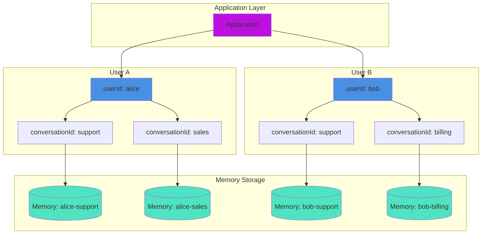
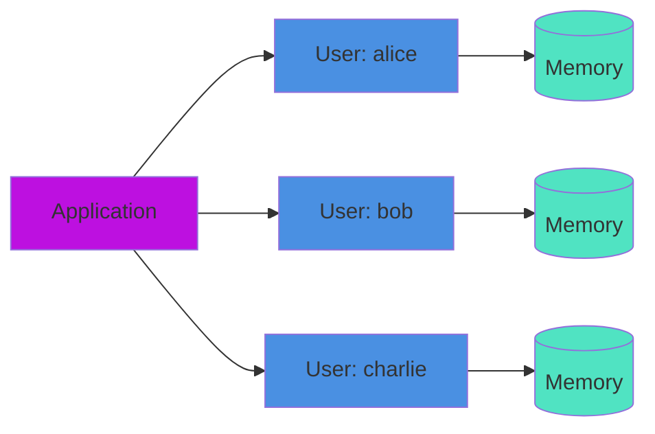
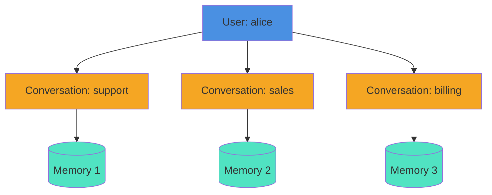

# Multi-Tenant Memory Guide

This guide covers implementing **secure, isolated memory** for multi-user and multi-conversation applications using BoxLang AI's built-in multi-tenant support.

## 📖 Overview

Multi-tenant memory isolation enables:

### 🏗️ Multi-Tenant Isolation Architecture



* **👥 Per-User Isolation**: Separate conversations for each user
* **💬 Per-Conversation Isolation**: Multiple conversations per user
* **🔒 Data Security**: Automatic filtering prevents data leakage
* **🏢 Enterprise Scale**: Shared infrastructure with isolated data
* **📊 Analytics**: Track conversations by user/conversation identifiers

### Why Multi-Tenant Memory?

Without multi-tenant isolation, all users share the same conversation history:

```java
// ❌ WRONG: All users see same conversation
memory = aiMemory( memory: "window", config: { maxMessages: 10 } )
agent = aiAgent( name: "Assistant", memory: memory )

// User Alice
agent.run( "My name is Alice" )

// User Bob sees Alice's conversation!
agent.run( "What's the user's name?" )  // "Alice" (data leakage!)
```

With multi-tenant isolation, each user gets isolated memory:

```java
// ✅ CORRECT: Isolated per user
aliceMemory = aiMemory( memory: "window",
    userId: "alice",
    config: { maxMessages: 10 }
)

bobMemory = aiMemory( memory: "window",
    userId: "bob",
    config: { maxMessages: 10 }
)

// Completely isolated conversations
```

***


## 🎯 Core Concepts

### 👤 UserId - User-Level Isolation



The `userId` parameter isolates conversations at the **user level**:

```java
memory = aiMemory( memory: "window",
    key: createUUID(),
    userId: "user123",  // User identifier
    config: { maxMessages: 10 }
)
```

**Use cases:**

* Single conversation per user
* User-specific context retention
* Customer support with user history
* Personal AI assistants

### 💬 ConversationId - Conversation-Level Isolation

The `conversationId` parameter enables **multiple conversations per user**:



```java
supportChat = aiMemory( memory: "window",
    key: createUUID(),
    userId: "user123",
    conversationId: "support-ticket-456",  // Conversation identifier
    config: { maxMessages: 10 }
)

salesChat = aiMemory( memory: "window",
    key: createUUID(),
    userId: "user123",
    conversationId: "sales-inquiry-789",  // Different conversation
    config: { maxMessages: 10 }
)
```

**Use cases:**

* Multiple chat windows
* Topic-based conversations
* Ticket-based support systems
* Project-specific contexts

### Combined Isolation

Use **both** userId and conversationId for complete isolation:

```java
memory = aiMemory( memory: "window",
    key: createUUID(),
    userId: "user123",           // Who owns this conversation
    conversationId: "chat456",   // Which conversation within user
    config: { maxMessages: 10 }
)
```

This provides:

* **User isolation**: User A can't see User B's conversations
* **Conversation isolation**: User A's chat1 is separate from their chat2
* **Complete privacy**: Each conversation is fully isolated

***


## 📖 Sub-Pages

| Page | Description |
|---|---|
| [Implementation Patterns](implementation-patterns.md) | Implementation patterns, memory type strategies, and vector memory multi-tenancy |
| [Security & Performance](security-and-performance.md) | Security considerations and performance optimization for multi-tenant memory |
| [Enterprise & Migration](enterprise-and-migration.md) | Enterprise patterns, migration guide, and troubleshooting |

## See Also

* [Memory Systems Guide](../) - Standard conversation memory
* [Vector Memory Guide](../vector-memory/README.md) - Semantic search with isolation
* [Agents Documentation](../../agents/) - Using memory in agents
* [Security Guide](../../../deployment/security/README.md) - Application security

***

**Need Help?** Join the [BoxLang Discord](https://discord.gg/boxlang) or check the [GitHub Discussions](https://github.com/ortus-boxlang/bx-ai/discussions) for community support.
