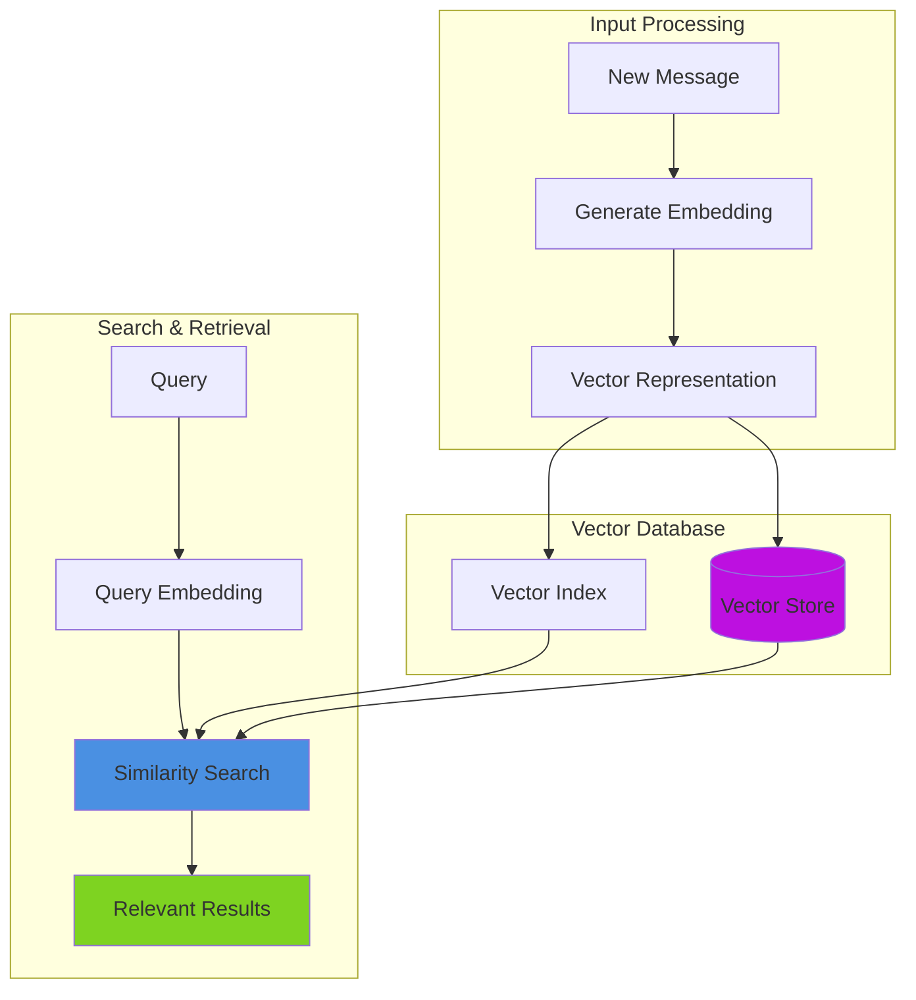
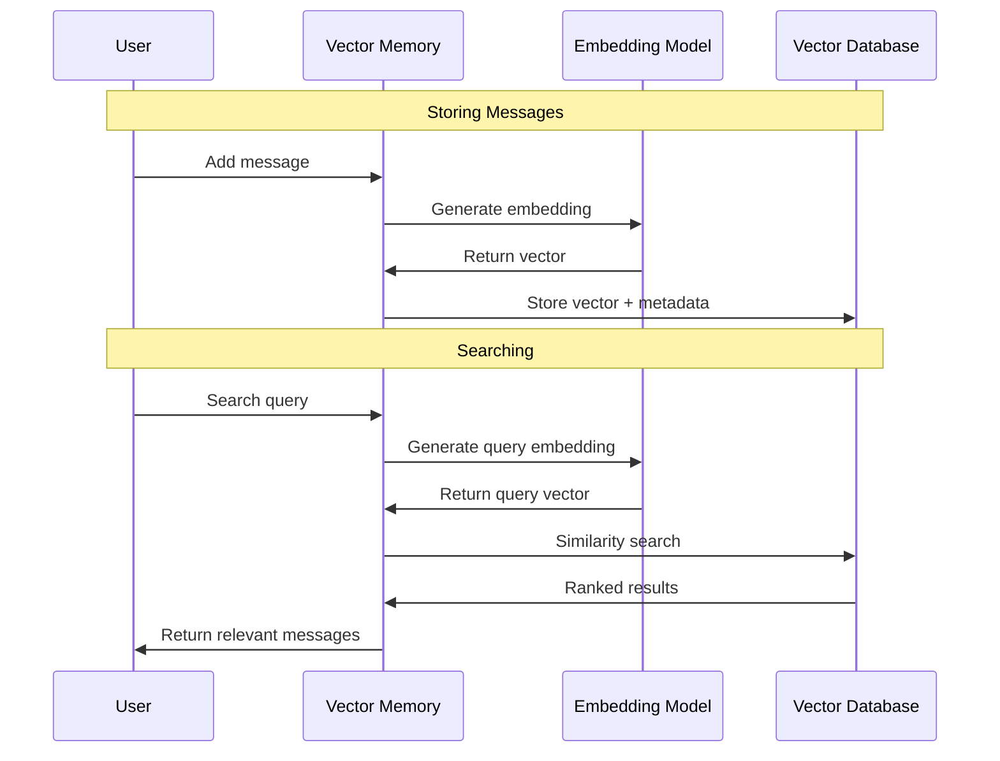

# Vector Memory Systems

Vector memory enables **semantic search and retrieval** using embeddings to find contextually relevant information based on meaning rather than just recency. This guide covers all vector memory implementations and how to choose the right one for your needs.

> **📖 Looking for Standard Memory?** For conversation history management, see the [Memory Systems Guide](../).

***

## 🔒 Multi-Tenant Isolation

**All vector memory providers support multi-tenant isolation** through `userId` and `conversationId` parameters. This enables secure, isolated vector storage for:

* **Per-user isolation**: Separate vector collections per user
* **Per-conversation isolation**: Multiple conversations for same user
* **Combined isolation**: Complete conversation isolation in shared collections

### How Multi-Tenant Works

Vector memories automatically filter searches and retrievals by userId/conversationId:

```java
// Single-tenant (shared collection)
memory = aiMemory( memory: "chroma", config: {
    collection: "shared_vectors",
    embeddingProvider: "openai"
})

// Multi-tenant (isolated by userId)
alice = aiMemory( memory: "chroma",
    key: createUUID(),
    userId: "alice",
    config: {
        collection: "shared_vectors",
        embeddingProvider: "openai"
    }
)

bob = aiMemory( memory: "chroma",
    key: createUUID(),
    userId: "bob",
    config: {
        collection: "shared_vectors",
        embeddingProvider: "openai"
    }
)

// Alice and Bob share collection but see only their own vectors
alice.add( "Alice's message" )
bob.add( "Bob's message" )

// Automatic isolation - Alice only retrieves her vectors
aliceResults = alice.getRelevant( "message", 10 )  // Only Alice's vectors
bobResults = bob.getRelevant( "message", 10 )      // Only Bob's vectors
```

### Multi-Conversation Support

Isolate multiple conversations for the same user:

```java
// User Alice has multiple conversations
supportChat = aiMemory( memory: "pinecone",
    key: createUUID(),
    userId: "alice",
    conversationId: "support-ticket-123",
    config: { collection: "customer_interactions" }
)

salesChat = aiMemory( memory: "pinecone",
    key: createUUID(),
    userId: "alice",
    conversationId: "sales-inquiry-456",
    config: { collection: "customer_interactions" }
)

// Each conversation is completely isolated
supportChat.add( "Help with billing issue" )
salesChat.add( "Interested in premium plan" )

// Searches only within conversation scope
supportResults = supportChat.getRelevant( "issue", 5 )  // Only support messages
salesResults = salesChat.getRelevant( "plan", 5 )       // Only sales messages
```

### Storage Strategy by Provider

| Provider    | Storage Method               | Filter Type        |
| ----------- | ---------------------------- | ------------------ |
| BoxVector   | Metadata                     | In-memory filter   |
| Chroma      | Metadata                     | $and operator      |
| Milvus      | Metadata                     | filter expressions |
| MySQL       | Dedicated columns            | SQL WHERE          |
| OpenSearch  | Metadata                     | bool filter        |
| Postgres    | Dedicated columns            | SQL WHERE          |
| Pinecone    | Metadata                     | $eq operators      |
| Qdrant      | Payload root                 | match filters      |
| TypeSense   | Root fields                  | := filters         |
| Weaviate    | Properties root              | GraphQL Equal      |
| Hybrid      | Delegates to vector provider | Provider-specific  |

All providers support `getAllDocuments()`, `getRelevant()`, and `findSimilar()` with automatic tenant filtering.

For enterprise patterns, security considerations, and advanced multi-tenancy, see the [Multi-Tenant Memory Guide](../multi-tenant-memory.md).

***

## 📖 Overview

Vector memory systems store conversation messages as embeddings (numerical vector representations) and enable **semantic similarity search**. Unlike standard memory that retrieves messages chronologically, vector memory finds the most relevant messages based on meaning.

### 🏗️ Vector Memory Architecture



### Key Benefits

* **Semantic Understanding**: Find relevant context based on meaning, not just keywords
* **Long-term Context**: Search across thousands of past messages efficiently
* **Intelligent Retrieval**: Get the most relevant history, even if discussed long ago
* **Scalable**: Handle large conversation datasets with specialized vector databases
* **Flexible**: Choose from local (in-memory), cloud, or self-hosted solutions

### Use Cases

* **Customer Support**: Retrieve relevant past support cases
* **Knowledge Bases**: Find similar questions and answers
* **Long Conversations**: Maintain context across lengthy interactions
* **Multi-session**: Remember user preferences across sessions
* **RAG Applications**: Combine document retrieval with AI responses

***

## 🔄 How Vector Memory Works

### 🔄 Vector Search Process



### 1. Embedding Generation

When you add a message, it's converted to a vector embedding:

```java
memory = aiMemory( memory: "chroma", config: {
    collection: "support_chat",
    embeddingProvider: "openai",
    embeddingModel: "text-embedding-3-small"
} )

// Message is automatically embedded and stored
memory.add( "I need help with my billing account" )
```

### 2. Semantic Search

When retrieving context, vector memory finds similar messages:

```java
// Finds semantically similar messages, even with different wording
relevant = memory.getRelevant( query: "payment issues", limit: 5 )
// Returns messages about billing, invoices, charges, etc.
```

### 3. Integration with Agents

Agents automatically use vector memory for context:

```java
agent = aiAgent(
    name: "Support Bot",
    memory: memory
)

// Agent automatically retrieves relevant past conversations
agent.run( "What was my last invoice amount?" )
```

***

## Choosing a Vector Provider

### Quick Decision Matrix

| Provider       | Best For                                | Setup       | Cost      | Performance | Multi-Tenant |
| -------------- | --------------------------------------- | ----------- | --------- | ----------- | ------------ |
| **BoxVector**  | Development, testing, small datasets    | ✅ Instant   | Free      | Good        | ✅            |
| **Hybrid**     | Balanced recent + semantic              | ✅ Easy      | Low       | Excellent   | ✅            |
| **ChromaDB**   | Python integration, local dev           | ⚙️ Moderate | Free      | Good        | ✅            |
| **PostgreSQL** | Existing Postgres infrastructure        | ⚙️ Moderate | Low       | Good        | ✅            |
| **MySQL**      | Existing MySQL 9+ infrastructure        | ⚙️ Moderate | Low       | Good        | ✅            |
| **OpenSearch** | AWS integration, enterprise search      | ⚙️ Moderate | Free/Paid | Excellent   | ✅            |
| **TypeSense**  | Fast typo-tolerant search, autocomplete | ⚙️ Easy     | Free/Paid | Excellent   | ✅            |
| **Pinecone**   | Production, cloud-first                 | ⚙️ Easy     | Paid      | Excellent   | ✅            |
| **Qdrant**     | Self-hosted, high performance           | ⚙️ Complex  | Free/Paid | Excellent   | ✅            |
| **Weaviate**   | GraphQL, knowledge graphs               | ⚙️ Complex  | Free/Paid | Excellent   | ✅            |
| **Milvus**     | Enterprise, massive scale               | ⚙️ Complex  | Free/Paid | Outstanding | ✅            |

### Detailed Recommendations

**Start Development:**

* Use **BoxVector** for immediate prototyping
* Use **Hybrid** when you need both recent and semantic context

**Production (Cloud):**

* **Pinecone**: Best for cloud-native, managed service
* **Qdrant Cloud**: Excellent performance, generous free tier

**Production (Self-Hosted):**

* **PostgreSQL**: If you already use Postgres
* **MySQL**: If you already use MySQL 9+
* **OpenSearch**: AWS infrastructure, enterprise search features
* **TypeSense**: Fast typo-tolerant search with low latency
* **Qdrant**: Best performance for self-hosted
* **Milvus**: Enterprise-grade, handles billions of vectors

**Special Use Cases:**

* **ChromaDB**: Python ML infrastructure
* **Weaviate**: Complex queries, GraphQL API
* **Hybrid**: Best of both worlds (recent + semantic)

***

## 📖 Sub-Pages

| Page | Description |
|---|---|
| [Self-Hosted Providers](self-hosted-providers.md) | BoxVector, Chroma, Postgres, MySQL, OpenSearch, TypeSense — self-managed setups |
| [Cloud Providers](cloud-providers.md) | Pinecone, Qdrant, Weaviate, Milvus — managed cloud services |
| [Hybrid Memory](hybrid-memory.md) | Combine recent + semantic context for balanced retrieval |
| [Configuration Examples](configuration-examples.md) | Ready-to-use configs for dev, cloud, and self-hosted production |
| [Best Practices & Advanced Usage](best-practices.md) | Embedding models, metadata filtering, performance, advanced patterns |
| [Troubleshooting](troubleshooting.md) | Common errors and how to resolve them |

***

## See Also

* [Memory Systems Guide](../) - Standard conversation memory
* [Custom Vector Memory](../../../extending-boxlang-ai/custom-vector-memory.md) - Build your own provider
* [Embeddings Guide](../../../rag/embeddings.md) - Understanding embeddings
* [Agents Documentation](../../agents/) - Using memory in agents

***

**Next Steps:** Learn about [building custom vector memory](../../../extending-boxlang-ai/custom-vector-memory.md) providers.
