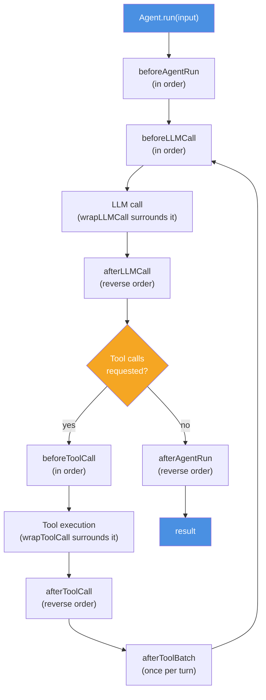

# Middleware


**Since BoxLang AI v3.0+**. This page is the canonical middleware reference — [Agent Middleware](agents/middleware.md) covers agent-specific usage and links back here for the full API.


Middleware provides hooks into every stage of agent execution — before and after LLM calls, tool invocations, and the full agent run. Use it for logging, retrying failures, enforcing guardrails, human approval, and more without touching your agent code.

## How It Works

Middleware wraps agent execution in layers. Each layer can inspect and modify the request/response, or halt execution entirely.



**Inbound hooks** (`before*`) run in registration order.
**Outbound hooks** (`after*`) run in reverse order.
**Wrap hooks** (`wrapLLMCall`, `wrapToolCall`) surround the call itself — call `handler()` to proceed.
**The loop**: after `afterToolBatch`, execution returns to `beforeLLMCall` — the LLM sees the tool results and may call more tools, or respond directly and fall through to `afterAgentRun`.

## Adding Middleware to an Agent

```javascript
agent = aiAgent(
    name      : "assistant",
    middleware: [
        new LoggingMiddleware(),
        new RetryMiddleware( maxRetries: 3 ),
        new GuardrailMiddleware( blockedTools: [ "deleteRecord" ] )
    ]
)
```

Or with the fluent API:

```javascript
agent = aiAgent( name: "assistant" )
    .withMiddleware( new LoggingMiddleware() )
    .withMiddleware( new RetryMiddleware() )
```

Fetch an attached instance back off the agent by name:

```javascript
logger = agent.getMiddlewareByName( "Logging Middleware" )
```

## Lifecycle Hooks

| Hook | Fires When | Context Keys |
| --- | --- | --- |
| `beforeAgentRun` | Before agent starts processing | `agent`, `input`, `messages`, `params`, `options` |
| `afterAgentRun` | After agent finishes | `agent`, `input`, `messages`, `params`, `options`, `response` |
| `beforeLLMCall` | Before each LLM API call | `model`, `chatRequest`, `messages` |
| `afterLLMCall` | After each LLM API call | `model`, `chatRequest`, `messages`, `response` |
| `beforeToolCall` | Before each tool execution | `tool`, `toolName`, `toolArgs`, `toolCallId` |
| `afterToolCall` | After each tool execution | `tool`, `toolName`, `toolArgs`, `toolCallId`, `result` |
| `afterToolBatch` | Once per turn, after every tool call has been decided | `chatRequest`, `assistantMessage`, `batch` (array of `{ tool, toolCall, toolName, toolArgs, result }`) |
| `onError` | On any unhandled exception | `error`, `phase` (hook name), `context` (that hook's context) |
| `onAttach` | When the middleware is attached to an agent | the agent instance |

### Wrap-Style Hooks

Two additional hooks give you **full around-advice** — call `handler()` yourself to proceed, or don't, to short-circuit. Use these for retry, caching, or fallback patterns that need to run code both before *and* after the call, or skip it entirely.

| Hook | Wraps | Context |
| --- | --- | --- |
| `wrapLLMCall( context, handler )` | The LLM HTTP call | `model`, `chatRequest`, `messages` |
| `wrapToolCall( context, handler )` | Each tool invocation | `tool`, `toolName`, `toolArgs`, `toolCallId` |

```javascript
AiMiddlewareResult function wrapLLMCall( required struct context, required function handler ) {
    var start = getTickCount()
    var result = handler()   // runs the next layer, or the real LLM call
    logTiming( context.model, getTickCount() - start )
    return result
}
```

## Middleware Return Values (`AiMiddlewareResult`)

Every hook returns an `AiMiddlewareResult` to control the flow. Use the dot-call form — `AiMiddlewareResult.continue()`, not `::`.

| Factory Method | Effect |
| --- | --- |
| `AiMiddlewareResult.continue()` | Proceed normally (default) |
| `AiMiddlewareResult.cancel( reason )` | Stop execution entirely |
| `AiMiddlewareResult.approve()` | Explicitly approve a tool call (`beforeToolCall`) |
| `AiMiddlewareResult.reject( reason )` | Skip this tool call; the reason is fed back as its result |
| `AiMiddlewareResult.edit( args )` | Replace the tool call's arguments, then run it |
| `AiMiddlewareResult.suspend( pending )` | Pause the run and checkpoint it for later resume |
| `AiMiddlewareResult.defer( pending )` | Mark this call as needing a decision, but keep scanning the rest of the batch |

`defer()` is what makes [batched HITL approvals](human-in-the-loop.md) possible — it lets a middleware flag one pending call in `beforeToolCall` without stopping the provider from evaluating the rest of the turn's tool calls, so multiple calls needing approval can suspend together as one checkpoint instead of one at a time.

Every result exposes predicates: `isContinue()`, `isCancelled()`, `isApproved()`, `isRejected()`, `isEdit()`, `isSuspended()`, `isDeferred()`, and `isTerminal()` (true for anything that stops normal flow — cancel, suspend, or a batch-ending defer).

## Built-in Middleware

BoxLang AI ships **nine** middleware classes: six general-purpose ones in `bxModules.bxai.models.middleware.core`, and three security-focused ones in `bxModules.bxai.models.middleware.security` (see the [Security Guide](../deployment/security/README.md) for those in depth).

| Middleware | When to Use It |
| --- | --- |
| `LoggingMiddleware` | Audit every LLM call and tool invocation — write to console, file, or both with a configurable log level |
| `RetryMiddleware` | Automatically retry failed LLM calls with exponential back-off; essential for flaky or rate-limited providers |
| `GuardrailMiddleware` | Block dangerous **tool calls** by name, or enforce regex-based argument validation before any tool runs |
| `MaxToolCallsMiddleware` | Prevent runaway agents by capping the total number of tool invocations per run |
| `HumanInTheLoopMiddleware` | Suspend for human approval — CLI, web/async, or any [gateway](gateways.md) — with policies, durable grants, and batching |
| `FlightRecorderMiddleware` | Record live LLM/tool interactions to a JSON fixture and replay them offline — ideal for testing and debugging |
| `InputSanitizerMiddleware` | Heuristic prompt-injection scanning on inbound content and tool/MCP results |
| `OutputGuardMiddleware` | Redact secrets/PII and strip data-exfiltration markdown from model responses |
| `LLMGuardMiddleware` | LLM-as-judge classification of requests/responses using a second, cheaper model |

### LoggingMiddleware

Logs every agent lifecycle event.

```javascript
middleware = new bxModules.bxai.models.middleware.core.LoggingMiddleware(
    logToFile      : true,
    logToConsole   : false,
    logLevel       : "info",     // "info", "warn", "error", "debug"
    prefix         : "[AI Middleware]"
)
```

### RetryMiddleware

Retries failed LLM calls with exponential backoff.

```javascript
middleware = new bxModules.bxai.models.middleware.core.RetryMiddleware(
    maxRetries         : 3,
    initialDelay       : 1000,      // ms
    backoffMultiplier  : 2,
    maxDelay           : 30000,
    nonRetryableTypes  : "InvalidInput,MaxInteractionsExceeded"
)
```

### GuardrailMiddleware

Blocks specified **tool calls** by name, and validates tool arguments against regex patterns. This guards tool invocations, not prompt or response content — for that, see the security middleware below.

```javascript
middleware = new bxModules.bxai.models.middleware.core.GuardrailMiddleware(
    blockedTools : [ "deleteRecord", "dropTable" ],
    argPatterns  : {
        "runSQL": [ { "query": "^SELECT" } ]  // Only allow SELECT statements
    }
)
```

### MaxToolCallsMiddleware

Caps the total number of tool invocations in a single run.

```javascript
middleware = new bxModules.bxai.models.middleware.core.MaxToolCallsMiddleware(
    maxCalls: 10
)
```

### HumanInTheLoopMiddleware

Suspends the agent for human approval before specified tools execute — matched by tool name (default), or by any `IApprovalPolicy` for more nuanced rules.

```javascript
// CLI mode (default) — blocking terminal prompt
middleware = new bxModules.bxai.models.middleware.core.HumanInTheLoopMiddleware(
    toolsRequiringApproval: [ "sendEmail", "chargeCard" ],
    showArguments         : true
)

// Web / async mode — the run SUSPENDS instead of blocking (checkpointer required)
middleware = new bxModules.bxai.models.middleware.core.HumanInTheLoopMiddleware(
    mode                  : "web",
    toolsRequiringApproval: [ "sendEmail" ]
)

// Present through a gateway, with durable "always allow" grants
middleware = new bxModules.bxai.models.middleware.core.HumanInTheLoopMiddleware(
    toolsRequiringApproval: [ "sendEmail" ],
    gateway               : aiGateway( "http" ),
    decisionStore         : aiDecisionStore( "jdbc", { datasource: "myDSN" } )
)
```

Full constructor: `toolsRequiringApproval`, `mode` (`"cli"` default / `"web"`), `showArguments`, `approvalCallback`, `policy` (any `IApprovalPolicy`), `gateway` (any `IGateway`), `decisionStore` (any `IDecisionStore`).

When several tool calls in one turn all need approval, they suspend together as **one** checkpoint, and `agent.resume()` finishes the whole batch without replaying the LLM call. See [Human-in-the-Loop](human-in-the-loop.md) for the full picture — policies, durable grants, batching, and the pending-approval query API.

### FlightRecorderMiddleware

Records LLM and tool interactions to a JSON fixture for debugging and replay.

```javascript
// Passthrough mode (observe only, no writing) — the default
middleware = new bxModules.bxai.models.middleware.core.FlightRecorderMiddleware(
    mode: "passthrough"
)

// Record mode — captures interactions to disk
middleware = new bxModules.bxai.models.middleware.core.FlightRecorderMiddleware(
    mode       : "record",
    fixtureDir : "/.agents/flight-recorder",   // default
    recordTools: true
)

// Replay mode — returns fixture data without live LLM calls (great for testing)
middleware = new bxModules.bxai.models.middleware.core.FlightRecorderMiddleware(
    mode       : "replay",
    fixturePath: "/.agents/flight-recorder/test-run.json",
    strict     : true    // Error if interaction not found in fixture
)

// Read back what was recorded
tape = middleware.getTape()
```

### Security Middleware

Three middleware classes defend against prompt injection and data leakage. They're covered in depth in the [Security Guide](../deployment/security/README.md) — brief summaries:

```javascript
import bxModules.bxai.models.middleware.security.InputSanitizerMiddleware;
import bxModules.bxai.models.middleware.security.OutputGuardMiddleware;
import bxModules.bxai.models.middleware.security.LLMGuardMiddleware;

agent = aiAgent(
    middleware: [
        new InputSanitizerMiddleware( action: "flag" ),   // heuristic injection scanning
        new LLMGuardMiddleware( judge: { provider: "ollama", model: "llama-guard3" } ), // second-model judge
        new OutputGuardMiddleware( action: "redact" )      // secrets/PII redaction on the response
    ]
)
```

`settings.security.enabled = true` auto-attaches `InputSanitizerMiddleware` (and fencing) to every request without wiring it into every agent by hand — see the [Security Guide](../deployment/security/README.md) for the full settings reference.

## Struct-Based Inline Middleware

For simple cases, pass a struct with hook functions — no class required:

```javascript
agent = aiAgent(
    name      : "assistant",
    middleware: [
        {
            beforeLLMCall: function( context ) {
                println( "Calling LLM with #context.messages.len()# messages" )
                return AiMiddlewareResult.continue()
            },
            afterLLMCall: function( context ) {
                println( "Got response: #context.response.getContent().left(80)#..." )
                return AiMiddlewareResult.continue()
            }
        }
    ]
)
```

## Custom Middleware Class

Extend `BaseAiMiddleware` for reusable, configurable middleware — override only the hooks you need:

```javascript
class extends="bxModules.bxai.models.middleware.BaseAiMiddleware" {

    property name="maxTokensPerCall" type="numeric" default=4000;

    function init( numeric maxTokensPerCall = 4000 ) {
        variables.maxTokensPerCall = arguments.maxTokensPerCall
        variables.name             = "Token Budget Middleware"
        variables.description      = "Cancels requests that would exceed the token budget"
        return this
    }

    function beforeLLMCall( required struct context ) {
        var estimated = context.messages.reduce( ( acc, msg ) => acc + msg.content.len() / 4, 0 )
        if ( estimated > variables.maxTokensPerCall ) {
            return AiMiddlewareResult.cancel( "Estimated token count #estimated# exceeds budget of #variables.maxTokensPerCall#" )
        }
        return AiMiddlewareResult.continue()
    }
}
```

## Combining Middleware

Stack middleware to compose behaviors:

```javascript
agent = aiAgent(
    name      : "production-agent",
    middleware: [
        new LoggingMiddleware( logToConsole: false, logToFile: true ),
        new RetryMiddleware( maxRetries: 3 ),
        new MaxToolCallsMiddleware( maxCalls: 20 ),
        new GuardrailMiddleware( blockedTools: [ "deleteUser" ] ),
        new FlightRecorderMiddleware( mode: "passthrough" )
    ]
)
```

## Related Pages

* [Agent Middleware](agents/middleware.md) — attaching middleware to an agent, agent-scoped patterns
* [Human-in-the-Loop](human-in-the-loop.md) — approval policies, durable grants, batched approvals
* [Gateways](gateways.md) — presenting HITL requests over CLI, HTTP, or a platform module
* [Security Guide](../deployment/security/README.md) — the full guardrail stack
* [Custom Tools](../extending-boxlang-ai/custom-tools.md) — build tools that middleware can intercept
