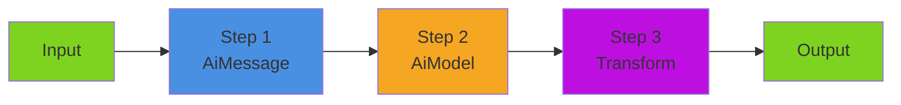

# Pipelines

Pipelines are the foundation of BoxLang AI's composable architecture. They allow you to chain AI operations, create reusable workflows, and build complex data processing flows with simple, readable code.

## 📖 In This Section

| Page                                         | What's covered                                       |
| -------------------------------------------- | ---------------------------------------------------- |
| [Building Pipelines](building.md)            | Three construction methods, data flow, `_input`, params/options |
| [Transforms](transforms.md)                  | Pre-processing, post-processing, named transformers  |
| [Multi-Model Workflows](multi-model.md)      | Multi-step patterns, model specialization, reusable templates |
| [Streaming](streaming.md)                    | Real-time streaming with callbacks and pipeline integration |
| [Structured Output](structured-output.md)    | Extracting typed structs and objects                 |
| [Advanced](advanced.md)                      | Events, debugging, performance, error handling       |

---

## 🎯 What are Pipelines?

Pipelines are **composable workflows** where data flows through a sequence of operations. Each operation (called a "runnable") processes the input and passes the result to the next step.

```javascript
// Simple pipeline: Message → AI Model → Transform
pipeline = aiMessage()
    .user( "Explain AI in one sentence" )
    .toDefaultModel()
    .transform( r => r.content.uCase() )

// Execute the pipeline
result = pipeline.run()
// Result: "ARTIFICIAL INTELLIGENCE IS THE SIMULATION OF HUMAN INTELLIGENCE BY MACHINES."
```

### Key Benefits

✅ **Composability** - Mix and match components like LEGO blocks ✅ **Reusability** - Define once, execute with different inputs ✅ **Readability** - Pipelines read like natural workflows ✅ **Flexibility** - Swap providers, add steps, modify behavior easily ✅ **Testability** - Each step can be tested independently ✅ **Maintainability** - Changes are isolated to specific steps

### Real-World Analogy

Think of a pipeline like an **assembly line** in a factory:

1. **Raw materials** (input) enter the line
2. **Each station** (runnable) performs a specific operation
3. **Output** from one station becomes **input** to the next
4. **Final product** (result) exits the line

```javascript
// Assembly line for content generation
contentPipeline = aiMessage()                    // Station 1: Prepare message
    .user( "Write about ${topic}" )
    .toDefaultModel()                             // Station 2: AI generation
    .transform( r => r.content )                  // Station 3: Extract text
    .transform( text => text.trim() )             // Station 4: Clean up
    .transform( text => {                         // Station 5: Package result
        return {
            content: text,
            wordCount: text.split( " " ).len(),
            timestamp: now()
        }
    } )
```

***

## 🏗️ Pipeline Architecture

### The IAiRunnable Interface

All pipeline components implement the `IAiRunnable` interface:

```javascript
interface IAiRunnable {
    // Synchronous execution
    any function run( any input = {}, struct params = {}, struct options = {} )

    // Streaming execution
    void function stream( function onChunk, any input = {}, struct params = {}, struct options = {} )

    // Chaining
    IAiRunnable function to( IAiRunnable next )

    // Introspection
    string function getName()
}
```

This consistent interface means **everything can be chained** with everything else.

### Built-in Runnable Components

| Component               | Purpose             | Example                                    |
| ----------------------- | ------------------- | ------------------------------------------ |
| **AiMessage**           | Message templates   | `aiMessage().user( "Hello ${name}" )`      |
| **AiModel**             | AI provider wrapper | `aiModel( "openai" )`                      |
| **AiAgent**             | Autonomous agent    | `aiAgent( model, memory, tools )`          |
| **AiTransformRunnable** | Data transformer    | `aiTransform( r => r.content )`            |
| **AiRunnableSequence**  | Pipeline chain      | `new AiRunnableSequence( [step1, step2] )` |

### Pipeline Flow



**Data flows left-to-right:**

1. Input data enters the first step
2. Each step's **output** becomes the next step's **input**
3. Final step's output is the pipeline result

***

## 🔗 Related Documentation

* [**AI Models**](../models.md) - Configure and use AI providers
* [**Messages**](../messages/) - Build message templates
* [**Transformers**](../transformers/README.md) - Data transformation patterns
* [**Streaming**](streaming.md) - Real-time response handling
* [**Agents**](../agents/) - Autonomous AI workflows
* [**Events**](../../advanced/events/README.md) - Event interception and monitoring

***

**Ready to build complex AI workflows?** Start with simple pipelines and gradually add complexity as your needs grow. The composable architecture scales from basic scripts to enterprise applications.
