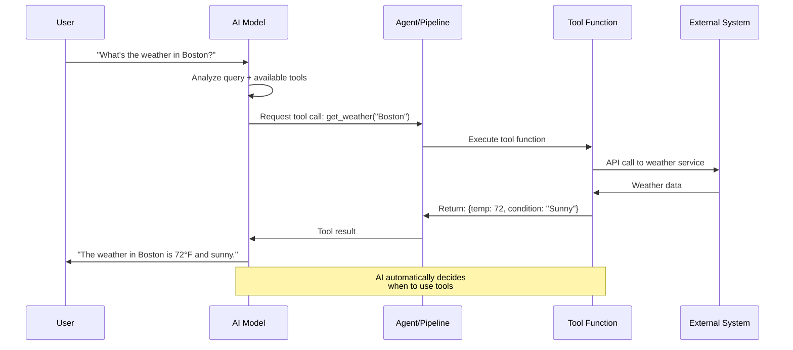
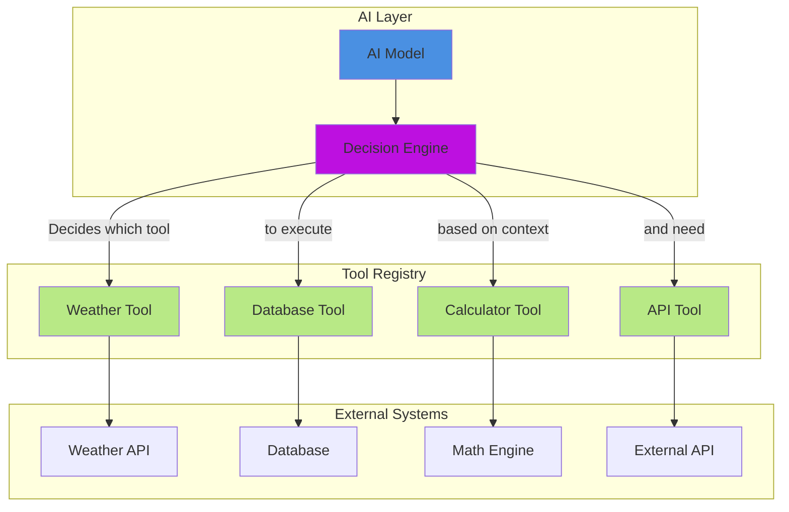
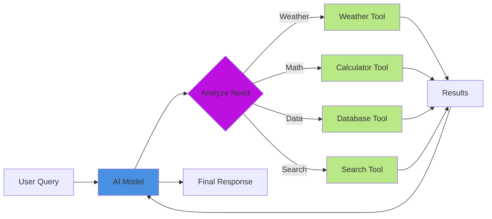

# AI Tools (Function Calling)

AI Tools enable AI models to call functions in your code, providing access to real-time data, external APIs, databases, and any other system integration.

## 📋 Table of Contents

* [What are AI Tools?](tools.md#-what-are-ai-tools)
* [Creating Tools](tools.md#-creating-tools)
* [Tool Parameters](tools.md#-tool-parameters)
* [Using Tools with aiChat()](tools.md#-using-tools-with-aichat)
* [Tools with Agents](tools.md#-tools-with-agents)
* [Advanced Tool Patterns](tools.md#-advanced-tool-patterns)
* [Best Practices](tools.md#-best-practices)
* [Real-World Examples](tools.md#-real-world-examples)

***

## 🎯 What are AI Tools?

Tools are functions that you define and make available to AI models. When the AI needs information or wants to perform an action, it can call these tools:

```
User: "What's the weather in Boston?"
   ↓
AI: Determines it needs weather data → Calls your weather tool
   ↓
Your Tool: Fetches actual weather from API → Returns "72°F, Sunny"
   ↓
AI: "The weather in Boston is 72°F and sunny."
```

### 🔄 Tool Execution Flow



### 🏗️ Tool Architecture



## 🔧 Creating Tools

### Basic Tool

```java
weatherTool = aiTool(
    "get_weather",                           // Tool name (used by AI)
    "Get current weather for a location",    // Description (AI reads this)
    ( args ) => {                            // Your function
        // Call your weather API
        return getWeatherData( args.location )
    }
).describeLocation( "City name, e.g. Boston, MA" )
```

### Using Tools

```java
result = aiChat(
    "What's the weather in San Francisco?",
    { tools: [ weatherTool ] }
)
// AI calls your tool automatically and uses the result
```

## 📝 Tool Definition

### The `aiTool()` Function

```java
aiTool( name, description, callback )
```

**Parameters:**

* `name` (string): The function name the AI uses to call the tool
* `description` (string): Explains what the tool does (AI uses this to decide when to call it)
* `callback` (function): Your function that executes when called

### Describing Parameters

Use `.describeArg()` or the fluent `.describe{ArgName}()` pattern:

```java
// Using describeArg
weatherTool = aiTool(
    "get_weather",
    "Get weather data",
    ( args ) => getWeatherData( args.location )
).describeArg( "location", "City and country, e.g. Boston, MA" )

// Using fluent pattern (recommended)
weatherTool = aiTool(
    "get_weather",
    "Get weather data",
    ( args ) => getWeatherData( args.location )
).describeLocation( "City and country, e.g. Boston, MA" )
```

### Multiple Parameters

```java
searchTool = aiTool(
    "search_products",
    "Search product catalog",
    ( args ) => {
        return searchProducts(
            query: args.query,
            category: args.category,
            maxResults: args.limit
        )
    }
)
    .describeQuery( "Search keywords" )
    .describeCategory( "Product category (optional)" )
    .describeLimit( "Maximum results to return (default: 10)" )
```

## ⚙️ Tool Properties

Access tool properties:

```java
tool = aiTool( "my_tool", "Description", myCallback )

// Read properties
println( tool.getName() )           // "my_tool"
println( tool.getDescription() )    // "Description"
println( tool.getSchema() )         // Full JSON schema

// Modify properties
tool.setDescription( "New description" )
```

## 💡 Common Tool Patterns


Tools that touch sensitive systems (databases, payments, file access) are prime targets for prompt injection. `GuardrailMiddleware` can block dangerous tools by name or validate their arguments before they ever run — see [Tool & Function Calling Security](../deployment/security/tool-calling-security.md) in the Security Guide.


### Database Query Tool

```java
dbTool = aiTool(
    "query_customers",
    "Query customer database",
    ( args ) => {
        result = queryExecute(
            "SELECT * FROM customers WHERE #args.field# LIKE :value",
            { value: "%#args.value#%" }
        )
        return result
    }
)
    .describeField( "Field to search: name, email, city" )
    .describeValue( "Value to search for" )

// Usage
result = aiChat(
    "Find all customers in California",
    { tools: [ dbTool ] }
)
```

### API Integration Tool

```java
apiTool = aiTool(
    "get_stock_price",
    "Get current stock price",
    ( args ) => {
        return http( "https://api.stocks.com/v1/price/#args.symbol#" )
            .header( "Authorization", "Bearer #getApiKey()#" )
			.asJson()
            .send()
    }
).describeSymbol( "Stock ticker symbol, e.g. AAPL, GOOGL" )
```

### Calculator Tool

```java
calcTool = aiTool(
    "calculate",
    "Perform mathematical calculations",
    ( args ) => {
        // Safely evaluate math expression
        return evaluate( args.expression )
    }
).describeExpression( "Mathematical expression to evaluate, e.g. 15 * 23 + 7" )
```

### File Operations Tool

```java
fileTool = aiTool(
    "read_file",
    "Read contents of a file",
    ( args ) => {
        if( !fileExists( args.path ) ) {
            return { error: "File not found" }
        }
        return fileRead( args.path )
    }
).describePath( "Path to the file" )
```

### Built-In Web Search Tool (v3.2+)

The module auto-registers `webSearch@bxai`, which lets agents fetch current web information without custom tool wiring.

```java
researchAgent = aiAgent(
    name: "ResearchAssistant",
    instructions: "Use web search for current, verifiable information.",
    tools: [ "webSearch@bxai" ]
)

answer = researchAgent.run( "Find the latest BoxLang AI release updates and cite sources." )
```

Use this for fact-checking, current events, and research workflows where model pretraining alone is not enough.

### Built-In Console & Logging Tools (v4.0+)

The module auto-registers three utility tools for debugging, logging, and notifications:

#### `print@bxai`

Prints a message to the console. Useful for debugging or outputting information you want the user to see.

```java
debugAgent = aiAgent(
    name: "DebugAssistant",
    instructions: "Use print to show debug information.",
    tools: [ "print@bxai" ]
)

answer = debugAgent.run( "Debug the current state of the application" )
```

#### `log@bxai`

Sends a message to the AI log file. Useful for keeping a record of interactions or debugging. Log files can be found in the `logs` directory of your BoxLang installation, typically named `ai.log`.

**Parameters:**

| Parameter | Type   | Default  | Description                              |
|-----------|--------|----------|------------------------------------------|
| `message` | string | required | The message to log                       |
| `type`    | string | `"info"` | Log level: `"info"`, `"warning"`, `"error"` |

```java
loggingAgent = aiAgent(
    name: "LoggingAssistant",
    instructions: "Use log@bxai to record important events.",
    tools: [ "log@bxai" ]
)

answer = loggingAgent.run( "Log a warning about low disk space" )
```

#### `sendEmail@bxai`

Sends an email using the server's mail configuration. Useful for notifications or alerts. This tool relies on the server's mail configuration being properly set up.

**Parameters:**

| Parameter | Type     | Default  | Description              |
|-----------|----------|----------|--------------------------|
| `to`      | string   | required | Recipient email address  |
| `subject` | string   | required | The subject of the email |
| `body`    | string   | required | The body content         |
| `from`    | string   | required | The sender's email address |

```java
notifierAgent = aiAgent(
    name: "Notifier",
    instructions: "Use sendEmail@bxai to send notifications.",
    tools: [ "sendEmail@bxai" ]
)

answer = notifierAgent.run( "Send an alert email to admin@example.com about server load" )
```

> **Note:** `httpGet@bxai` is also available but **not** auto-registered for security reasons (it can reach internal networks). Register it manually if needed via `aiToolRegistry().register( "httpGet", ... )`.

## 🔗 Multiple Tools

Provide multiple tools for complex tasks:

### Multi-Tool Orchestration



```java
// Define tools
weatherTool = aiTool( "get_weather", "Get weather", ... )
calcTool = aiTool( "calculate", "Do math", ... )
searchTool = aiTool( "search", "Search data", ... )

// Use together
result = aiChat(
    "What's the temperature in NYC, and what's 15% of that number?",
    { tools: [ weatherTool, calcTool, searchTool ] }
)
// AI calls weather tool, then calculator tool, then responds
```

## Tools with Agents

Agents can use tools across multiple interactions:

```java
// Create tools
tools = [
    aiTool( "lookup_order", "Find order by ID", lookupOrder ),
    aiTool( "check_inventory", "Check product stock", checkInventory ),
    aiTool( "process_refund", "Process a refund", processRefund )
]

// Create agent with tools
supportAgent = aiAgent(
    name: "CustomerSupport",
    description: "Customer support specialist",
    instructions: "Help customers with orders. Use tools when needed.",
    tools: tools
)

// Agent uses tools automatically
response = supportAgent.run( "Check the status of order #12345" )
```

## Tools with Models

Bind tools to models for reuse:

```java
// Create model with tools
model = aiModel( "openai" )
    .bindTools( [ weatherTool, calcTool ] )

// Use in pipeline
pipeline = aiMessage()
    .user( "What's the weather in ${city}?" )
    .to( model )

result = pipeline.run( { city: "Boston" } )
```

## Tool Execution Flow

When you provide tools, the AI:

1. **Receives your message** and available tools
2. **Decides** if a tool is needed based on the question
3. **Calls the tool** with arguments it determines
4. **Receives the result** from your function
5. **Generates response** using the tool result

```java
// Example flow
result = aiChat(
    "What's 25% of the temperature in Miami?",
    { tools: [ weatherTool, calcTool ] }
)

// Behind the scenes:
// 1. AI calls get_weather("Miami") → Returns "85"
// 2. AI calls calculate("85 * 0.25") → Returns "21.25"
// 3. AI responds: "25% of Miami's temperature (85°F) is 21.25°F"
```

## Handling Tool Errors

Design tools to handle errors gracefully:

```java
apiTool = aiTool(
    "fetch_data",
    "Fetch external data",
    ( args ) => {
        try {
            result = callExternalApi( args.query )
            return result
        } catch( any e ) {
            return {
                error: true,
                message: "Failed to fetch data: #e.message#"
            }
        }
    }
)
```

## Advanced: Custom Schema

For complex parameter types, provide a custom schema:

```java
complexTool = aiTool(
    "complex_search",
    "Advanced search with filters",
    ( args ) => performSearch( args )
)

complexTool.setSchema({
    "type": "function",
    "function": {
        "name": "complex_search",
        "description": "Advanced search with filters",
        "parameters": {
            "type": "object",
            "properties": {
                "query": {
                    "type": "string",
                    "description": "Search query"
                },
                "filters": {
                    "type": "object",
                    "properties": {
                        "category": { "type": "string" },
                        "minPrice": { "type": "number" },
                        "maxPrice": { "type": "number" }
                    }
                },
                "limit": {
                    "type": "integer",
                    "default": 10
                }
            },
            "required": ["query"]
        }
    }
})
```

## Best Practices

### 1. Clear Descriptions

Good descriptions help the AI understand when to use tools:

```java
// ✅ GOOD: Clear, specific
aiTool(
    "get_order_status",
    "Get the current status of a customer order by order ID. Returns shipping status, estimated delivery, and tracking number.",
    callback
)

// ❌ BAD: Vague
aiTool(
    "get_order",
    "Get order info",
    callback
)
```

### 2. Validate Input

```java
aiTool(
    "process_payment",
    "Process a payment",
    ( args ) => {
        // Validate before processing
        if( !isNumeric( args.amount ) || args.amount <= 0 ) {
            return { error: "Invalid amount" }
        }
        if( len( args.cardToken ) < 10 ) {
            return { error: "Invalid card token" }
        }

        return processPayment( args.amount, args.cardToken )
    }
)
```

### 3. Return Structured Data

```java
// ✅ GOOD: Structured return
aiTool(
    "get_weather",
    "Get weather data",
    ( args ) => {
        return {
            location: args.location,
            temperature: 72,
            unit: "fahrenheit",
            condition: "Sunny",
            humidity: 45,
            wind: "5 mph NW"
        }
    }
)

// ❌ BAD: Unstructured string
aiTool(
    "get_weather",
    "Get weather data",
    ( args ) => "It's 72 degrees and sunny in Boston"
)
```

### 4. Handle Missing Data

```java
aiTool(
    "lookup_user",
    "Find user by email",
    ( args ) => {
        user = userService.findByEmail( args.email )

        if( isNull( user ) ) {
            return {
                found: false,
                message: "No user found with email: #args.email#"
            }
        }

        return {
            found: true,
            user: {
                id: user.getId(),
                name: user.getName(),
                email: user.getEmail()
            }
        }
    }
)
```

### 5. Keep Tools Focused

```java
// ✅ GOOD: Focused tools
aiTool( "get_order_status", "Get order status", ... )
aiTool( "update_order", "Update order details", ... )
aiTool( "cancel_order", "Cancel an order", ... )

// ❌ BAD: One tool does everything
aiTool( "manage_order", "Get, update, or cancel orders", ... )
```

## 📦 Tool Registry

The **Tool Registry** lets you register tools once and reference them by name across your entire application — no need to re-declare tools on every agent.

```javascript
// Register globally (e.g., at application startup)
aiToolRegistry().register(
    name       : "searchProducts",
    description: "Search the product catalog",
    callback   : ( query ) => productService.search( query )
)

// Resolve by name when building agents
agent = aiAgent(
    name : "shop-assistant",
    tools: aiToolRegistry().resolveTools( [ "searchProducts" ] )
)
```

You can also scan classes annotated with `@AITool` to register all their methods at once:

```javascript
aiToolRegistry().scan( new OrderService(), "orders-module" )
```

> See [Tool Registry](tool-registry.md) for complete documentation.

## Provider Support

| Provider | Tool Support      | Notes                             |
| -------- | ----------------- | --------------------------------- |
| OpenAI   | ✅ Full            | Best support, parallel tool calls |
| Claude   | ✅ Full            | Excellent tool use                |
| Gemini   | 🔜 Coming         | In development                    |
| Ollama   | ✅ Model-dependent | Works with supported models       |
| DeepSeek | ✅ Full            | Good support                      |
| Grok     | ✅ Full            | Good support                      |

## Next Steps

* [**Advanced Chatting**](chatting/advanced-chatting.md#ai-tools) - Tool examples with `aiChat()`
* [**AI Agents**](agents/) - Using tools with autonomous agents
* [**Tool Registry**](tool-registry.md) - Register tools globally
* [**Custom Tools**](../extending-boxlang-ai/custom-tools.md) - Build custom tool classes
* [**Working with Models**](models.md#binding-tools-to-models) - Binding tools to models
* [**MCP Client**](../mcp/client/README.md) - Connect to external tool servers
