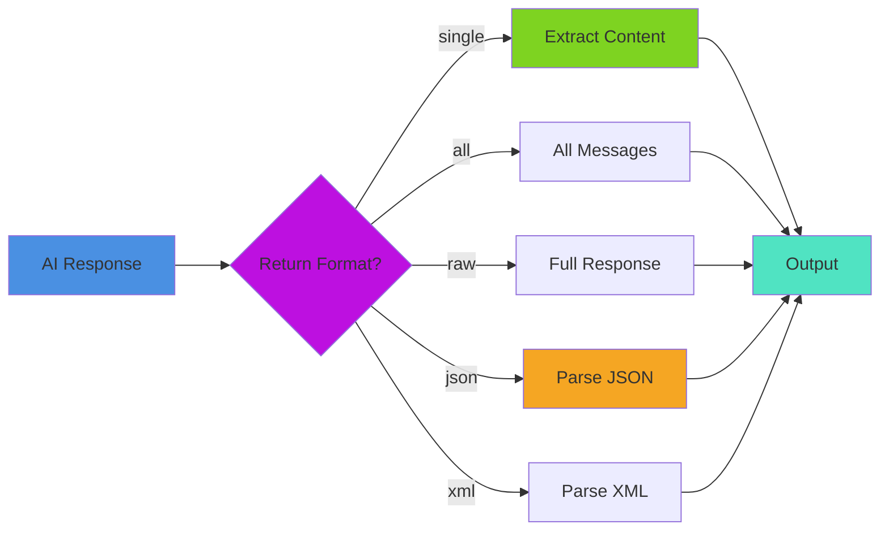
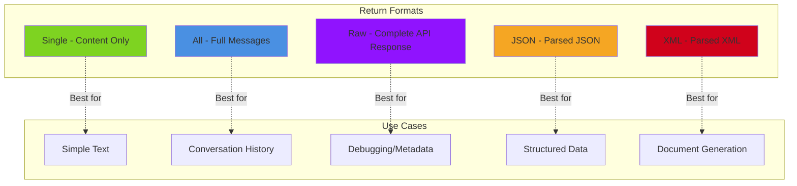

# Transformers & Return Formats

Transform and process data between pipeline steps. Learn about built-in transformers (return formats) and custom data transformations.

## 🎯 Built-In Transformers: Return Formats

The most common "transformers" in bx-ai are **return formats** - built-in ways to automatically transform AI responses.

### 🏗️ Transformation Pipeline



### 📊 Available Return Formats

All AI functions accept a `returnFormat` option that controls response transformation:



| Format   | Description           | Returns    | Use Case              |
| -------- | --------------------- | ---------- | --------------------- |
| `single` | Extract content only  | String     | Simple text responses |
| `all`    | Full messages array   | Array      | Conversation history  |
| `raw`    | Complete API response | Struct     | Debugging, metadata   |
| `json`   | Parse JSON response   | Any        | Structured data       |
| `xml`    | Parse XML response    | XML Object | XML documents         |

### Single Format (Default for Functions)

Returns just the content string - the most common use case:

```java
// These are equivalent
result = aiChat( "What is BoxLang?" )
result = aiChat( "What is BoxLang?", {}, { returnFormat: "single" } )

println( result )  // "BoxLang is a modern dynamic JVM language..."
```

**Perfect for:**

* Simple questions
* Text generation
* When you only need the answer

### All Format

Returns complete messages array with roles and metadata:

```java
result = aiChat(
    "What is BoxLang?",
    {},
    { returnFormat: "all" }
)

println( result )
// [
//     {
//         role: "user",
//         content: "What is BoxLang?"
//     },
//     {
//         role: "assistant",
//         content: "BoxLang is a modern dynamic JVM language...",
//         model: "gpt-4",
//         finishReason: "stop"
//     }
// ]
```

**Perfect for:**

* Conversation history
* Multi-turn chats
* Analyzing conversation flow

### Raw Format (Default for Pipelines)

Returns the complete API response with all metadata:

```java
result = aiChat(
    "What is BoxLang?",
    {},
    { returnFormat: "raw" }
)

println( result )
// {
//     id: "chatcmpl-123",
//     object: "chat.completion",
//     created: 1677652288,
//     model: "gpt-4",
//     choices: [
//         {
//             index: 0,
//             message: {
//                 role: "assistant",
//                 content: "BoxLang is..."
//             },
//             finishReason: "stop"
//         }
//     ],
//     usage: {
//         promptTokens: 12,
//         completionTokens: 45,
//         totalTokens: 57
//     }
// }
```

**Perfect for:**

* Token usage tracking
* Debugging
* Custom response processing
* Accessing metadata

### JSON Format (NEW!)

Automatically parses JSON responses:

```java
// Ask for JSON response
result = aiChat(
    "Return a JSON object with name and age for a person",
    {},
    { returnFormat: "json" }
)

println( result )
// { name: "John", age: 30 }

// Access directly as struct
println( "Name: #result.name#" )
println( "Age: #result.age#" )
```

**Perfect for:**

* Structured data extraction
* API-like responses
* Data transformation
* Form generation

**Advanced JSON Usage:**

```java
// Complex JSON structure
prompt = "
    Return JSON with this structure:
    {
        'users': [
            { 'name': string, 'email': string, 'active': boolean }
        ],
        'total': number
    }
"

data = aiChat( prompt, {}, { returnFormat: "json" } )

println( "Total users: #data.total#" )
data.users.each( user => {
    println( "#user.name# - #user.email# (Active: #user.active#)" )
} )
```

### XML Format (NEW!)

Automatically parses XML responses:

```java
// Ask for XML response
result = aiChat(
    "Return an XML document with person information",
    {},
    { returnFormat: "xml" }
)

// Result is parsed XML object
println( result.xmlRoot.person.name.xmlText )
println( result.xmlRoot.person.age.xmlText )
```

**Perfect for:**

* XML document generation
* Legacy system integration
* RSS/ATOM feeds
* SOAP responses

**Advanced XML Usage:**

```java
// Complex XML
prompt = "
    Generate an XML RSS feed with 3 articles.
    Use proper RSS 2.0 format.
"

feed = aiChat( prompt, {}, { returnFormat: "xml" } )

// Access XML nodes
println( "Feed title: #feed.xmlRoot.channel.title.xmlText#" )

// Iterate through items
feed.xmlRoot.channel.xmlChildren
    .filter( node => node.xmlName == "item" )
    .each( item => {
        println( "- #item.title.xmlText#" )
        println( "  #item.description.xmlText#" )
    } )
```

### Using Return Formats in Pipelines

Pipelines use `raw` format by default, but you can set any format:

```java
// Set format on pipeline
pipeline = aiMessage()
    .user( "What is ${topic}?" )
    .toDefaultModel()
    .withOptions({ returnFormat: "single" })

result = pipeline.run({ topic: "BoxLang" })
// Returns just the content string
```

**Helper methods for common formats:**

```java
// .singleMessage() - shorthand for returnFormat: "single"
pipeline = aiMessage()
    .user( "Hello" )
    .toDefaultModel()
    .singleMessage()

// .allMessages() - shorthand for returnFormat: "all"
pipeline = aiMessage()
    .user( "Hello" )
    .toDefaultModel()
    .allMessages()

// .rawResponse() - shorthand for returnFormat: "raw" (default)
pipeline = aiMessage()
    .user( "Hello" )
    .toDefaultModel()
    .rawResponse()

// .asJson() - shorthand for returnFormat: "json" (NEW!)
pipeline = aiMessage()
    .user( "Return JSON: ${data}" )
    .toDefaultModel()
    .asJson()

// .asXml() - shorthand for returnFormat: "xml" (NEW!)
pipeline = aiMessage()
    .user( "Return XML: ${data}" )
    .toDefaultModel()
    .asXml()
```

### Comparing Formats

```java
message = "Explain BoxLang in one sentence"

// Single - just text
single = aiChat( message, {}, { returnFormat: "single" } )
println( single )
// "BoxLang is a modern dynamic language for the JVM"

// All - full messages
all = aiChat( message, {}, { returnFormat: "all" } )
println( all.last().content )
// "BoxLang is a modern dynamic language for the JVM"

// Raw - complete response
raw = aiChat( message, {}, { returnFormat: "raw" } )
println( raw.choices.first().message.content )
// "BoxLang is a modern dynamic language for the JVM"
println( "Used #raw.usage.totalTokens# tokens" )

// JSON - parsed structure
jsonMessage = "Return JSON: { 'name': 'BoxLang', 'type': 'JVM language' }"
json = aiChat( jsonMessage, {}, { returnFormat: "json" } )
println( json.name )  // Direct access!
// "BoxLang"

// XML - parsed document
xmlMessage = "Return XML: <language><name>BoxLang</name></language>"
xml = aiChat( xmlMessage, {}, { returnFormat: "xml" } )
println( xml.xmlRoot.language.name.xmlText )
// "BoxLang"
```


## 📖 Sub-Pages

| Page | Description |
|---|---|
| [Built-In Transformers](built-in-transformers.md) | Core transformers: CodeExtractor, JSONExtractor, XMLExtractor, TextCleaner, AiTransformRunnable, Transform Library |
| [Custom Transformers](custom-transformers.md) | Inline transforms, `aiTransform()`, testing, and building your own transformer classes |
| [Chaining & Patterns](chaining-and-patterns.md) | Return format examples, combining formats with custom transforms, chaining, options, advanced transforms, transform patterns |
| [Practical Examples](practical-examples.md) | Real-world transform recipes and best practices |

## Next Steps

* [**Building Custom Transformers**](../../extending-boxlang-ai/custom-transformer.md) - Create your own transformers
* [**Pipeline Streaming**](../pipelines/streaming.md) - Stream through transforms
* [**Working with Models**](../models.md) - Model output transforms
* [**Pipeline Overview**](../pipelines/README.md) - Complete pipeline guide
