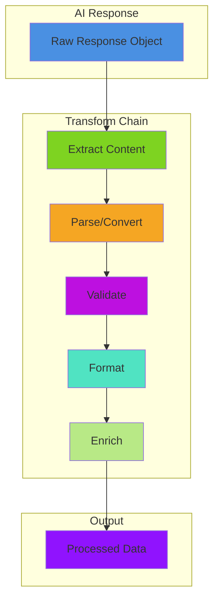

# Chaining & Patterns

## Return Format Examples in Pipelines

### Simple Text Extraction with .singleMessage()

```java
// Extract just the text content
pipeline = aiMessage()
    .user( "Explain ${topic}" )
    .toDefaultModel()
    .singleMessage()  // Returns: "Explanation text..."

result = pipeline.run({ topic: "AI" })
println( result )  // Just a string
```

### JSON Data Extraction with .asJson()

```java
// Get structured JSON data
pipeline = aiMessage()
    .system( "Return only valid JSON" )
    .user( "Create a person object with name: ${name}, age: ${age}" )
    .toDefaultModel()
    .asJson()  // Automatically parses JSON

person = pipeline.run({ name: "Alice", age: 30 })
println( "Name: #person.name#" )
println( "Age: #person.age#" )

// Complex JSON extraction
dataPipeline = aiMessage()
    .system( "Return valid JSON array" )
    .user( "List 3 colors as JSON array" )
    .toDefaultModel()
    .asJson()

colors = dataPipeline.run()  // ["red", "green", "blue"]
colors.each( color => println( color ) )
```

### XML Document Generation with .asXml()

```java
// Generate and parse XML
pipeline = aiMessage()
    .system( "Return valid XML" )
    .user( "Create XML for a book: ${title} by ${author}" )
    .toDefaultModel()
    .asXml()  // Automatically parses XML

book = pipeline.run({
    title: "Learning BoxLang",
    author: "John Doe"
})

// Access XML nodes
println( "Title: #book.xmlRoot.book.title.xmlText#" )
println( "Author: #book.xmlRoot.book.author.xmlText#" )
```

### Full Response with .rawResponse()

```java
// Get complete API response for token tracking
pipeline = aiMessage()
    .user( "Hello ${name}" )
    .toDefaultModel()
    .rawResponse()  // Full API response

response = pipeline.run({ name: "World" })
println( "Content: #response.choices.first().message.content#" )
println( "Tokens used: #response.usage.totalTokens#" )
println( "Model: #response.model#" )
```

### Conversation History with .allMessages()

```java
// Build conversation flow
pipeline = aiMessage()
    .system( "You are a helpful assistant" )
    .user( "Hello" )
    .toDefaultModel()
    .allMessages()  // Returns full message array

messages = pipeline.run()
messages.each( msg => {
    println( "#msg.role#: #msg.content#" )
} )
```

## Combining Return Formats with Custom Transforms

### JSON Then Transform

```java
// Parse JSON, then transform it
pipeline = aiMessage()
    .user( "Return JSON with user data" )
    .toDefaultModel()
    .asJson()  // Parse JSON first
    .transform( data => {
        // Now transform the parsed data
        return {
            fullName: "#data.firstName# #data.lastName#",
            email: data.email.lcase(),
            displayAge: "#data.age# years old"
        }
    } )

result = pipeline.run()
println( result.fullName )
```

### XML Then Extract Data

```java
// Parse XML, then extract specific data
pipeline = aiMessage()
    .user( "Generate RSS feed with 3 articles" )
    .toDefaultModel()
    .asXml()  // Parse XML first
    .transform( feed => {
        // Extract just article titles
        return feed.xmlRoot.channel.xmlChildren
            .filter( node => node.xmlName == "item" )
            .map( item => item.title.xmlText )
    } )

titles = pipeline.run()  // ["Title 1", "Title 2", "Title 3"]
```

### Raw Response for Debugging

```java
// Use raw format to debug, then extract
debugPipeline = aiMessage()
    .user( "Test message" )
    .toDefaultModel()
    .rawResponse()  // Get full response
    .transform( response => {
        // Log everything for debugging
        writeLog( "Model: #response.model#" )
        writeLog( "Tokens: #response.usage.totalTokens#" )
        writeLog( "Finish reason: #response.choices.first().finishReason#" )

        // Return just content
        return response.choices.first().message.content
    } )
```

## Common Transformations

### Extract Content from Raw Response

```java
pipeline = aiMessage()
    .user( "Explain AI" )
    .toDefaultModel()
    .transform( r => r.choices.first().message.content )
// Input: { choices: [...], ... }
// Output: "AI is..."
```

### String Manipulation

```java
pipeline = aiMessage()
    .user( "List colors" )
    .toDefaultModel()
    .transform( r => r.content )
    .transform( s => s.ucase() )
    .transform( s => s.trim() )
```

### Parse JSON

```java
pipeline = aiMessage()
    .system( "Return only valid JSON" )
    .user( "Create person: name=${name}, age=${age}" )
    .toDefaultModel()
    .transform( r => r.content )
    .transform( s => deserializeJSON( s ) )

person = pipeline.run( { name: "Alice", age: 30 } )
// { name: "Alice", age: 30 }
```

### Extract Code

````java
codeExtractor = aiTransform( response => {
    content = response.content ?: ""
    // Extract from markdown code blocks
    code = content.reReplace( "(?s).*```[a-z]*\n(.*?)```.*", "\1", "one" )
    return code.trim()
} )

pipeline = aiMessage()
    .user( "Write a BoxLang function to ${task}" )
    .toDefaultModel()
    .to( codeExtractor )
````

## ⛓️ Chaining Transforms

### 🔗 Transform Chain Architecture



### Sequential Processing

```java
pipeline = aiMessage()
    .user( "List 3 colors" )
    .toDefaultModel()
    .transform( r => r.content )          // Extract content
    .transform( s => s.listToArray() )    // Convert to array
    .transform( arr => arr.map( c => c.ucase() ) )  // Uppercase each

result = pipeline.run()
// ["RED", "BLUE", "GREEN"]
```

### Data Enrichment

```java
pipeline = aiMessage()
    .user( "Explain ${topic}" )
    .toDefaultModel()
    .transform( r => {
        return {
            content: r.content,
            topic: variables.topic,
            timestamp: now(),
            length: len( r.content )
        }
    } )

result = pipeline.run( { topic: "AI" } )
// { content: "...", topic: "AI", timestamp: {ts}, length: 150 }
```

## Options in Transformers

Transformers accept the `options` parameter for interface consistency but **ignore it** since they don't make AI requests:

```java
transformer = aiTransform( r => r.content.ucase() )

// Options parameter exists but has no effect on transformer behavior
result = transformer.run(
    { content: "hello" },     // input
    {},                       // params (ignored)
    { timeout: 60 }          // options (ignored by transformer)
)
// "HELLO"
```

**Why options exist:** Transformers implement `IAiRunnable` interface which requires the `options` parameter. This maintains a consistent API across all pipeline components, even though transformers don't use options.

**Options propagation:** When transformers are part of a pipeline sequence, options flow through to AI components:

```java
pipeline = aiMessage()
    .user( "Hello" )
    .toDefaultModel()
    .transform( r => r.content )  // Ignores options
    .withOptions( { returnFormat: "single" } )  // Applies to model, not transform

result = pipeline.run()  // Options affect the model step
```

## Advanced Transforms

### Conditional Logic

```java
ratingTransform = aiTransform( response => {
    content = response.content ?: "0"
    rating = val( content.reReplace( "[^0-9]", "", "all" ) )

    return {
        raw: content,
        rating: rating,
        quality: rating >= 7 ? "good" : "needs improvement",
        passed: rating >= 5
    }
} )

pipeline = aiMessage()
    .user( "Rate this from 1-10: ${item}" )
    .toDefaultModel()
    .to( ratingTransform )
```

### Error Handling

```java
safeTransform = aiTransform( response => {
    try {
        if( !structKeyExists( response, "content" ) ) {
            return "Error: No content returned"
        }

        data = deserializeJSON( response.content )
        return data
    } catch( any e ) {
        return {
            error: true,
            message: e.message,
            raw: response.content ?: ""
        }
    }
} )
```

### Data Validation

```java
validator = aiTransform( data => {
    errors = []

    if( !structKeyExists( data, "name" ) || len( data.name ) < 2 ) {
        errors.append( "Invalid name" )
    }

    if( !structKeyExists( data, "age" ) || data.age < 0 ) {
        errors.append( "Invalid age" )
    }

    return {
        valid: errors.len() == 0,
        errors: errors,
        data: data
    }
} )
```

## Transform Patterns

### Filter Pattern

```java
filterTransform = aiTransform( items => {
    return items.filter( item => item.score > 5 )
} )
```

### Map Pattern

```java
mapTransform = aiTransform( items => {
    return items.map( item => {
        return {
            id: item.id,
            display: item.name.ucase()
        }
    } )
} )
```

### Reduce Pattern

```java
sumTransform = aiTransform( items => {
    return items.reduce( ( sum, item ) => sum + item.value, 0 )
} )
```

### Aggregate Pattern

```java
aggregator = aiTransform( data => {
    return {
        total: data.len(),
        average: data.sum() / data.len(),
        min: data.min(),
        max: data.max()
    }
} )
```

## TransformAndRun Shortcut

Combine transform and run in one step:

```java
result = aiMessage()
    .user( "Say hello" )
    .toDefaultModel()
    .transformAndRun( r => r.content.ucase() )
// "HELLO!"
```

