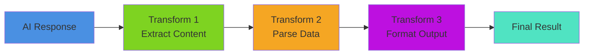

# Custom Transformers

## 🔧 Custom Transformers

Transformers process data between pipeline steps. They implement the `IAiRunnable` interface but ignore the `options` parameter since they don't interact with AI providers.

### 🔄 Custom Transform Flow



### Inline Transform

```java
pipeline = aiMessage()
    .user( "Say hello" )
    .toDefaultModel()
    .transform( response => response.content )
```

### Using `aiTransform()`

```java
transformer = aiTransform( response => response.content.ucase() )

pipeline = aiMessage()
    .user( "Hello" )
    .toDefaultModel()
    .to( transformer )
```

### Named Transformer

```java
transformer = aiTransform( r => r.content )
    .withName( "content-extractor" )
```

## Testing Transforms

```java
// Test transform independently
transformer = aiTransform( r => r.content.ucase() )

testInput = { content: "hello" }
result = transformer.run( testInput )

assert( result == "HELLO" )
```

## 🏗️ Building Your Own Transformers

Want to create custom transformers for your specific needs? BoxLang AI provides a complete framework for building reusable, pipeline-compatible transformers.

**Learn More:**

* [**Building Custom Transformers**](../../extending-boxlang-ai/custom-transformer.md) - Complete guide with examples:
  * Implementing the ITransformer interface
  * Extending BaseTransformer
  * Real-world examples (JSONSchemaTransformer, code extractor, sentiment analyzer)
  * Pipeline integration patterns
  * Testing and best practices

**Common Custom Transformer Use Cases:**

* 🔍 **Data Validation** - Validate and sanitize AI responses
* 🔄 **Format Conversion** - Convert between JSON, XML, and custom formats
* 📊 **Content Extraction** - Parse specific data from responses (code, prices, entities)
* 🧮 **Business Logic** - Apply domain-specific rules and calculations
* 📝 **Logging & Monitoring** - Track and audit data flow through pipelines

