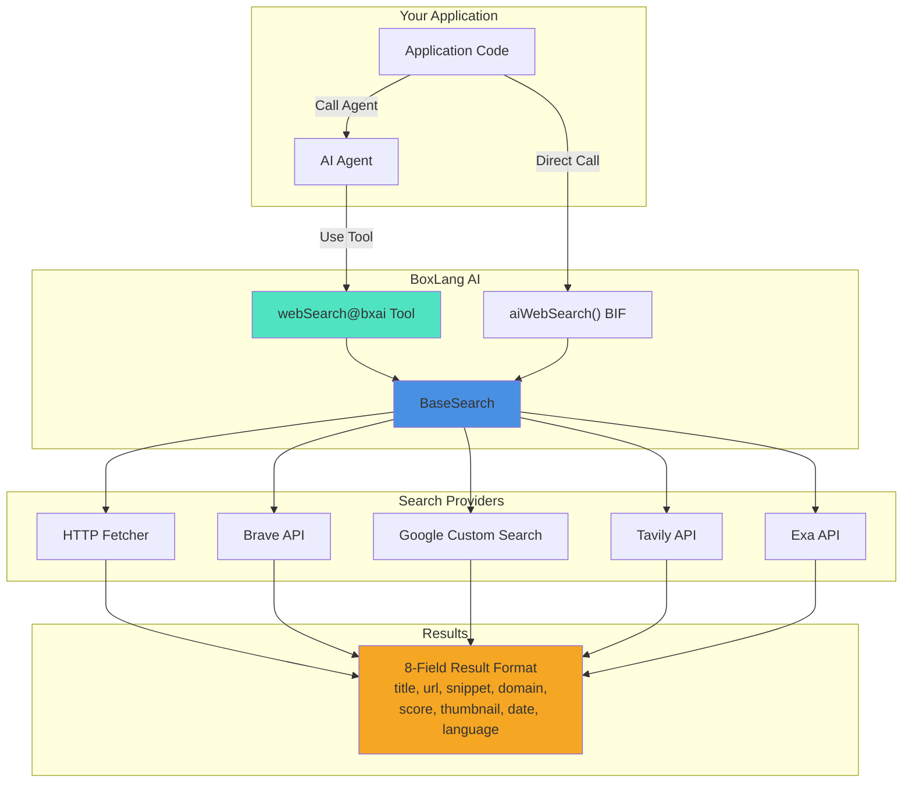

# Web Search Tools

Real-time internet search capabilities for AI agents. Give your agents the ability to browse the web, fact-check information, and access current data beyond their training knowledge.

## 🎯 Why Web Search?

**Extend AI agents with live internet access**:

- 📚 **Real-time Information** - Access current news, prices, events
- ✅ **Fact Checking** - Verify claims against live sources
- 🔍 **Research Tasks** - Multi-source information gathering
- 🧠 **RAG Enhancement** - Combine retrieved web content with vector memory
- 🤖 **Agent Autonomy** - Agents can independently search for information

## 🔌 Available Providers

| Provider | API Key | Free Tier | Best For |
|----------|---------|-----------|----------|
| **HTTP** | ❌ None | ✅ Unlimited | Generic URL fetching, testing |
| **Brave Search** | ✅ BRAVE_API_KEY | 2K/month | Privacy-focused search |
| **Google Custom Search** | ✅ GOOGLE_API_KEY | 100/day | Large-scale deployments |
| **Tavily** | ✅ TAVILY_API_KEY | 1K/month | AI-optimized search |
| **Exa** | ✅ EXA_API_KEY | Paid | Neural/semantic search |

Current release includes 5 providers with a shared interface and normalized response format.

## 🏗️ Architecture



## 🚀 Quick Start

### Simple Web Search

```javascript
// Basic search using default HTTP provider
var results = aiWebSearch( "BoxLang programming language" )

// Loop through results
for ( result in results ) {
    println( result.title )
    println( result.snippet )
    println( "Domain: #result.domain# | Score: #result.score#" )
}
```

### Async Search (Non-blocking)

```javascript
// Non-blocking async search
var future = aiWebSearchAsync( "latest BoxLang releases" )

// Continue doing other work...

// Get results when ready
var results = future.get()
```

### With Agent

```javascript
// Create an agent with web search capability
var researchAgent = aiAgent(
    name: "Researcher",
    instructions: "You are a research assistant. Use web search to find current information.",
    tools: [ "webSearch@bxai" ]  // Auto-registered tool
)

// Agent can now autonomously search
var response = researchAgent.run( "Find the latest BoxLang updates" )
```

## 📊 Result Format

Every search returns results with a consistent 8-field format:

```javascript
{
    title: "Page Title",
    url: "https://example.com/page",
    snippet: "First 200 chars of page content",
    domain: "example.com",
    score: 0.95,                        // Relevance score (0-1)
    thumbnail: "https://...",           // Featured image or empty
    publishedDate: "2024-05-14",        // ISO date or empty
    language: "en"                      // Language code or empty
}
```

## 🔑 Getting Started

### Step 1: Choose a Provider

- **No API Key Required** → Use `"http"` provider (default)
- **Quick Testing** → Use `"http"` with direct URLs
- **Production** → Choose Brave, Google, Tavily, or Exa

### Step 2: Configure API Keys

Set environment variables or module settings:

```bash
export BRAVE_API_KEY="your-brave-key"
export GOOGLE_API_KEY="your-google-key"
export GOOGLE_SEARCH_ENGINE_ID="your-custom-engine-id"
export TAVILY_API_KEY="your-tavily-key"
export EXA_API_KEY="your-exa-key"
```

### Step 3: Execute Search

```javascript
// With provider selection
var results = aiWebSearch(
    "your search query",
    { provider: "brave", maxResults: 10 }
)

// Or use directly in agent
var agent = aiAgent(
    tools: [ "webSearch@bxai" ]
)
agent.run( "Search for current AI news" )
```

## 🧰 Agent Tool Contract

When used as an agent tool, the auto-registered key is `webSearch@bxai` and maps to this method:

```javascript
@AITool( "Searches the web for information. Returns an array of results with title, URL, and snippet. Use this to find current information, verify facts, or research topics. Default provider is HTTP (simple URL fetcher, no API key needed). For better results use: brave, google, tavily, exa." )
function webSearch(
    required string query,
    string provider = "",
    numeric maxResults = 0
)
```

- `query`: Search text the agent should run
- `provider`: Optional provider override (`""` uses configured default provider, HTTP by default)
- `maxResults`: Optional cap (`0` uses provider/module defaults)

## 📖 Next Steps

- 👉 **[Getting Started](getting-started.md)** - Detailed usage patterns
- 🔧 **[Providers Reference](providers.md)** - Complete provider documentation
- 🤖 **[Agent Integration](agent-tools.md)** - Using web search with agents
- 🛡️ **[Security](../../deployment/security/data-validation.md#web-search-specific-security)** - Security best practices for web search

## 💡 Common Patterns

### Fact Checking

```javascript
var agent = aiAgent(
    name: "FactChecker",
    tools: [ "webSearch@bxai" ]
)

var response = agent.run(
    "Is it true that BoxLang runs on the JVM? Search and verify."
)
```

### Multi-Source Research

```javascript
function researchTopic( required string topic ) {
    // Search multiple providers for comparison
    var braveResults = aiWebSearch( topic, { provider: "brave", maxResults: 5 } )
    var tavilyResults = aiWebSearch( topic, { provider: "tavily", maxResults: 5 } )

    return {
        brave: braveResults,
        tavily: tavilyResults
    }
}
```

### RAG Enhancement

```javascript
// Combine web search with vector memory
var vectorMemory = aiMemory( memory: "chroma", config: { collection: "knowledge" } )

// Search web for current info
var webResults = aiWebSearch( "latest BoxLang features" )

// Add to memory for context
for ( result in webResults ) {
    vectorMemory.add( result.snippet, { source: result.url, date: result.publishedDate } )
}

// Use in agent with enhanced context
var agent = aiAgent(
    memory: vectorMemory,
    tools: [ "webSearch@bxai" ]
)
```

## ⚠️ Rate Limiting & Costs

| Provider | Rate Limit | Cost | Notes |
|----------|-----------|------|-------|
| HTTP | Unlimited | $0 | No API key, basic results |
| Brave | 2,000/month | Free tier only | $0 in free tier |
| Google | 100/day | $5-25/month | Per 1K queries after free tier |
| Tavily | 1,000/month | Free tier + paid | $0 in free tier |
| Exa | Varies | Paid | Premium semantic search |

**Best Practice**: Start with free tier providers, implement rate limiting, and monitor costs:

```javascript
function checkRateLimit( required string userId ) {
    var searchCount = queryExecute(
        "SELECT COUNT(*) as cnt FROM web_searches
         WHERE user_id = :userId AND created_at > DATE_SUB(NOW(), INTERVAL 1 HOUR)",
        { userId: arguments.userId }
    )

    if ( searchCount.cnt >= 50 ) {
        throw "Search rate limit exceeded"
    }
}
```

---

## 🔗 References

- [Web Search API BIF Reference](../../advanced/reference/built-in-functions/aiwebsearch.md)
- [Async BIF Reference](../../advanced/reference/built-in-functions/aiwebsearchasync.md)
- [Agents Documentation](../agents/README.md)
- [Tools Documentation](../tools.md)
- [Security Guide](../../deployment/security/README.md)
