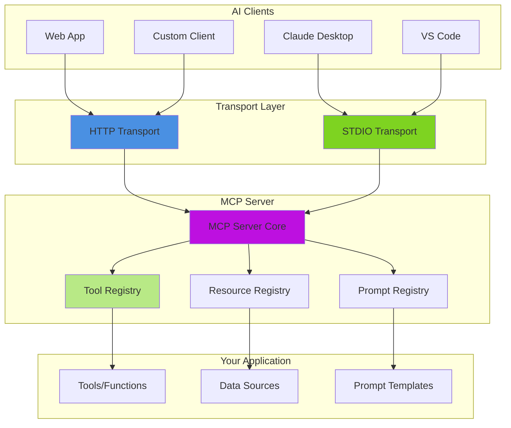

# MCP Server - Model Context Protocol Server

The BoxLang AI Module provides a complete MCP (Model Context Protocol) server implementation that allows you to expose tools, resources, and prompts to AI clients.

## What is an MCP Server?

An MCP Server is a service that exposes capabilities to AI clients using the standardized Model Context Protocol. It enables:

* 🔧 **Expose Tools**: Register functions that AI clients can invoke
* 📚 **Serve Resources**: Provide documents and data to AI clients
* 💬 **Offer Prompts**: Define reusable prompt templates
* 🌐 **HTTP & STDIO Transports**: Expose your MCP server via web or command-line

## 🏗️ MCP Architecture



## Documentation

| Topic | Description |
|---|---|
| 🚀 [Getting Started](getting-started.md) | Build your first server in 5 minutes |
| 🌐 [Transports](transports.md) | HTTP vs STDIO — choose what fits your deployment |
| 🔧 [Server Configuration](server-configuration.md) | Authentication, CORS, IP allow lists, body limits, API keys |
| 🧩 [Registering Tools, Resources & Prompts](registration.md) | Manual registration with inline MCPServer calls |
| ✨ [Annotation-Based Discovery](annotation-discovery.md) | Auto-register with @mcpTool, @mcpResource, @mcpPrompt |
| 🏗️ [Class-Based Servers](class-based-servers.md) | Extend MCPServer for better organization |
| 🌍 [HTTP Endpoint & Routing](http-endpoint.md) | Set up custom HTTP endpoints |
| 📊 [Observability & Monitoring](observability.md) | Statistics, events, and real-time monitoring |
| ⏸️ [Pause & Resume](pause-resume.md) | Temporarily halt servers for maintenance |
| ⭐ [Best Practices](best-practices.md) | Security, design patterns, production setup |
| 💡 [Examples & Use Cases](_examples.md) | Complete working code examples |

## Quick Start

```javascript
// Application.bx
class {

    function onApplicationStart() {
        MCPServer( "myApp" )
            .setDescription( "My Application MCP Server" )
            .setVersion( "1.0.0" )
            .registerTool(
                aiTool( "search", "Search documents", ( query ) => {
                    return searchService.search( query )
                } )
            )
    }

}
```

Access at: `POST http://localhost/~bxai/mcp.bxm?server=myApp`

👉 **[Full Getting Started Guide →](getting-started.md)**

## External Resources

* [Model Context Protocol Specification](https://modelcontextprotocol.io)
* [MCP Implementation Examples](https://github.com/modelcontextprotocol)
